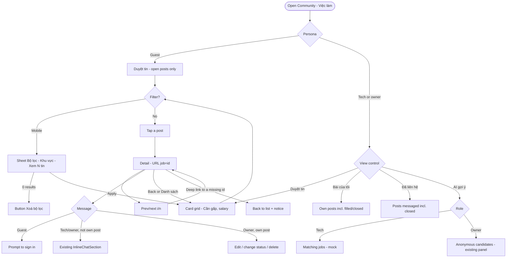

# Product Doc: Community Jobs — UI Layout Improvement

## Metadata
- **Master Doc**: [community-jobs-ui_master_260924_v1.09.24.md](../00-master/community-jobs-ui_master_260924_v1.09.24.md) (Approved 2026-09-24)
- **Branch**: `claude/community-jobs-layout-ui-af928c`
- **Created**: 2026-09-24 11:55
- **Last Updated**: 2026-09-24 11:55
- **Version**: v1.09.24
- **Author**: @tnsthao94 (Product-Designer role)
- **Status**: Review

---

## Persona

### Primary Users
- **Nail tech (Jessica, `tech`)**: uses a phone, often in a salon between clients. Wants to find a job near home with clear pay, compare several posts quickly, and message the salon right away. Is put off by long pages and information that is hard to find.
- **Salon owner (Kayla, `owner`)**: uses both desktop and phone. Posts hiring ads, manages their own posts (edit, change status, delete), and wants AI suggestions for suitable techs.

### Secondary Users
- **Guest (Linh, `guest`)**: not signed in yet. Browses to see whether the community is worth using. Needs to understand what they can do and when they must sign in, without hitting dead ends.

---

## Scenario

### Current State (E2E evidence 2026-09-24, 4 viewports)
- On mobile at 375×812, the first screen shows **no posts**. Before any content there are 3 chrome layers (pill tab strip, a separate mode card with a caption repeating the tab name, and a filter card with 2 selects stacked vertically plus a grey "Đăng nhập persona…" pill). The first card starts at about y=680.
- The active "Việc làm" tab sits off-screen on mobile, and is cut to "Việc" on landscape tablet.
- The card's chip row overflows: "Tuyển th", "Mong muốn 60/40 …", "$1,100 - $1,400/ng…".
- There are 3 navigation hierarchies: an English sidebar (missing Thông báo, in a different order), Vietnamese tabs, and a mode switcher.
- The "AI gợi ý tuyển thợ" button shows for everyone; a guest or tech who clicks it hits the dead end "Chỉ chủ salon mới xem được trang Quản lý tuyển dụng".
- On the mobile detail screen, salary is at y=623 because the tabs and mode card still sit above the back button. Messaging is an accordion at the end of the page.
- Filled/closed posts stay in the feed, dimmed.
- Many labels are 10–11px; on detail, the meta values are only 14px.

### Desired State
- The mobile first screen shows at least 2 full posts (first card y ≤ 380 in dev).
- A tech can read salary from the card itself (compact chip, Success color), open the detail view, see salary right away, message with 1 tap via the sticky CTA, and swipe to the previous/next post.
- There is one clear set of navigation per persona; guests are never shown a button they can't use.
- The feed only contains posts that can still be applied to; the user's own posts and posts they've contacted are in separate tabs.
- All text drawn by Jobs is at least 12px, and reading text is 16px.

### Business Impact
- Increases the number of techs who contact salons (the main conversion of Jobs): fewer steps before seeing salary and the message button.
- Reduces frustration from dead ends (the guest AI mode), which builds trust in the community.
- A clean feed (no closed posts) keeps first impressions positive and avoids wasted clicks.

---

## Audit

### Problem / root cause
- **Root cause 1: the source spec doesn't describe what ships.** `docs/community-jobs-layout-redesign-plan.md` describes a split-view and then a docking panel. What actually ships is a full-width detail view, added in 3 addenda. Mobile/tablet were marked "unchanged, not a target", so they were never designed.
- **Root cause 2: the chrome layers stack up.** Each feature (mode switcher, filters, persona hint) added its own card instead of sharing one toolbar.
- **Root cause 3: salary is shown as a raw string.** It is free text from the form, shown only when it contains "/tuần" or "thương lượng", so it gets truncated.
- **Root cause 4: permissions are scattered.** Role is inferred in 3 places, so the UI shows buttons first and blocks users afterwards.

### Codebase review (high level)
- **Areas touched**: Community shell (tab strip, sidebar shells), Jobs panel (toolbar, card grid, detail view, filters), owner AI panel, demo seed data.
- **Existing pieces to reuse**: `InlineChatSection` (demo chat in detail), `OwnerJobsPanel` (owner AI), `useNotification().showToast`, `ui/skeleton`, `Pagination`, the post modal pattern (already a sheet on mobile), the real DM system (`useFindOrCreateDirectChannel`, used later).

### Gaps identified
1. No hierarchy designed for mobile/tablet (first screen, detail).
2. No list-card spec for salary and badges.
3. No per-persona permission matrix.
4. Detail has no URL, so Back exits Community and posts can't be shared.
5. No type scale; many texts below 12px.
6. Business rule on filled/closed posts: not suited to the feed (see Solution).

---

## Solution (Product & UX)

### Product goals
- The main tech flow on mobile: see a post, read salary, open detail, message. **No scrolling needed** to read salary, and **1 tap** to message.
- Every persona only sees what it can use.
- **Change the layout only**; don't rebuild existing features (chat, owner AI, toast, skeleton).

### UX principles
- Content first, chrome second: one toolbar, no nested cards.
- The decision-making info (salary, urgency) sits in the first row of the card.
- Salary color: Success tint + a green dot + dark text (AA 16.99:1). Pure green text fails AA (2.59:1).
- Don't show a button and then block: use role-based permissions via a shared hook.
- Minimum 12px, reading text 16px, section headings 18px.

### Business rule change
- **Filled and closed posts are hidden from "Duyệt tin".** They only appear in "Bài của tôi" (own posts, with a label) and "Đã liên hệ" (posts the user has messaged, with a label). This replaces the old rule in `docs/business/community-jobs.md` (the row "Filled/Closed listings stay visible…"). The "Trạng thái" filter is removed.

### In scope
- **List:** card grid; badge row = "Cần gấp" · salary · status (status only in Bài của tôi/Đã liên hệ); no "Tuyển thợ / Tìm việc" badge; salary rule: money range → `$1,000-1,300` (weekly by convention, no unit), single number → `$1,000+`, other text → `Thỏa thuận`, empty → no chip; page size 12.
- **Filters:** mobile/portrait tablet: search + "Bộ lọc (n)" button → sheet (Khu vực) + kind chips (Tất cả / Tìm việc / Tuyển thợ) + active filter chip "Houston ✕"; desktop: inline "Khu vực" select.
- **Detail:** sticky back bar "‹ Danh sách" + "‹ i/n ›"; header = small image · salon · location · time · badges · large title · large salary on the right; "Chi tiết công việc" (type, experience, skills, status + description); "Thông tin liên lạc" (poster, salon, location, message button → existing chat; owner viewing their own post sees Edit/Change status/Delete); "Bài viết liên quan" (≤3 posts of the same kind, same location first).
- **Navigation:** text-only pill tab strip; sidebar sub-items in Vietnamese, same order; one `view` control: Duyệt tin · Bài của tôi · Đã liên hệ · ✦ AI gợi ý.
- **Personas:** see the matrix below.
- **URL:** the open post is in the URL, browser Back closes the detail view, links can be shared.

### Out of scope
- Real data for tech AI (D11) and "Đã liên hệ"; real DM messaging for Jobs.
- Toast / return to grid after delete (behavior stays as today).
- Phone number, address, map, view count on the detail screen (no such fields in the data).
- Auto-center/fade for the tab strip (accepted risk).
- i18n for existing strings; the Pagination and bottom-nav components.

### Permission matrix

| Action | Guest | Tech | Salon owner |
|---|---|---|---|
| View list / detail | ✓ | ✓ | ✓ |
| Message | Button → "Đăng nhập để nhắn tin" | ✓ | ✓ (not on own posts) |
| Post | "Đăng nhập để đăng tin" | Seeking work | Hiring |
| Bài của tôi | hidden | ✓ (including closed) | ✓ (including closed) |
| Đã liên hệ | hidden | hiring posts they messaged | tech posts they messaged |
| ✦ AI gợi ý | hidden | Matching jobs (mock) | Anonymous candidates (existing) |
| Edit / change status / delete | — | own posts | own posts |

### Metrics
Same as the KPIs in the Master doc (first card y ≤ 380, detail salary on the first screen, min text 12px, 0 truncated chips, 0 closed posts in the feed, 0 dead ends, `FLOW_VERIFIED` 4/4 × 3 flows).

---

## User Flow



Edge cases covered: 0 results in the filter sheet; deep link to a post that no longer exists; guest trying to message; owner opening their own post.

---

## Wireframe

### Component layout

**List (Duyệt tin)**
```
[App header]
[Pill tab strip - text only]          ← existing, drop icons
[View control: Duyệt tin | Bài của tôi | Đã liên hệ | ✦ AI gợi ý]   [+ Đăng tin]
[Search ...................] [Bộ lọc ①]      (desktop: [Khu vực ▾])
(Tất cả)(Tìm việc)(Tuyển thợ)(Houston ✕)          14 tin · mới nhất
┌ JobCard ────────────────────────────┐
│ [img] [Cần gấp] [● $1,200-1,500]     │
│       Title 16px bold (2 lines)      │
│ Salon · Khu vực · 2 ngày trước       │
│ Description 2 lines (≥768px)         │
└──────────────────────────────────────┘
[Pagination - existing]
```

**Detail (≥1024px)**
```
[‹ Danh sách ..................................... ‹ 1/14 ›]  sticky
[img] Salon · Khu vực · time                     [● $1,200-1,500]
      [Cần gấp]
      Large title 24-28px
┌ Chi tiết công việc ───────────┐ ┌ Thông tin liên lạc ──┐
│ Type | Experience | Skills | …│ │ (avatar) Salon        │
│ Description 16px              │ │ Poster · role         │
└───────────────────────────────┘ │ Khu vực               │
                                  │ [💬 Nhắn tin ▾]→ chat │
                                  └───────────────────────┘
                                  ┌ Bài viết liên quan ──┐
                                  │ 3 posts + salary chip │
                                  └───────────────────────┘
```

**Detail (<1024px)**: back bar → header (title full width under the image, salary below) → Chi tiết công việc → [Thông tin liên lạc | Bài viết liên quan] (2 columns at 768, stacked at 375) → sticky CTA "Nhắn tin cho <salon>" above the bottom nav (hidden while chat is open).

### Responsive breakpoints

| Breakpoint | Layout | Notes |
|---|---|---|
| Mobile (< 768px) | 1-column grid; toolbar: search + Bộ lọc (sheet); detail stacked; sticky CTA | first card y ≤ 380 (dev); detail title 20px, salary 18px |
| Tablet portrait (768px) | 2-column grid; toolbar like mobile; detail: contact + related in 2 columns | title 24px |
| Tablet landscape / small desktop (1024px) | sidebar 288 + 2-column grid; inline select; detail 2 columns (main + 320px) | meta 2 columns |
| Desktop (1440px) | sidebar + 3-column grid; detail 2 columns (main + 380px) | title 28px, meta 4 columns |

### Components reused vs new

| Component | Status |
|---|---|
| Pill tab strip (`CommunityTabs`) | Reused, drop icons |
| Sidebar shells (Demo*Shell) | Reused, labels changed |
| JobCard | Reused, restructured badge row |
| `InlineChatSection` | **Reused unchanged** |
| `OwnerJobsPanel` | **Reused unchanged** (only mounted for owners) |
| `Pagination` | Reused unchanged |
| Post modal | Reused unchanged |
| JobBadges (Cần gấp · salary · status) | **New** (extracted from 3 duplicated places) |
| Filter sheet | **New**, following the post modal's sheet pattern |
| View control (4 values) | **New**, replaces the mode card |
| TechJobsPanel (mock) | **New** |
| "Đã liên hệ" list (mock) | **New** |
| Related posts card | **New** (reuses card data) |

---

## Design System Audit

### Audit Date: 2026-09-24 11:55
### Status: ⚠️ Updates Needed (no new tokens; replace hardcoded values with existing ones)

### Token Compliance Check
- **Primitive Tokens:** ✅ Present (`nexora*` colors in `tailwind.config.js`, DESIGN.md)
- **Semantic Tokens:** ✅ Present (`nexoraSuccess`, `nexoraDanger`, `nexoraBrand`, `nexoraBrandSoft`, `nexoraSubtle`…)
- **Component Tokens:** ✅ Present (`shadow-nexora-card`, `.nexora-card`)
- **Hardcoded values found (files Jobs will modify):** 2 hex, 10 raw Tailwind color classes, 13 sub-12px font sizes
  - `CommunityJobDetail.tsx:673`: `#8a5a00` ("Nội dung mẫu" chip) → `text-nexoraSubtle`, becomes a small line (12px)
  - `CommunityJobDetail.tsx:46`: `bg-yellow-50 text-yellow-800` / `bg-blue-50 text-blue-700` (kind badge) → **removed** (no more kind badge)
  - `CommunityJobDetail.tsx:494`: `border-blue-200 bg-blue-50 text-blue-700` (salary chip) → `border-nexoraSuccess/40 bg-nexoraSuccess/10 text-nexoraText`
  - `CommunityJobDetail.tsx:761`: `bg-emerald-50 border-emerald-200 text-emerald-700` → `nexoraSuccess` tint
  - `CommunityJobDetail.tsx:681`: "Cần gấp" `bg-nexoraWarning` → `bg-nexoraDanger` (same as the card)
  - `CommunityJobDetail.tsx`: 13× `text-[10px]`/`text-[11px]` (lines 562, 673, 681, 724–736…) → `text-xs` (12px)
  - `OwnerJobsPanel.tsx:258, 387, 388, 420`: `emerald-*` / `amber-*` → **not changed** (the panel is reused as-is; logged as follow-up debt)
  - `CommunityScreens.tsx:599–782`: `amber-*`, `#fff7ea`, `#8a5a00` → **outside Jobs scope** (Staff/Chat screens)

### Tokens Updated (if any)
- None. No new tokens are added.

### Recommendations
- Salary uses `nexoraSuccess` as tint + dot, **not as text color** (2.59:1 fails AA).
- Consider a darker success token (e.g. `nexoraSuccessDark` ≥ 4.5:1) in the design system if green text is needed later. That needs a separate decision, so it is not included in this pass.

### Approval
- **Auditor:** Product-Designer role (Claude)
- **Approved By:** — (pending Product Lead review)

---

## Design Links

- **Approved visual mockup (G0a, 2026-09-24):** `~/.gstack/projects/SotaThao-nexora/designs/community-jobs-ui-improve-20260924/final-board-APPROVED-20260924.html`: interactive HTML, real `nexora*` tokens, 3 personas × screens × 4 viewports, "Tỉ lệ 100%" toggle.
- **Decision boards (history):** `design-board.html` (D1), `nav-board.html` (D2), `ai-mode-board.html` (D3), `mobile-board.html` (D4/D5), `tabs-board.html` (D10), in the same folder.
- ⚠️ **Deviation from Rule 5 (Pencil wireframe → Visual UI via Codex):** this pass did not create `.pencil` files. The mockup is hand-built HTML because the gstack designer has no OpenAI key on this machine, and the user reviewed and approved the HTML directly. The model names in Rule 5 (`ChatGPT-5-4-Mini Extra-high`, `ChatGPT-5-4-extra-high`) no longer match the current catalog (`gpt-5.6-*`, `gpt-6-astra`). If a Pencil file is required, it must be created and approved again.

---

## Related Documents
- **Master Doc**: [../00-master/community-jobs-ui_master_260924_v1.09.24.md](../00-master/community-jobs-ui_master_260924_v1.09.24.md)
- **Plan (design + eng review)**: [../community-jobs-ui-improvement-plan.md](../community-jobs-ui-improvement-plan.md)
- **Business doc (updated, rule on filled/closed)**: [../business/community-jobs.md](../business/community-jobs.md)
- **Evidence**: `.e2e/out/community-jobs-layout/LAYOUT-FINDINGS.md` (local)
- **Engineering Doc**: — (to be created)

## Changelog
| Version | Date | Time | Author | Changes | Status |
|---|---|---|---|---|---|
| v1.09.24 | 2026-09-24 | 11:55 | @tnsthao94 | Initial Product doc from the approved G0a mockup + Master | Review |
