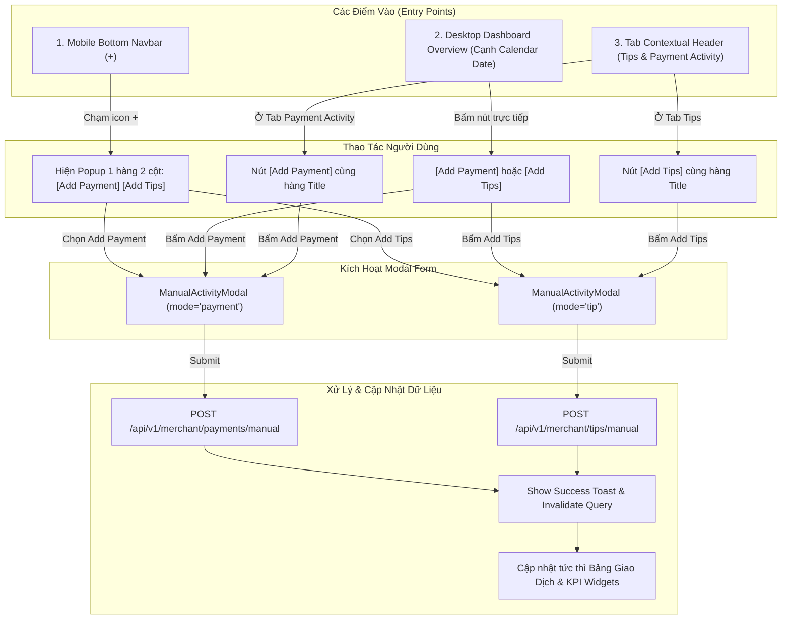

# Engineering Document: US-109 Manual Payment & Tip Activity Full Flow Handoff

> **Document ID**: `manual-payment-activity-us109_engineering_260826_v1.08.26`  
> **Feature**: US-109 Manual Payment & Tip Activity Logging & Dashboard Quick Access  
> **Target Audience**: Frontend Developers, Backend Developers, QA Testers, Product Designers  
> **Created Date**: 2026-08-26  
> **Status**: APPROVED / IMPLEMENTED & VERIFIED  

---

## 1. Giải thích chi tiết các Text trên 2 hình (Modal UI Breakdown & Copy Dictionary)

Hai hình ảnh thể hiện hai chế độ hoạt động của [`ManualActivityModal.tsx`](file:///C:/Users/AD/.gemini/antigravity/worktrees/vlink-nexora-fe/manual_payment_activity_prototype/src/components/dashboard/modals/ManualActivityModal.tsx):
- **Hình 1 (`Add Tip Activity`)**: Modal ghi nhận tiền tip thủ công theo từng nhân viên.
- **Hình 2 (`Add Payment Activity`)**: Modal ghi nhận thanh toán dịch vụ tiệm thủ công/ngoài hệ thống.

```
+----------------------------------------------------------------------------------------------------+
| 1. TIPS LEDGER / PAYMENT REPORTS  <-- Badge xác định ngữ cảnh lưu trữ (Sổ cái tip vs Báo cáo shop) |
| 2. Add Tip Activity / Add Payment Activity <-- Tiêu đề chính (Đã bỏ chữ 'Manual' & bỏ Subtitle)    |
| 3. Info Banner (MỚI BỔ SUNG): Thông báo giao dịch được gắn nhãn [Manual] để đối soát với máy POS    |
| 4. AMOUNT (USD) *: Ô nhập số tiền bắt buộc (> $0.00)                                               |
| 5. PAYMENT METHOD *: Dropdown chọn phương thức (Zelle, Venmo, Cash App, Cash,...)                 |
| 6. TRANSACTION DATE *: Chọn ngày thực hiện giao dịch (chặn ngày tương lai)                         |
| 7. STAFF RECIPIENT *: (CHỈ CÓ Ở TIPS) Chọn nhân viên thụ hưởng tip để tính payroll                |
| 8. NOTE / DESCRIPTION (OPTIONAL): Ghi chú bổ sung context                                          |
| 9. Buttons: [Cancel] & [✓ Save Activity]                                                           |
+----------------------------------------------------------------------------------------------------+
```

### 1.1 Chi tiết từng trường và ý nghĩa nghiệp vụ

| Vị trí trên hình | Text tiếng Anh (Giao diện) | Bản dịch tiếng Việt | Ý nghĩa nghiệp vụ & Quy tắc kỹ thuật |
|---|---|---|---|
| **Top Badge (Tip)** | `TIPS LEDGER` | `SỔ CÁI TIỀN TIP` | Xác định ngữ cảnh lưu trữ vào sổ cái tiền tip cá nhân của nhân viên. |
| **Top Badge (Payment)** | `PAYMENT REPORTS` | `BÁO CÁO THANH TOÁN` | Xác định ngữ cảnh lưu trữ vào báo cáo doanh thu thanh toán của merchant/tiệm. |
| **Title (Tip)** | `Add Tip Activity` | `Ghi nhận tiền tip` | Tiêu đề gọn gàng (đã bỏ chữ `Manual` và bỏ subtitle). |
| **Title (Payment)** | `Add Payment Activity` | `Ghi nhận thanh toán` | Tiêu đề gọn gàng (đã bỏ chữ `Manual` và bỏ subtitle). |
| **Info Banner** | `Transactions created here are marked with a Manual tag to clearly distinguish from automatic POS transactions.` | `Các giao dịch tạo tại đây được gắn nhãn [Manual] để phân biệt rõ ràng với giao dịch POS tự động.` | **Thành phần MỚI bổ sung trong US-109** để phục vụ đối soát kế toán (Xem mục 1.2 bên dưới). |
| **Field 1** | `AMOUNT (USD) *` | `SỐ TIỀN (USD) *` | Bắt buộc (`*`). Prefix `$`, định dạng float `0.01` - `999,999.99`. Báo lỗi nếu $\le 0$. |
| **Field 2** | `PAYMENT METHOD *` | `PHƯƠNG THỨC THANH TOÁN *` | Bắt buộc (`*`). Dropdown gồm: `Zelle`, `Venmo`, `Cash App`, `Apple Cash`, `Crypto`, `Other`. |
| **Field 3** | `TRANSACTION DATE *` | `NGÀY GIAO DỊCH *` | Bắt buộc (`*`). Datepicker mặc định là ngày hiện tại (`YYYY-MM-DD`). Không cho phép chọn ngày tương lai (`max={today}`). |
| **Field 4 (Chỉ có ở Tip)** | `STAFF RECIPIENT *` | `NHÂN VIÊN THỤ HƯỞNG *` | Bắt buộc đối với Tip (`*`). Chọn nhân viên salon nhận tiền tip. |
| **Helper text (Tip)** | `Assigned staff will see this tip in their payroll and personal dashboard.` | `Nhân viên được chỉ định sẽ thấy khoản tip này trong bảng lương và trang tổng quan cá nhân.` | Giải thích luồng dữ liệu tự động đồng bộ sang Personal Dashboard & Payroll. |
| **Field 5** | `NOTE / DESCRIPTION (OPTIONAL)` | `GHI CHÚ / MÔ TẢ (TÙY CHỌN)` | Tùy chọn. Placeholder: `e.g. Customer paid tech directly via salon Venmo QR...`. Giới hạn 255 ký tự. |
| **Button 1** | `Cancel` | `Hủy` | Đóng modal, reset form, không lưu dữ liệu. Hỗ trợ phím `Escape` và click outside. |
| **Button 2** | `✓ Save Activity` | `✓ Lưu hoạt động` | Validate toàn bộ form, submit payload lên API, hiển thị Toast thông báo và cập nhật bảng. |

---

### 1.2 Chú Thích Kỹ Thuật về Info Banner (Bổ Sung Mới trong US-109)

> [!IMPORTANT]
> **Tình trạng trong hệ thống hiện tại (As-Is)**:  
> Trong phiên bản hiện hành của Nexora Touch, hệ thống **CHƯA CÓ** Info banner này vì trước US-109 toàn bộ giao dịch đều được tạo tự động từ máy quẹt thẻ POS hoặc QR code checkout trực tiếp.

#### Mục đích thiết kế & Nghiệp vụ (Design & Business Rationale)
1. **Minh bạch hóa việc gắn thẻ `[Manual]`**: Các giao dịch tạo thủ công từ form này sẽ được API và giao diện gắn nhãn `Manual` (tag màu tím/xám) trên bảng báo cáo doanh thu và bảng tổng hợp tip. Banner giải thích trước để chủ tiệm hiểu đây là tính năng có chủ đích, không phải lỗi hệ thống.
2. **Ngăn ngừa tranh chấp đối soát kế toán cuối ngày**: Phân định rành mạch giữa:
   - Dòng tiền vào tài khoản ngân hàng thực tế qua máy POS (được gateway xử lý tự động).
   - Dòng tiền ghi nhận ngoài luồng (như khách chuyển thẳng Venmo/Zelle cho thợ hoặc trả tiền mặt).
3. **Đặc tả Token & Styling**:
   - `Background`: `bg-nexoraBrandSoft/60` (Light) / `dark:bg-indigo-950/40` (Dark).
   - `Border`: `border border-nexoraBrand/20`.
   - `Typography`: `text-xs text-nexoraBrand dark:text-indigo-300`.
   - `Icon`: `AlertCircle` (`w-4 h-4 text-nexoraBrand shrink-0 mt-0.5`).

---

## 2. Toàn bộ kiến trúc luồng truy cập (System Flow Architecture)

Có **3 điểm chạm (Entry Points)** trong ứng dụng cho phép mở luồng ghi nhận hoạt động thủ công:



---

## 3. Frontend Implementation Specifications

### 3.1 Danh sách Components & Files

| Component / File | Trạng thái | Nhiệm vụ kỹ thuật |
|---|---|---|
| [`ManualActivityModal.tsx`](file:///C:/Users/AD/.gemini/antigravity/worktrees/vlink-nexora-fe/manual_payment_activity_prototype/src/components/dashboard/modals/ManualActivityModal.tsx) | `NEW / MODIFIED` | Modal form chung cho cả 2 mode `payment` và `tip`, quản lý validation, animation và responsive. |
| [`manualActivityUtils.ts`](file:///C:/Users/AD/.gemini/antigravity/worktrees/vlink-nexora-fe/manual_payment_activity_prototype/src/components/dashboard/modals/manualActivityUtils.ts) | `NEW` | Thuật toán validate `amount`, `paymentMethod`, `transactionDate`, `staffRecipient` và mapping DTO. |
| [`MobileBottomNav.tsx`](file:///C:/Users/AD/.gemini/antigravity/worktrees/vlink-nexora-fe/manual_payment_activity_prototype/src/components/dashboard/layout/MobileBottomNav.tsx) | `MODIFIED` | Nút `+` trung tâm nâng cao, bật popover 1 hàng 2 cột `Add Payment` & `Add Tips` text-only. |
| [`Overview.desktop.tsx`](file:///C:/Users/AD/.gemini/antigravity/worktrees/vlink-nexora-fe/manual_payment_activity_prototype/src/components/dashboard/overview/Overview.desktop.tsx) | `MODIFIED` | Đặt 2 nút `Add Payment` và `Add Tips` ngay cạnh bộ lọc Calendar Date ở hàng header tổng quan. |
| [`ReportsView.tsx`](file:///C:/Users/AD/.gemini/antigravity/worktrees/vlink-nexora-fe/manual_payment_activity_prototype/src/components/dashboard/views/ReportsView.tsx) | `MODIFIED` | Đưa nút `Add Tips` lên cùng một hàng với tiêu đề `Transactions` trên mobile, bấm mở modal tip. |
| [`ReportsDirectPaymentsTab.tsx`](file:///C:/Users/AD/.gemini/antigravity/worktrees/vlink-nexora-fe/manual_payment_activity_prototype/src/components/dashboard/views/ReportsDirectPaymentsTab.tsx) | `MODIFIED` | Đưa nút `Add Payment` lên cùng hàng với tiêu đề `Payment Activity`, bấm mở modal payment. |

### 3.2 Modal Props Interface & Data Types

```typescript
export interface ManualActivityModalProps {
  open: boolean
  onClose: () => void
  onSave: (activity: ManualActivityPayload) => void
  mode?: 'payment' | 'tip'
  staffList?: Array<{ id?: string; fullName?: string; nickname?: string }>
  touchpoints?: Array<{ id?: string; name?: string }>
}

export interface ManualActivityPayload {
  amount: number
  paymentMethod: string
  dateTime: string // Format: YYYY-MM-DD HH:mm
  staffName?: string
  staffId?: string
  touchpoint?: string
  note?: string
  isManual: boolean
}
```

---

## 4. Backend API Specifications & Data Contracts

### 4.1 Tạo giao dịch Thanh toán thủ công (Manual Payment)

- **Endpoint**: `POST /api/v1/merchant/payments/manual`
- **Headers**:
  - `Authorization: Bearer <access_token>`
  - `Content-Type: application/json`
- **Request Body**:
```json
{
  "amount": 150.00,
  "paymentMethod": "Zelle",
  "transactionDate": "2026-08-26T10:30:00Z",
  "touchpointId": "tp_123456",
  "note": "Customer paid directly via owner Zelle QR",
  "isManual": true
}
```
- **Response** (`201 Created`):
```json
{
  "success": true,
  "data": {
    "id": "pay_manual_88921a",
    "amount": 150.00,
    "paymentMethod": "Zelle",
    "status": "Confirmed",
    "type": "DirectPayment",
    "isManual": true,
    "createdAt": "2026-08-26T10:30:00Z"
  }
}
```

### 4.2 Tạo giao dịch Tiền Tip thủ công (Manual Tip)

- **Endpoint**: `POST /api/v1/merchant/tips/manual`
- **Headers**:
  - `Authorization: Bearer <access_token>`
  - `Content-Type: application/json`
- **Request Body**:
```json
{
  "amount": 25.00,
  "paymentMethod": "Venmo",
  "transactionDate": "2026-08-26T11:15:00Z",
  "staffId": "staff_godlai_01",
  "note": "Customer left cash gratuity on station #3",
  "isManual": true
}
```
- **Response** (`201 Created`):
```json
{
  "success": true,
  "data": {
    "id": "tip_manual_7712ba",
    "amount": 25.00,
    "paymentMethod": "Venmo",
    "staffId": "staff_godlai_01",
    "staffName": "GodLai",
    "status": "Completed",
    "isManual": true,
    "createdAt": "2026-08-26T11:15:00Z"
  }
}
```

---

## 5. Danh mục Bằng chứng Kiểm thử Thực tế (QA Evidence Map)

Thư mục lưu trữ bằng chứng: [`C:\Users\AD\Downloads\us109-manual-payment-activity-prototype\evidence\`](file:///C:/Users/AD/Downloads/us109-manual-payment-activity-prototype/evidence)

| File Ảnh Evidence | Thiết bị / Viewport | Luồng kiểm thử đã hoàn tất |
|---|---|---|
| [`09_real_nexora_dashboard_overview_with_widget.png`](file:///C:/Users/AD/Downloads/us109-manual-payment-activity-prototype/evidence/09_real_nexora_dashboard_overview_with_widget.png) | Desktop (1440px) | Vị trí 2 nút `Add Payment` và `Add Tips` cạnh ô Calendar Date. |
| [`10_real_nexora_dashboard_quick_payment_open.png`](file:///C:/Users/AD/Downloads/us109-manual-payment-activity-prototype/evidence/10_real_nexora_dashboard_quick_payment_open.png) | Desktop (1440px) | Mở modal Add Payment Activity từ Desktop Overview. |
| [`12_real_nexora_dashboard_mobile_widget.png`](file:///C:/Users/AD/Downloads/us109-manual-payment-activity-prototype/evidence/12_real_nexora_dashboard_mobile_widget.png) | Mobile (375px) | Giao diện First View trên Mobile hiển thị 2 QR code và nút `+` Navbar. |
| [`13_real_nexora_dashboard_mobile_tip_modal.png`](file:///C:/Users/AD/Downloads/us109-manual-payment-activity-prototype/evidence/13_real_nexora_dashboard_mobile_tip_modal.png) | Mobile (375px) | Menu Popover 1 hàng 2 cột (`Add Payment`, `Add Tips`) bật lên từ nút `+`. |
| [`15_real_nexora_dashboard_mobile_tips_tab_header.png`](file:///C:/Users/AD/Downloads/us109-manual-payment-activity-prototype/evidence/15_real_nexora_dashboard_mobile_tips_tab_header.png) | Mobile (375px) | Tab Tips: Tiêu đề `Transactions` và nút `Add Tips` nằm chung 1 hàng. |
| [`16_real_nexora_dashboard_mobile_tips_modal_open.png`](file:///C:/Users/AD/Downloads/us109-manual-payment-activity-prototype/evidence/16_real_nexora_dashboard_mobile_tips_modal_open.png) | Mobile (375px) | Bấm `Add Tips` mở trực tiếp modal `TIPS LEDGER - Add Tip Activity`. |
| [`17_real_nexora_dashboard_mobile_payment_tab_header.png`](file:///C:/Users/AD/Downloads/us109-manual-payment-activity-prototype/evidence/17_real_nexora_dashboard_mobile_payment_tab_header.png) | Mobile (375px) | Tab Payment Activity: Tiêu đề và nút `Add Payment` nằm chung 1 hàng. |
| [`18_real_nexora_dashboard_mobile_payment_modal_open.png`](file:///C:/Users/AD/Downloads/us109-manual-payment-activity-prototype/evidence/18_real_nexora_dashboard_mobile_payment_modal_open.png) | Mobile (375px) | Bấm `Add Payment` mở trực tiếp modal `PAYMENT REPORTS - Add Payment Activity`. |
