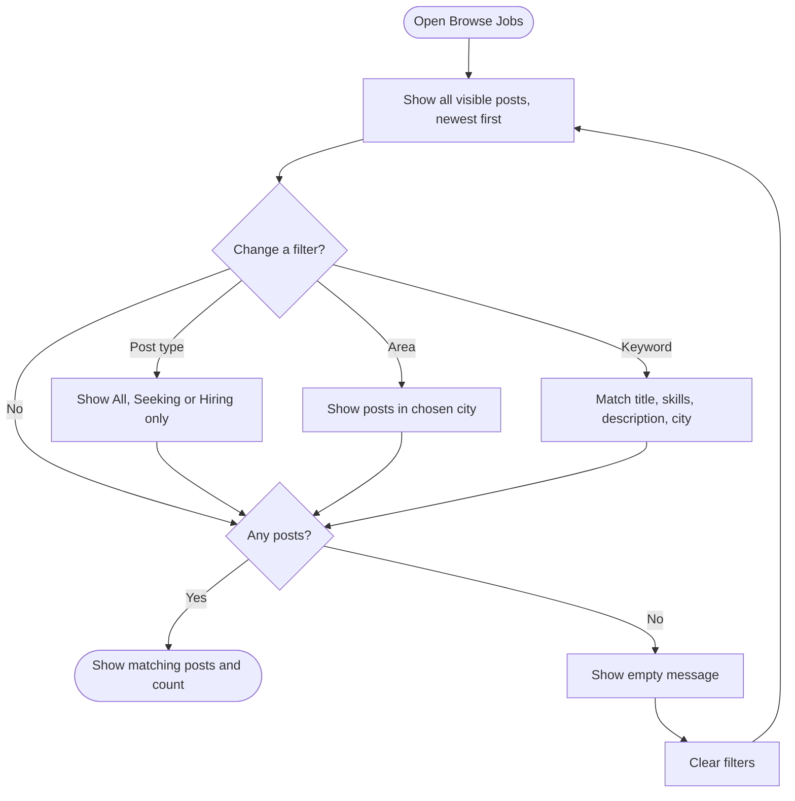
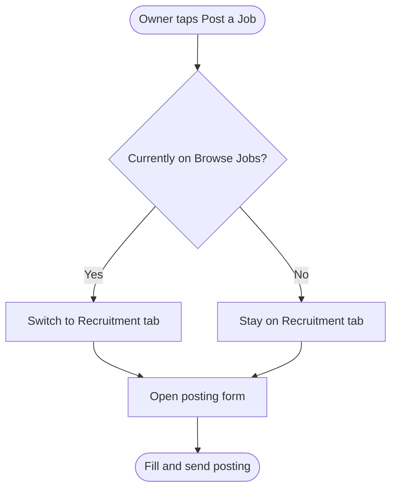
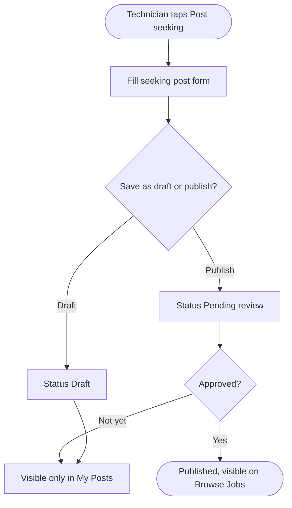
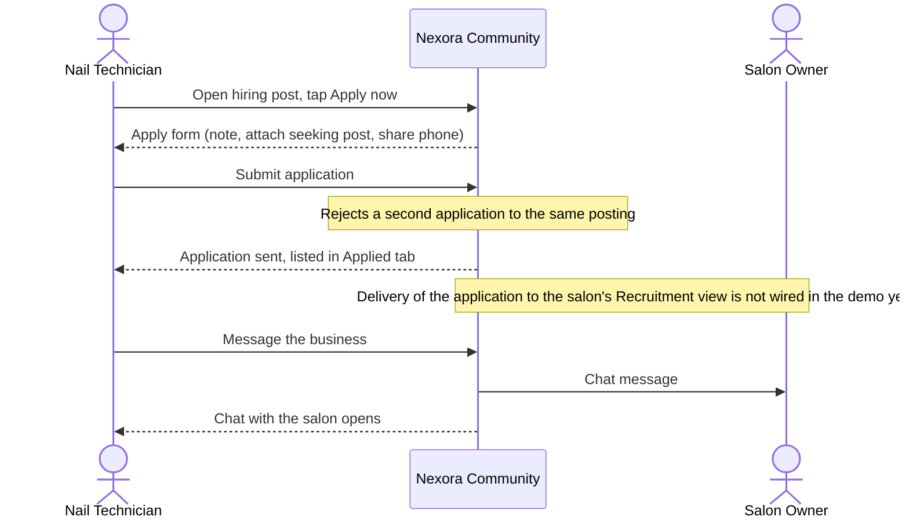
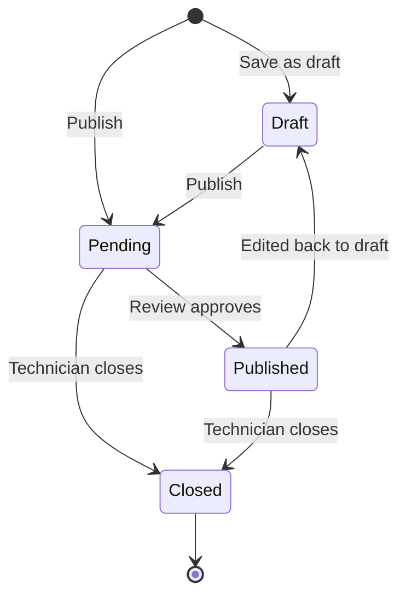

## Community Jobs — Browse Jobs (Owner & Technician)

**Last Updated:** 2026-10-06
**Audience:** Salon Owner, Nail Technician, Community Member (Guest), Support Agent, QA
**Status:** Draft

---

### Overview

> Browse Jobs is the shared job board inside Community › Jobs. It shows, in one list, salons that are hiring and nail technicians who are looking for work, with a simple filter bar (post type, area, keyword). Technicians use it to find salons and apply; salon owners use it to see the local market — which salons are hiring and which technicians are available — next to their own Recruitment tab. It gives both sides the same view of the market without leaving Nexora Touch.

> ⚠️ **Demo status.** The board currently runs on sample data inside the app (shown with a "simulated" notice). Posts, applications and filters work on screen but are not yet stored in a real backend; refreshing the page resets them.

---

### Key Concepts

| Term | Definition |
| :--- | :--- |
| Browse Jobs | The shared board listing all visible job posts from salons and technicians. |
| Hiring post | A post published by a salon owner from Recruitment (POS or Community) advertising an open position. |
| Seeking post | A post published by a nail technician saying they are available for work. |
| Post type filter | The pills **All / Seeking work / Hiring** that decide which kinds of posts appear. |
| Area | The city a post is located in. The area list is built from the cities that appear in current posts. |
| Recruitment tab | The salon owner's own posting manager (create, edit, close job postings). Owners see it next to Browse Jobs. |
| Anonymous technician | The name shown on a seeking post when the technician chose not to show their full name. |
| Simulated notice | The banner telling users the board uses demo data. |

---

### User Roles

| Role | Responsibilities in this Feature |
| :--- | :--- |
| Salon Owner | Browses the market (hiring + seeking posts) in **Browse Jobs**; creates and manages their own hiring posts in **Recruitment** via **Post a Job**. Cannot apply or message from Browse Jobs. |
| Nail Technician | Browses salons that are hiring, opens details, applies or messages the salon; publishes their own seeking posts via **Post seeking**; tracks posts in **My Posts** and applications in **Applied**. |
| Community Member (Guest) | Browses and filters posts read-only; is prompted to switch to a technician account to apply or message. Cannot post. |

---

### End-to-End Workflows

#### Workflow: Browse and filter the job board

**Primary Actor:** Any signed-in member or guest
**Trigger:** Member opens Community › Jobs › Browse Jobs
**Outcome:** Member sees the posts that match the chosen post type, area and keyword

**User Stories:**
- As a Nail Technician, I want to see salons that are hiring and other technicians' seeking posts in one list, so that I understand the market in my area.
- As a Salon Owner, I want to see which technicians are looking for work and which salons are hiring, so that I can plan my own hiring.
- As any member, I want to narrow the list by post type, area and keyword, so that I only see relevant posts.
- As any member, when nothing matches my filters, I want a clear empty message and a one-tap way to clear filters, so that I can start over.

| Step | Who | Action | System Response | Notes |
| :--- | :--- | :--- | :--- | :--- |
| 1 | Member | Opens Browse Jobs | Shows all visible hiring and seeking posts, newest first, with a "{n} matching posts" count | Owners reach it from the **Browse Jobs** tab next to Recruitment |
| 2 | Member | Taps a post type pill (All / Seeking work / Hiring) | List shows only that kind of post | Default is **All** |
| 3 | Member | Opens the area dropdown and picks a city | List shows only posts in that city | "All areas" removes the area filter |
| 4 | Member | Types a keyword | List narrows after a short pause while typing | Matches title, skills, description and city |
| 5 | Member | Taps **Clear filters** (shown only when a filter is active) | Resets type to All, area to All areas, keyword to empty | |
| 6 | Member | — | If nothing matches: "No posts match your filters" with a hint to change type, area or keyword | |

---

#### Workflow: Salon Owner posts a job from Community

**Primary Actor:** Salon Owner
**Trigger:** Owner taps **Post a Job** on the right of the Recruitment / Browse Jobs tab row
**Outcome:** The posting form opens in the Recruitment tab

**User Stories:**
- As a Salon Owner browsing the market, I want to post a job in one tap, so that I can act right after seeing what other salons offer.
- As a Salon Owner, I want a shortcut to the full POS recruitment screen, so that I can manage postings there if I prefer.

| Step | Who | Action | System Response | Notes |
| :--- | :--- | :--- | :--- | :--- |
| 1 | Owner | Taps **Post a Job** (from either tab) | Switches to the Recruitment tab and opens the posting form (Advanced compose) directly | No "Choose how to post" step since 2026-10-06; switching tabs manually later does not reopen the form |
| 2 | Owner | Completes the form | Posting is created in Recruitment | Posting creation itself is covered by the Jobs documentation |
| 3 | Owner | (Optional) Taps **Open in POS** | Opens POS › Staff › Recruitment | Same postings, POS view |

---

#### Workflow: Technician posts a seeking post

**Primary Actor:** Nail Technician
**Trigger:** Technician taps **Post seeking** on the right of the Browse Jobs / My Posts / Applied tab row
**Outcome:** A seeking post is saved and appears in **My Posts**

**User Stories:**
- As a Nail Technician, I want to post that I'm looking for work from the board, so that salons can find me.
- As a Nail Technician, I want to choose whether my full name is shown, so that I can stay anonymous to salons (including my current one).
- As a Nail Technician, I want my phone number never shown on the public board, so that I control who contacts me.

| Step | Who | Action | System Response | Notes |
| :--- | :--- | :--- | :--- | :--- |
| 1 | Technician | Taps **Post seeking** | Opens the "Post that you're seeking work" form | Not shown to owners or guests |
| 2 | Technician | Fills headline, experience, skills, work types, area, pay, availability and visibility options | Validates required fields | Visibility: show full name, show phone |
| 3 | Technician | Saves as draft or publishes | Draft → saved as **Draft**; Publish → saved as **Pending** (awaiting review) | See Business Rule 5 |
| 4 | Technician | Opens **My Posts** | Sees the post with its status; can edit or close it | |

---

#### Workflow: Technician applies to or messages a hiring post

**Primary Actor:** Nail Technician
**Trigger:** Technician taps a hiring post card in Browse Jobs
**Outcome:** An application is sent to the salon, or a chat with the salon opens

**User Stories:**
- As a Nail Technician, I want to see full job details before applying, so that I know the pay, schedule and skills required.
- As a Nail Technician, I want to apply with a note and optionally attach my seeking post and share my phone, so that the salon has what it needs to contact me.
- As a Nail Technician, I want to be stopped from applying twice to the same job, so that I don't send duplicates.
- As a Salon Owner or Guest, when I try to apply or message, I want to be told why I can't, so that I'm not confused.

| Step | Who | Action | System Response | Notes |
| :--- | :--- | :--- | :--- | :--- |
| 1 | Technician | Taps a hiring post | Opens Job details with **Message salon** and **Apply now** | Already-applied posts are marked on the card |
| 2 | Technician | Taps **Apply now**, writes a note, optionally attaches a seeking post and ticks "Share my phone number" | Submits the application; shows "Application sent" | Phone is shared with that salon only if ticked |
| 3 | Technician | Taps **View applied jobs** or **Message the business** | Opens the Applied tab or a chat with the salon | |
| 4 | Owner / Guest | Taps Apply or Message | Action is blocked with an explanation | Owner: "Applying and messaging are for technician accounts…"; Guest: prompted to switch to a technician account |

---

### System Configuration & Administration

- As a Product/Ops stakeholder, I want seeking posts to pass a review step before they appear on Browse Jobs, so that inappropriate posts don't reach salons. *(The review step is not yet built in the demo — see Business Rule 5.)*
- As a Product/Ops stakeholder, I want the area list to come from real post locations, so that new cities appear without configuration. *(Current behavior.)*

---

### State Lifecycle

**Seeking post (technician)**

| Current Status | Trigger | New Status | Notes |
| :--- | :--- | :--- | :--- |
| (none) | Technician saves as draft | Draft | Only in My Posts |
| (none) / Draft | Technician publishes | Pending | Awaiting review; only in My Posts |
| Pending | Review approves | Published | Now visible on Browse Jobs |
| Draft / Published | Technician edits and saves as draft | Draft | Leaves Browse Jobs |
| Pending / Published | Technician closes the post | Closed | Leaves Browse Jobs; stays in My Posts with "Closed" |

**Visibility on Browse Jobs by status**

| Status | Hiring post | Seeking post |
| :--- | :--- | :--- |
| Draft | Hidden | Hidden |
| Pending | Shown | Hidden |
| Published | Shown | Shown |
| Closed / Filled | Hidden | Hidden |

---

### Business Rules

- **Rule 1:** Browse Jobs is the same board for technicians, owners and guests; only the actions differ by role.
- **Rule 2:** Only technicians can apply to or message a hiring post from Browse Jobs. Owners and guests see an explanation instead.
- **Rule 3:** The **+ Post** button depends on role: owners get **Post a Job** (goes to Recruitment), technicians get **Post seeking**, guests get no button.
- **Rule 4:** A seeking post on the board never shows the technician's phone number, status or post code. It shows the technician's name only if they chose "show full name"; otherwise it shows **Anonymous technician**.
- **Rule 5:** A seeking post appears on Browse Jobs only when it is **Published**. Publishing from the form puts it in **Pending** (awaiting review) first. Hiring posts are shown when Pending or Published.
- **Rule 6:** A technician can apply to the same hiring post only once.
- **Rule 7:** Sharing a phone number with a salon happens only when the technician ticks "Share my phone number" in the apply form, and only with that salon.
- **Rule 8:** The list is sorted newest first; post type, area and keyword filters combine (all must match).
- **Rule 9 (demo-only):** Data is sample data held in the browser session and resets on refresh.

> 💡 **Important:** No step in this feature moves money. Rules 4 and 7 protect technicians' personal contact details.

---

### Edge Cases & Exception Handling

| Scenario | What Happens | Who Resolves It |
| :--- | :--- | :--- |
| No posts match the filters | "No posts match your filters" with a hint; **Clear filters** resets everything | Member |
| The board fails to load | "Could not load job posts" with **Try again** | Member (retry) / Support if persistent |
| Technician applies twice to the same posting | Second application is rejected: "You already applied to this posting." | Auto |
| Owner taps Apply or Message on a hiring post | Blocked with the owner hint pointing to the Recruitment tab | N/A — by design |
| Guest taps Apply or Message | Blocked; prompted to switch to a technician account | Guest |
| Technician publishes a seeking post but doesn't see it on Browse Jobs | Post is **Pending** review; it shows in My Posts only | Ops (review) — **in the demo there is no review step yet, so it stays Pending** |
| Technician hid their full name | Card shows "Anonymous technician" | N/A — by design |
| Owner wants to contact a technician from a seeking post | Not available from Browse Jobs yet (seeking cards have no detail or message action) | Product — open gap |

---

### Frequently Asked Questions

**Q: Why can't a salon owner apply or message from Browse Jobs?**
A: Applying and messaging on hiring posts are technician actions. Owners use Browse Jobs to see the market and manage their own postings in the Recruitment tab.

**Q: I published a seeking post — why isn't it on the board?**
A: Published seeking posts first go to **Pending** review and only appear on Browse Jobs once approved. Until then they are visible in your **My Posts** tab. In the current demo the review step isn't built, so new seeking posts stay Pending.

**Q: Will salons see my phone number?**
A: Not on the board. A salon only receives your phone number if you tick "Share my phone number" when applying to that salon.

**Q: Why does a seeking post say "Anonymous technician"?**
A: The technician chose not to show their full name on public posts.

**Q: Where does the area list come from?**
A: From the cities of the posts currently on the board, so new cities appear automatically.

**Q: Does "Post a Job" from Community create a different posting from POS?**
A: No. It opens the same Recruitment flow; postings are the same whether managed from Community or POS (use **Open in POS** to switch).

---

### Related Features

- **Community Jobs (overview)** — [community-jobs.md](./community-jobs.md). Note: that document describes the earlier prototype board; Browse Jobs above reflects the current owner/technician flow.
- **Recruitment (POS › Staff › Recruitment)** — where salon owners create, edit and close hiring postings.
- **Community Chat** — used when a technician taps **Message salon** / **Message the business**.
