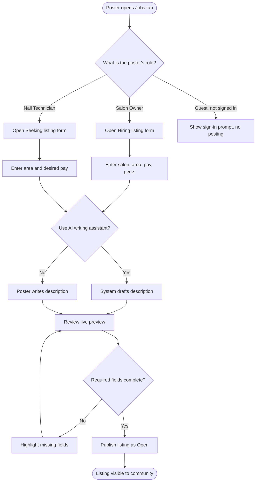
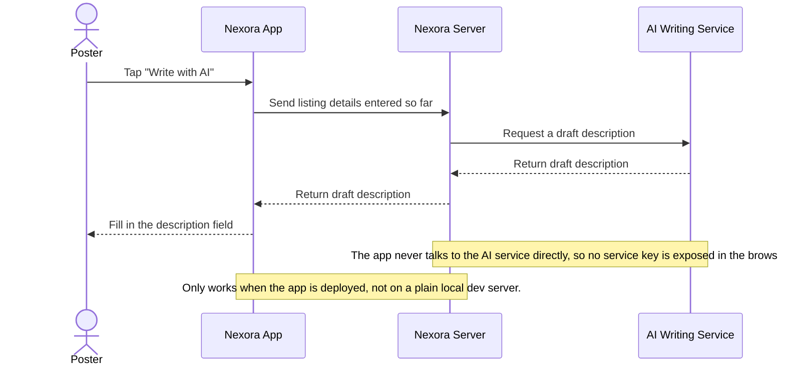
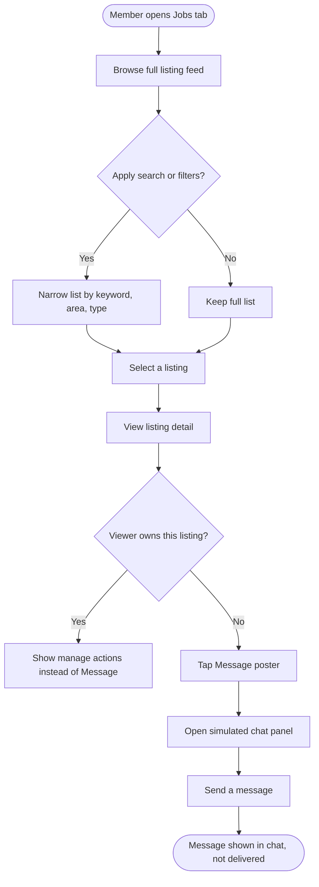
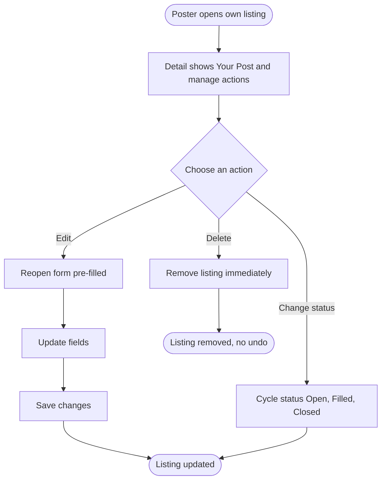
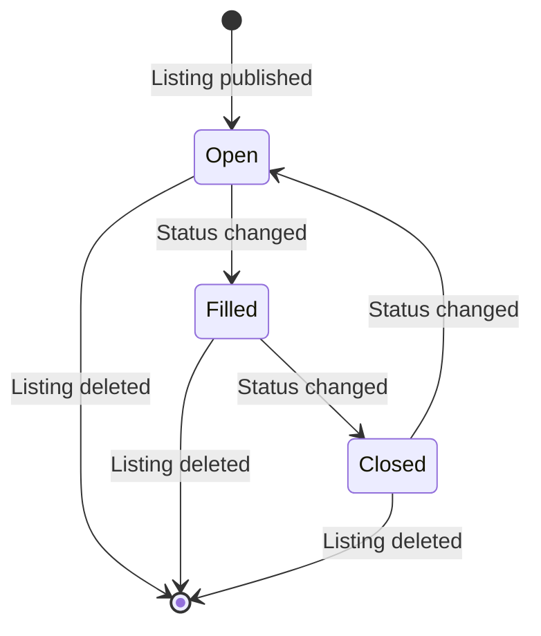

## Community Jobs

**Last Updated:** 2026-09-22
**Audience:** Salon Owner, Nail Technician, Community Member (Guest)
**Status:** Draft

---

### Overview

> Community Jobs is a jobs board built into Nexora Touch's Community area, where salon owners can advertise open positions and nail technicians can advertise that they're available to work — without leaving the app. Members can search and filter listings, view full details, and message a poster directly to follow up. It exists today as a working, clickable prototype used to gather feedback; it is not yet connected to a real database or to real messaging (see the notice below).

> ⚠️ **Prototype status.** Everything described in this document works on screen today, but nothing is saved anywhere yet: posting, editing, deleting, changing status, and messaging all happen only in the current browser tab and are lost on refresh. See [Related Features](#related-features) for the engineering hand-off documents.

> 🔭 **What's planned for the real version (decided 2026-09-21, not yet built).** Nexora's backend will not store job posts itself. It will call a real, already-live nail-industry job board (Nailhub.ai) on the poster's behalf, and keep only a small internal record of who really owns each post — needed because that outside service can't tell individual Nexora users apart. In practice this means: new posts will automatically go through that service's existing content-approval queue before appearing (shown as "Pending Approval"); real messaging will connect to Nexora's actual Community Chat; and once a listing is Closed it will be final, with no reopening — relisting will mean creating a new post (today's prototype cycles Closed back to Open; the real version won't). The "Write with AI" description helper is marked optional for this first real release, not guaranteed to ship in it. Three operational questions are still open with the outside provider's team (their production address, request-volume limits, and whether one shared account can post both listing types) before backend work can start.

---

### Key Concepts

| Term | Definition |
| :--- | :--- |
| Job Post (Listing) | A single entry on the Jobs board — either a salon looking to hire or a technician looking for work. |
| Hiring Listing (`postKind: hiring`) | A listing created by a Salon Owner advertising an open position at their salon. |
| Seeking Listing (`postKind: seeking`) | A listing created by a Nail Technician advertising that they are available to work. |
| Urgent | An optional flag a poster can add to make a listing stand out with a highlighted badge. |
| My Posts | The listings a signed-in poster has created themselves; only they can edit, change the status of, or delete them. |
| Post Status | Whether a listing is Open, Filled, or Closed. |
| AI Description Assistant ("Write with AI") | An optional helper that drafts the listing's description text from the details already entered. |
| Sample Content | A label shown throughout Jobs indicating today's build is a demonstration prototype, not live data. |

---

### User Roles

| Role | Responsibilities in this Feature |
| :--- | :--- |
| Salon Owner | Publishes Hiring listings for their salon; manages (edits, changes status of, deletes) only their own listings; can message technicians about their Seeking listings. |
| Nail Technician | Publishes Seeking listings; manages only their own listings; can message salon owners about their Hiring listings. |
| Community Member (Guest) | Can browse, search, view listing details, and message a poster; cannot publish a listing. |

---

### End-to-End Workflows

#### Workflow: Create a Job Post

**Primary Actor:** Salon Owner or Nail Technician
**Trigger:** Poster taps "Post a hiring listing" or "Post a job-seeking listing" from the Jobs tab
**Outcome:** A new listing appears at the top of the board with status Open

**User Stories:**
- As a Salon Owner, I want to post a hiring listing for my salon, so that technicians looking for work can find and contact me.
- As a Nail Technician, I want to post a listing that I'm looking for work, so that salon owners can find and contact me.
- As a poster, I want the system to draft a description for me from the details I've already entered, so that I don't have to write marketing copy myself.
- As a poster, I want to mark my listing "Urgent," so that it stands out to people browsing.
- As a Salon Owner, if I haven't entered my salon name yet, I want to be told clearly, so that I understand why I can't submit or use the AI assistant.

| Step | Who | Action | System Response | Notes |
| :--- | :--- | :--- | :--- | :--- |
| 1 | Poster | Opens the posting form from the Jobs tab | Shows a form pre-set to the poster's allowed listing type | Listing type (Hiring vs. Seeking) is fixed by the poster's role and cannot be changed |
| 2 | Poster | Fills in salon name (owners only), area, employment type, and pay | Required fields are checked as the poster leaves each one | Salon name is required only for Hiring listings; pay is optional free text |
| 3 | Poster (owner) | Optionally selects perks the salon offers (e.g., flexible schedule, extra training, housing support) | Selected perks appear as chips | Optional, Hiring listings only |
| 4 | Poster | Optionally picks a photo from a preset gallery or uploads their own | Preview updates immediately | See Business Rules on photo handling |
| 5 | Poster | Optionally taps "Write with AI" | System drafts a description in the right voice and fills the message field | Requires salon name for Hiring listings; see sequence diagram below |
| 6 | Poster | Reviews the live preview card, optionally checks "Urgent" | Preview card updates to match | |
| 7 | Poster | Submits the form | New listing appears at the top of the board with status Open; form closes | |

**AI Description Assistant — how the draft is produced:**

---

#### Workflow: Browse and Contact a Poster

**Primary Actor:** Any Community Member (including Guests)
**Trigger:** Member opens the Jobs tab
**Outcome:** Member finds a relevant listing and starts a conversation with its poster

**User Stories:**
- As a Community Member, I want to search and filter listings by keyword, area, and type, so that I can find relevant opportunities quickly.
- As a Community Member, I want to see the full details of a listing, so that I can decide whether to reach out.
- As a Community Member, I want to message the person who posted a listing, so that I can ask about it directly.
- As a Community Member, if no listings match my filters, I want a clear empty state, so that I know to adjust my search.

| Step | Who | Action | System Response | Notes |
| :--- | :--- | :--- | :--- | :--- |
| 1 | Member | Opens the Jobs tab | Shows only listings that are still Open ("Duyệt tin") | Filled/Closed listings are **not** shown in the feed. They appear only in "Bài của tôi" (the poster's own listings) and "Đã liên hệ" (listings the member has messaged), with a status label. Changed 2026-09-24, see Rule 4 |
| 2 | Member | Types a keyword and/or picks an area and a listing-type filter | List narrows to matching listings instantly | Search matches title, salon name, area, and description text |
| 3 | Member | Taps a listing card | Opens a detail panel with the full description, pay, schedule, and perks | |
| 4 | Member | Taps "Message [poster's name]" | Opens a chat panel with the poster | Chat is simulated in this prototype — see Business Rules |
| 5 | Member | Types and sends a message | Message appears in the conversation | Not delivered to the poster or saved anywhere in this prototype |

---

#### Workflow: Manage My Posts

**Primary Actor:** The listing's original poster
**Trigger:** Poster opens one of their own listings
**Outcome:** Listing is updated, its status changes, or it is removed

**User Stories:**
- As a poster, I want to edit my listing, so that I can correct or update its details.
- As a poster, I want to change my listing's status, so that others know whether the position is still open.
- As a poster, I want to delete my listing, so that it's no longer visible once I no longer need it.
- As a poster, I want the listing type (Hiring/Seeking) to stay fixed when I edit, so that it always matches my role.

| Step | Who | Action | System Response | Notes |
| :--- | :--- | :--- | :--- | :--- |
| 1 | Poster | Opens one of their own listings | Detail panel shows a "Your post" tag and Edit / Change Status / Delete actions instead of Message | Only the original poster sees these controls |
| 2 | Poster | Taps "Edit" | Posting form reopens pre-filled with the listing's current details | Listing type cannot be changed |
| 3 | Poster | Updates fields and saves | Listing updates in place | |
| 4 | Poster | Taps "Change status" | Status cycles Open → Filled → Closed → back to Open | Status wording adapts to listing type (e.g., "Position filled" vs. "Job found") |
| 5 | Poster | Taps "Delete" | Listing is removed from the board immediately | No confirmation step or undo in this prototype |

---

### System Configuration & Administration

> No admin configuration screen exists yet for this feature. Two lists that would normally be business-configurable are currently fixed in the product itself and can only be changed by engineering:

- As a Product/Ops stakeholder, I want the list of areas (currently limited to Houston TX, Dallas TX, and Austin TX) to be configurable, so that the board can expand to new markets without an engineering change.
- As a Product/Ops stakeholder, I want the list of salon-offered perks (currently a fixed set: flexible schedule, extra training, housing support) to be configurable, so that salons can describe support that isn't on the preset list.

---

### State Lifecycle

| Current Status | Trigger | New Status | Notes |
| :--- | :--- | :--- | :--- |
| (none) | Poster publishes a listing | Open | Shown as "Actively hiring" or "Actively job-seeking" depending on listing type |
| Open | Poster taps "Change status" | Filled | Shown as "Position filled" (Hiring) or "Job found" (Seeking) |
| Filled | Poster taps "Change status" | Closed | Shown as "Closed" for both listing types |
| Closed | Poster taps "Change status" | Open | Status cycles back to Open rather than staying closed |
| Any | Poster taps "Delete" | (removed) | Immediate, no undo |

> **Note:** The Closed → Open cycle above is prototype-only behavior. In the planned real version, Closed is final — there is no reopening a closed listing; relisting means creating a new post.

---

### Business Rules

- **Rule 1:** Only two account types may publish a listing — Salon Owner accounts always post Hiring listings, and Nail Technician accounts always post Seeking listings. The listing type is locked to the account type and cannot be changed, even while editing.
- **Rule 2:** A Guest or a visitor who isn't signed in as an owner or technician may browse and view listings but cannot publish one.
- **Rule 3:** A salon name is required to publish a Hiring listing, so job seekers know which salon is hiring. No other field is mandatory.
- **Rule 4 (changed 2026-09-24):** Filled and Closed listings are **hidden from the browse feed** ("Duyệt tin"). They stay visible, with their status label, in the poster's "Bài của tôi" and in "Đã liên hệ" for members who messaged them. The feed's status filter is removed because the feed only contains Open listings. *(Previously: "Filled and Closed listings remain visible to everyone browsing — they are not hidden, only their status label changes." Reversed by the product owner after the 2026-09-24 layout review, see `docs/01-product/community-jobs-ui_product_260924_v1.09.24.md`.)*
- **Rule 5:** Only the original poster can edit, change the status of, or delete their own listing.
- **Rule 6:** Marking a listing "Urgent" adds a highlighted badge but does not change its position in the list, its visibility, or when it disappears.
- **Rule 7:** The pay field is free text and optional. It is only shown as a highlight badge on the listing card when it names a weekly rate or says "negotiable" — other formats (e.g., hourly rate, commission split) are shown only inside the full detail view, to avoid a confusing partial number on the card.
- **Rule 8:** Illustrative photos come from a fixed gallery of 6 salon/nail images, or a poster can upload their own image; an uploaded image is only kept for the current browser session (see Rule 9).
- **Rule 9 (prototype-only):** All data in this feature — listings created, edits, status changes, and chat messages — exists only in the current browser session. Reloading the page resets Jobs back to its 4 starting example listings. Nothing is saved to a real database yet.
- **Rule 10 (prototype-only):** The in-listing chat is a local simulation for demonstration: it starts with two pre-written example messages and appends anything the viewer types, but it never delivers messages to the real poster and is not connected to Nexora's real Community chat system.
- **Rule 11 (prototype-only):** Every listing card and detail view carries a "Sample content" label so viewers know today's data is illustrative, not live.

> 💡 **Important:** No step in this feature moves money — there is no payment, deposit, or fee tied to posting, browsing, or messaging.

---

### Edge Cases & Exception Handling

| Scenario | What Happens | Who Resolves It |
| :--- | :--- | :--- |
| Owner tries to publish a Hiring listing without entering a salon name | Submission is blocked; the Salon Name field is highlighted with an inline message | Poster (fills in the field) |
| Owner tries to use "Write with AI" before entering a salon name | Assistant shows an error asking for the salon name first | Poster |
| "Write with AI" is used outside a deployed environment (e.g., a plain local dev server) | Assistant shows an error that AI is unavailable in this environment | Engineering (needs a production-style deployment) |
| No listings match the current search or filters | Board shows an empty-state message suggesting the viewer adjust the filters | Community Member |
| A non-owner tries to manage someone else's listing | Manage actions (Edit/Status/Delete) are not shown; only "Message" is available | N/A — prevented by the interface |
| Poster deletes a listing whose chat panel is open | Listing and its chat panel both close immediately | Poster (no undo available) |
| Page is reloaded or revisited later | All created, edited, or deleted listings and chat messages are lost; the 4 example listings reappear | N/A — expected in this prototype |

---

### Frequently Asked Questions

**Q: If a technician sends a message about a listing, does the salon owner actually receive it?**
A: Not yet. In this prototype, messaging is simulated locally in the viewer's own browser and nothing is delivered to the other side. Real delivery is planned to reuse Nexora's existing Community chat system (see Related Features) once the real version is built.

**Q: Can a salon owner post a "looking for work" listing, or can a technician post a "hiring" listing?**
A: No. The listing type is locked to the signed-in account type — Salon Owner accounts always post Hiring listings, Nail Technician accounts always post Seeking listings.

**Q: Is a deleted or closed listing gone for good?**
A: A deleted listing is removed immediately with no recovery option. A closed listing is not deleted. It leaves the browse feed but stays in the poster's "Bài của tôi" (and in "Đã liên hệ" for members who messaged it) with a "Closed" label, and can be reopened by cycling its status again.

**Q: Will listings and messages still be there tomorrow?**
A: Not in the current prototype. Nothing is saved to a database yet; refreshing the page resets everything back to the 4 starting example listings.

**Q: Why doesn't my hourly rate or commission-split pay show on the listing card?**
A: The card only highlights pay written as a weekly rate or "negotiable," to avoid showing a number that reads confusingly out of context. Any pay format is still shown in full inside the listing's detail view.

**Q: Has a decision been made about how the real version will work?**
A: Yes, as of 2026-09-21. Rather than building and moderating its own job-posting storage, Nexora will integrate with an existing, already-live nail-industry job board (Nailhub.ai) and broker requests to it. Backend implementation has not started; a few operational questions are still open with that provider's team first. See the note under Prototype Status above.

---

### Related Features

- **Community Chat** — Nexora's real, persistent chat system. Jobs messaging is intended to connect to it in a future phase; today it uses a separate, local-only simulation.
- **Community Home** (Feed, Groups, Events, Learning, Jobs) — Jobs is one tab inside this shared area of the app.
- **Engineering hand-off documents** (technical detail on what's built vs. still pending): [community-jobs-prototype-spec-handoff_260917.md](../community-jobs-prototype-spec-handoff_260917.md), [community-jobs-handoff-v2_260915.md](../community-jobs-handoff-v2_260915.md)
- **Backend Integration Spec (2026-09-21)** — the engineering plan for the real, Nailhub.ai-backed version described above; tracked in the team's Nexora vault, not yet mirrored into this repo.
