## Jobs — POS Recruitment & Community Jobs

**Last Updated:** 2026-10-06
**Audience:** Salon Owner, Nail Technician, Community Member (Guest), Support Agent, QA, Product
**Status:** Draft

---

### Overview

> Jobs connects salons that need technicians with technicians who need work. **Salon owners** create and manage hiring postings from **POS › Staff & Recruitment** (or the same screen inside Community), and those postings are presented as going to **NailHub**, the nail-technician community board. **Nail technicians** browse hiring postings in **Community › Jobs**, apply or message the salon, and can publish their own "seeking work" post so salons can find them. Both roles share one **Browse Jobs** board that mixes hiring and seeking posts, so each side sees the same market.

> ⚠️ **Demo status (as of 2026-10-06).** Everything below works on screen, but data lives only in the browser session (sample data for the demo salon **Bitcoin Nail Bar**, owner Kayla Le). Refreshing the page resets postings, seeking posts and applications. NailHub sending and review are described in the interface but **not connected**: no step currently makes a posting public ("Recruiting") or marks it "Filled". See [Known Gaps](#known-gaps-demo-vs-intended-behavior).

---

### Key Concepts

| Term | Definition |
| :--- | :--- |
| Job posting (Hiring post) | A salon's advertisement for one or more open technician positions, created by the owner. |
| Seeking post | A technician's advertisement that they are available for work. |
| Recruitment | The owner's posting manager: list, create, edit, preview and close job postings. Same screen in POS and Community. |
| NailHub | The external nail-technician community board where postings are presented as published. "Recruitment posting channel." |
| Advanced compose (posting form) | The only way to create a hiring posting: a 3-step form (Compose → Preview → Result) with hiring needs, services, skills, pay, content and visibility settings. **Post a Job** always opens it. |
| Quick post (hidden) | A former 1-minute short form. Hidden since 2026-10-06 — no longer reachable from **Post a Job**. |
| Pending review | A posting or seeking post that has been sent and is awaiting review before becoming public. |
| Recruiting | A hiring posting that is public and accepting applications. |
| Visibility settings | What job seekers can see on a posting: salon name & photo, full street address, contact name, phone number. |
| Browse Jobs | The shared board of hiring and seeking posts, with post-type, area and keyword filters. |
| Application | A technician's request to be considered for a hiring posting, with an optional note, attached seeking post and phone sharing. |
| Applied | The technician's list of their submitted applications. |
| Anonymous technician | The name shown on a seeking post when the technician hides their full name. |
| Urgent | An optional badge that makes a posting stand out visually. |
| Apply by (deadline) | The last day the salon accepts applications; defaults to 30 days from creation. |

---

### User Roles

| Role | Where | Responsibilities in this Feature |
| :--- | :--- | :--- |
| Salon Owner | POS › Staff & Recruitment › **Recruitment**; Community › Jobs › **Recruitment** and **Browse Jobs** | Creates (Post a Job → posting form), previews, edits, saves drafts and closes their salon's job postings; browses the market. Cannot apply or message from Browse Jobs. |
| Nail Technician | Community › Jobs › **Browse Jobs**, **My Posts**, **Applied** | Browses and filters posts; opens hiring details; applies or messages the salon; creates, edits and closes seeking posts; tracks applications. |
| Community Member (Guest) | Community › Jobs › Browse Jobs (read-only) | Browses and opens details only; prompted to switch to a technician account to apply or message. Cannot post. |

**Demo personas:** Kayla = Salon Owner, Jessica = Nail Technician, Linh / guest / any other account = read-only.

---

### Where Things Live

| Surface | Salon Owner sees | Nail Technician sees | Guest sees |
| :--- | :--- | :--- | :--- |
| **POS › Staff & Recruitment** | Tabs **Staff** (sample list) and **Recruitment** (default). Header: "Recruitment", **View on Community**, **Post a Job**. | — | — |
| **Community › Jobs** | Tabs **Recruitment** and **Browse Jobs**; on the right of the tab row: **Open in POS** and **+ Post a Job**. | Page "Community Jobs"; tabs **Browse Jobs / My Posts / Applied**; **+ Post seeking** on the right of the tab row. | Browse Jobs only, with a guest banner. |

Postings created in POS and in Community are the **same postings** (one shared list per salon).

---

### End-to-End Workflows

#### Workflow 1: Owner starts a new posting (Post a Job)

**Primary Actor:** Salon Owner
**Trigger:** Owner taps **Post a Job** — in the POS Recruitment header, on the right of the Community **Recruitment / Browse Jobs** tab row, or via **Try posting a new job →** in the Recruitment sidebar
**Outcome:** The posting form (**Advanced compose**) opens directly on step 1 "Hiring needs"

**User Stories:**
- As a Salon Owner, I want **Post a Job** to take me straight to the full posting form, so that every posting has complete details (skills, pay, content, contact).
- As a Salon Owner, if I tap **Post a Job** while I'm already filling in a posting, I want my work kept, so that I don't lose what I typed.

| Step | Who | Action | System Response | Notes |
| :--- | :--- | :--- | :--- | :--- |
| 1 | Owner | Taps **Post a Job** (POS or Community) | Opens "Post a Job — Salon information is ready. Just add your hiring needs." at step **Compose** | No "Choose how to post" step; Quick post is hidden (changed 2026-10-06) |
| 2 | Owner | Taps it from Community **Browse Jobs** | Switches to the **Recruitment** tab first, then opens the form | |
| 3 | Owner | Taps **Post a Job** again while the form is open | The open form stays as it is (nothing is reset) | |
| 4 | Owner | Continues with Workflow 2 | — | |

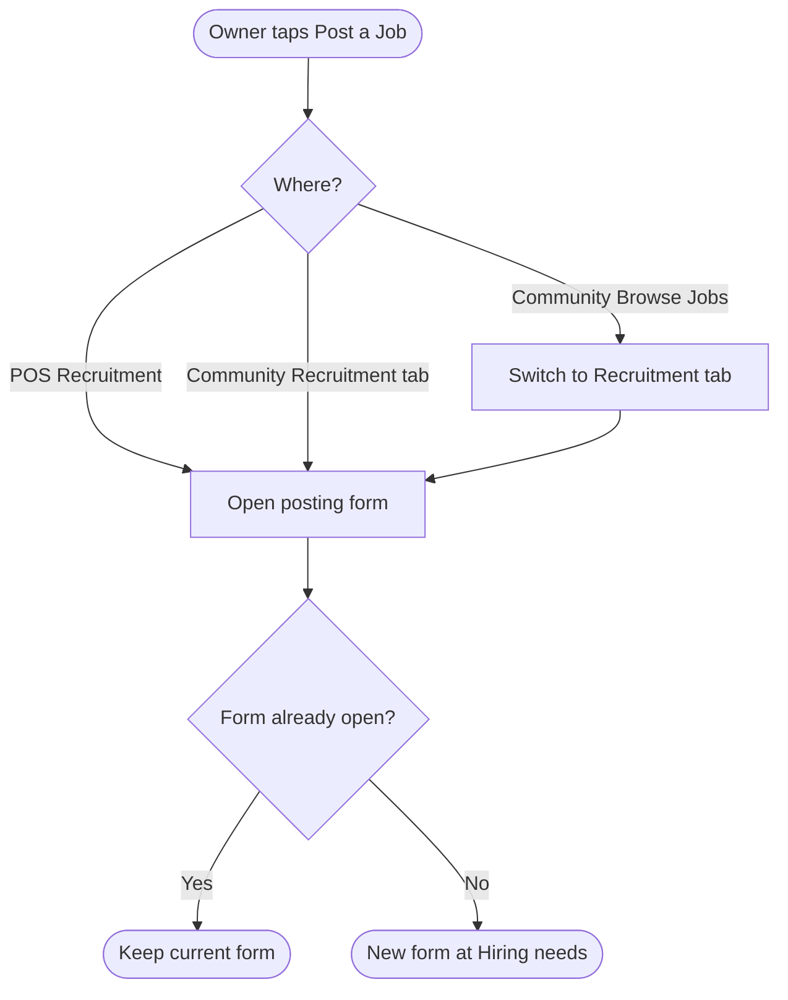

---

#### Workflow 2: Owner creates or edits a posting with Advanced compose

**Primary Actor:** Salon Owner
**Trigger:** Workflow 1 (**Post a Job**), or **Edit** / **Continue editing** on an existing posting
**Outcome:** A draft is saved (**Draft**) or the posting is sent (**Pending review**)

**User Stories:**
- As a Salon Owner, I want to choose the services I'm hiring for from my salon menu, so that the required skills are suggested for me.
- As a Salon Owner, I want to control what job seekers see (salon name, address, contact name, phone), so that I protect my salon's privacy when needed.
- As a Salon Owner, I want to be stopped if hidden details still appear in my title or text, so that I don't leak information I chose to hide.
- As a Salon Owner, I want to save an unfinished posting as a draft, so that I can finish it later.
- As a Salon Owner, I want to preview exactly what job seekers will see before sending, so that I can catch mistakes.

| Step | Who | Action | System Response | Notes |
| :--- | :--- | :--- | :--- | :--- |
| 1 | Owner | **01 Hiring needs**: job title*, position*, number of openings* (1–50), work schedule, apply-by date*, services from the salon menu, desired skills*, compensation (Negotiable / Fixed pay / Commission; Fixed requires amount and unit), specific pay text, benefits, Urgent | Choosing services auto-suggests matching skills | Positions offered: Nail technician, Acrylic/Dip technician, Manicure/Pedicure technician |
| 2 | Owner | **02 Posting content**: content* (20–4,000 characters); optional **Use template text** | Template fills the content based on visibility settings | |
| 3 | Owner | **03 Salon information & visibility**: preset (Show all / Chat only / Hide name & contact) or individual checkboxes; contact name* and phone* | Any custom combination shows as "Show some" | Phone: 10 digits, optional country code 1 |
| 4a | Owner | Taps **Save draft** | Saves as **Draft**; toast "Draft saved."; list switches to the Draft filter | Only a title is required for a draft |
| 4b | Owner | Taps **Preview posting →** | Validates all required fields and checks for hidden-information leaks | Leak: "Please remove hidden {fields} from the title or content." |
| 5 | Owner | Reviews "Ready to preview", ticks "I reviewed the posting content and contact information.", taps **Post to NailHub ↗** (or **Update on NailHub ↗**) | Saves as **Pending review**; shows "Posting sent for review — NailHub reviews the posting before it is public." | |
| 6 | Owner | **View posting on NailHub ↗** or **Back to job postings** | Opens the job-seeker preview or returns to the list | Preview opens inside the app, not an external site |

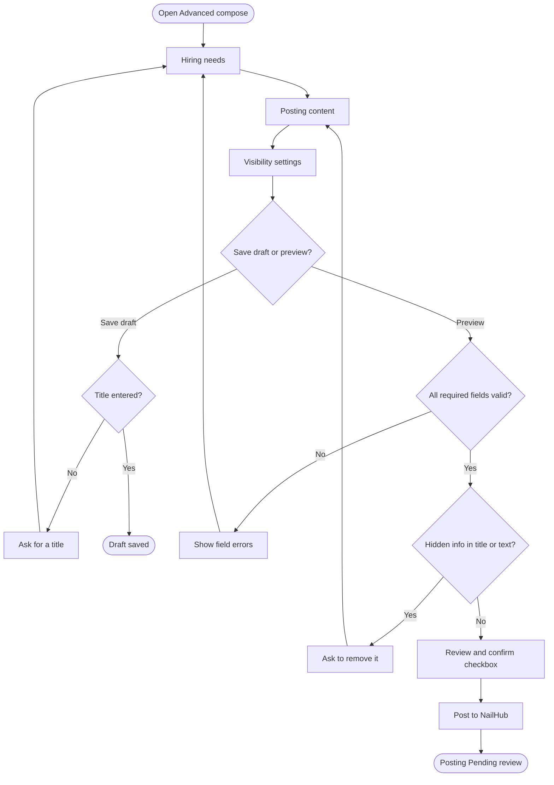

---

#### Workflow 3: Owner manages postings (list, preview, messages, close)

**Primary Actor:** Salon Owner
**Trigger:** Owner opens Recruitment
**Outcome:** Owner finds postings, previews them, opens messages, or closes recruitment

**User Stories:**
- As a Salon Owner, I want to filter my postings by status and search by title or skill, so that I find the right one quickly.
- As a Salon Owner, I want to see my posting as a job seeker would, so that I know what is public.
- As a Salon Owner, I want to close a posting when the position is filled, so that technicians stop applying.
- As a Salon Owner, I want to reopen a closed posting by editing and re-sending it, so that I can hire again for the same role.

| Step | Who | Action | System Response | Notes |
| :--- | :--- | :--- | :--- | :--- |
| 1 | Owner | Opens Recruitment | Shows "Job postings" with filter tabs **All / Recruiting / Draft / Pending review / Closed** and a search box | Search matches title and skills. "Filled" appears only under All |
| 2 | Owner | Reads a posting card | Card shows title, code, created date, Urgent, status, location, work type, number of openings, skills, pay | Footer: "Not sent to NailHub yet" (Draft), "Recruitment closed" (Closed), otherwise "NailHub" |
| 3 | Owner | Taps **View posting ↗** | Opens "Job seeker's view"; Pending postings show "This posting is pending review and is not public yet." | Not available for drafts |
| 4 | Owner | Taps **Messages** | Opens Community chat | Not available for drafts |
| 5 | Owner | Taps **Close recruitment** → confirms **Position filled · Close posting** | Status becomes **Closed**; toast "Recruitment closed." | Available for Pending, Recruiting and Filled postings |
| 6 | Owner | Taps **Edit** on a Closed posting and sends it again | Status returns to **Pending review** | Confirmation text: "You can edit and publish it again." |

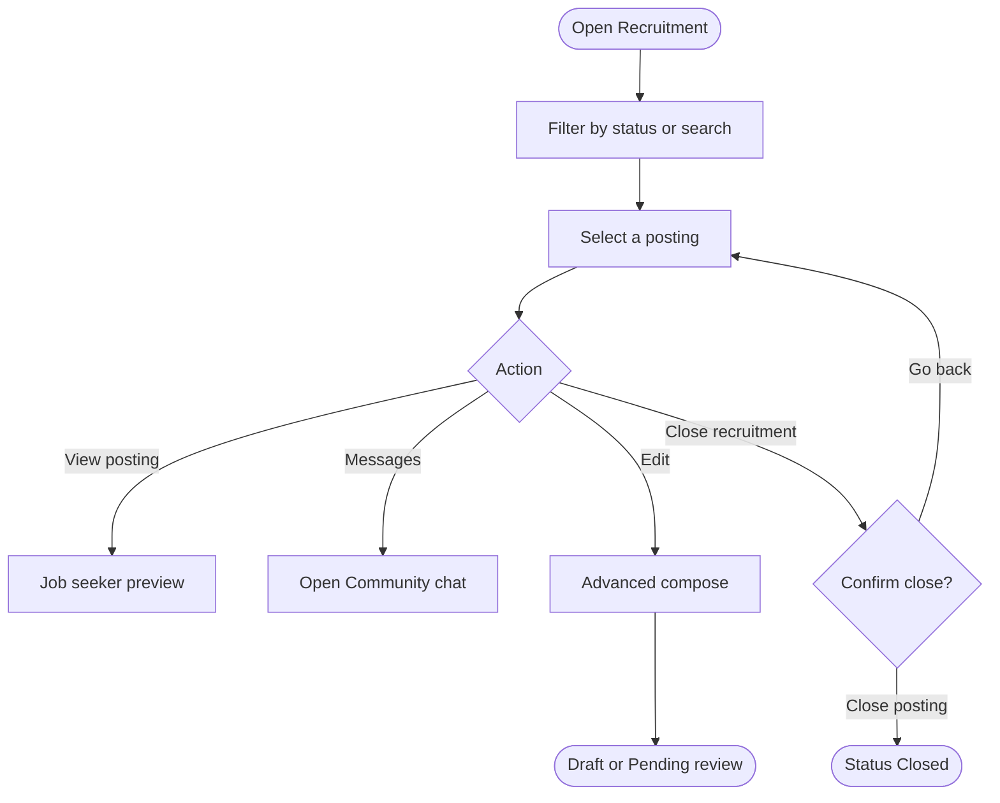

---

#### Workflow 4: Browse Jobs (all roles)

**Primary Actor:** Nail Technician, Salon Owner, Guest
**Trigger:** Member opens Community › Jobs › Browse Jobs
**Outcome:** Member sees hiring and seeking posts matching their filters

**User Stories:**
- As a Nail Technician, I want to see hiring salons and other technicians in one list, so that I understand the market.
- As a Salon Owner, I want to browse available technicians and competing salons, so that I can plan my hiring.
- As any member, I want to filter by post type, area and keyword, and clear filters in one tap, so that I find relevant posts.

| Step | Who | Action | System Response | Notes |
| :--- | :--- | :--- | :--- | :--- |
| 1 | Member | Opens Browse Jobs | Shows posts newest first with "{n} matching posts" | |
| 2 | Member | Picks **All / Seeking work / Hiring** | Shows only that type | |
| 3 | Member | Picks an area | Shows posts in that city | Area list = cities in current posts, A–Z |
| 4 | Member | Types a keyword | Narrows after a short pause | Matches title, skills, description (and city for seeking posts) |
| 5 | Member | Taps **Clear filters** | Resets type, area and keyword | Shown only when a filter is active |
| 6 | Member | Taps a hiring card | Opens **Job details** with **Message salon** and **Apply now** | Seeking cards have no detail view or actions |

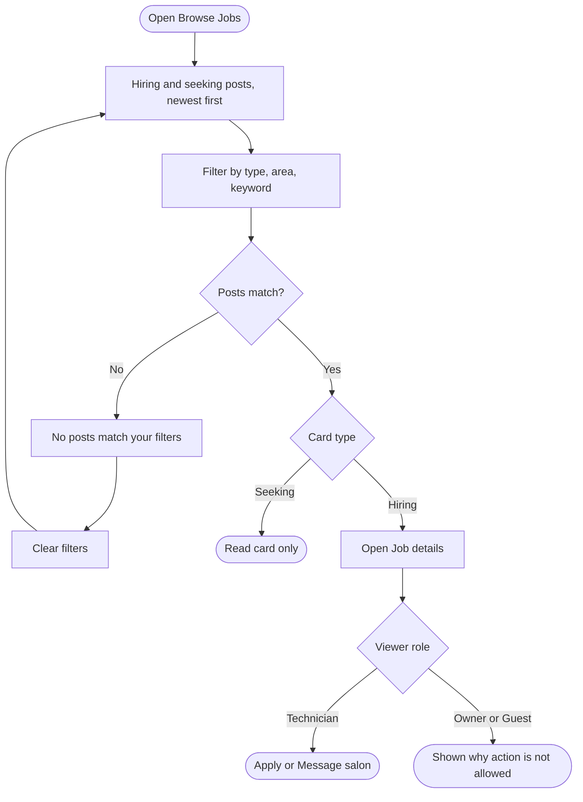

---

#### Workflow 5: Technician applies to a posting

**Primary Actor:** Nail Technician
**Trigger:** Technician taps **Apply now** in Job details
**Outcome:** Application submitted and listed in **Applied**

**User Stories:**
- As a Nail Technician, I want to add a note and attach my seeking post, so that the salon understands my experience.
- As a Nail Technician, I want to decide whether to share my phone number, so that I control who can call me.
- As a Nail Technician, I want to be prevented from applying twice, so that I don't send duplicates.
- As a Nail Technician, I want to see all jobs I applied to, so that I can follow up.

| Step | Who | Action | System Response | Notes |
| :--- | :--- | :--- | :--- | :--- |
| 1 | Technician | Taps **Apply now** | Opens "Apply to this job — Your application goes to {salon}." | |
| 2 | Technician | Writes an optional note (max 500), optionally attaches a seeking post, optionally ticks "Share my phone number with this salon" | — | Attach list shows only the technician's Pending or Published seeking posts; phone sharing is off by default |
| 3 | Technician | Taps **Submit application** | Shows "Application sent" with **Message the business** and **View applied jobs** | A second application to the same posting fails: "You already applied to this posting." |
| 4 | Technician | Opens **Applied** | Each row: posting title, salon, location, status "Submitted", applied date, note, **Message** | If the posting is gone: "Posting no longer available" |

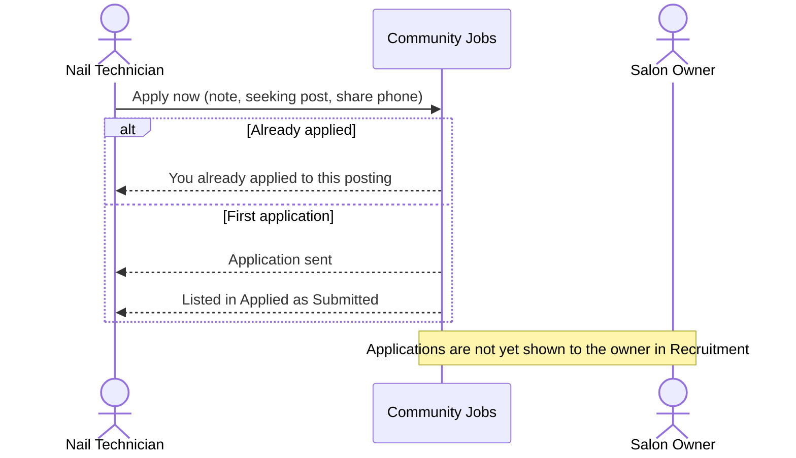

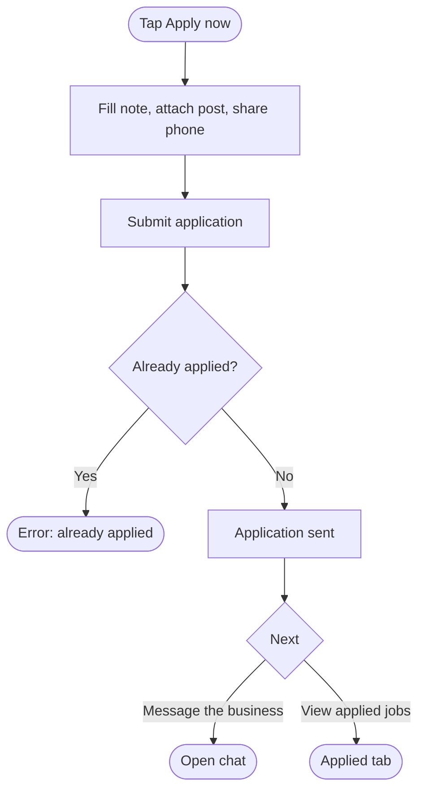

---

#### Workflow 6: Technician messages a salon

**Primary Actor:** Nail Technician
**Trigger:** **Message salon** (Job details), **Message the business** (after applying), or **Message** (Applied)
**Outcome:** A direct chat with the salon opens

| Step | Who | Action | System Response | Notes |
| :--- | :--- | :--- | :--- | :--- |
| 1 | Technician | Taps a message action | For the demo salon (Bitcoin Nail Bar): opens or creates a direct chat with the owner (chat dock on desktop, chat page on mobile) | Uses real Community chat |
| 2 | — | — | For sample salons on the board: opens the chat inbox with "This is a sample salon posting for the demo — no real chat is available here." | |
| 3 | — | — | If the chat can't start: "Couldn't start the chat. Please try again." | |

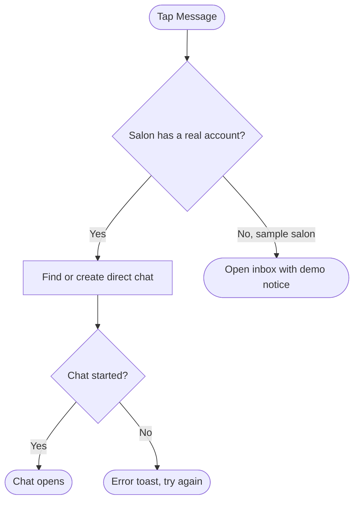

---

#### Workflow 7: Technician creates and manages a seeking post

**Primary Actor:** Nail Technician
**Trigger:** **+ Post seeking** or **New seeking post** (My Posts)
**Outcome:** Seeking post saved as **Draft** or sent as **Pending review**; can later be edited or closed

**User Stories:**
- As a Nail Technician, I want to describe my skills, experience, preferred work types, area and pay, so that salons can find me.
- As a Nail Technician, I want to hide my full name and phone number from the public, so that my current salon can't identify me.
- As a Nail Technician, I want a warning if my hidden phone number appears in my text, so that I don't leak it by accident.
- As a Nail Technician, I want to close my post once I find a job, so that salons stop contacting me.

| Step | Who | Action | System Response | Notes |
| :--- | :--- | :--- | :--- | :--- |
| 1 | Technician | Opens "Post that you're seeking work" | Shows the form with a live preview | |
| 2 | Technician | Fills headline*, experience, available-from date, work types*, skills*, city/state, pay expectation, name*, phone*, "About you"* (20–2,000 characters) | Validates required fields | Pay: Negotiable / Fixed (amount + unit) / Commission |
| 3 | Technician | Sets **Show my full name publicly** (default on) and **Show my phone number publicly** (default off) | Warns if a hidden phone number appears in the text | |
| 4a | Technician | **Save draft** | Saves as **Draft** | Only a headline is required |
| 4b | Technician | **Publish** | Saves as **Pending review**; toast "Your seeking post was submitted for review." | |
| 5 | Technician | In **My Posts**: **Edit** / **Continue draft →** / **Close** → confirm **Close post** | Close: post becomes **Closed** — "will no longer be visible to salons" | Close is available for Pending and Published posts |

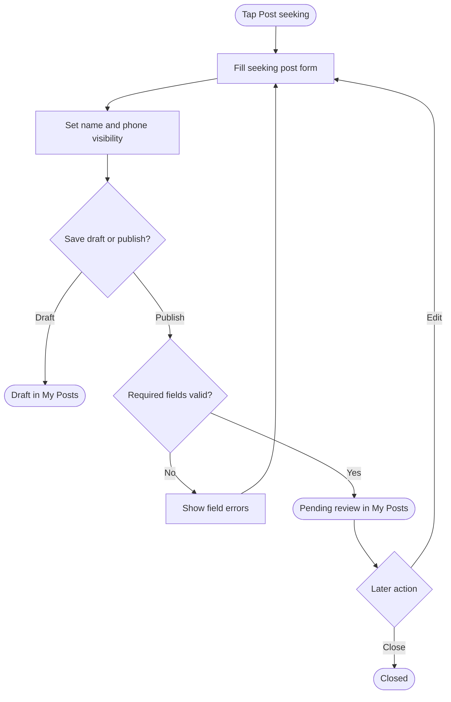

---

#### Workflow 8: Guest / read-only browsing

**Primary Actor:** Community Member (Guest)
**Trigger:** Guest (or a non-owner, non-technician account) opens Community › Jobs
**Outcome:** Guest can browse but is guided to a technician account to act

| Step | Who | Action | System Response | Notes |
| :--- | :--- | :--- | :--- | :--- |
| 1 | Guest | Opens Jobs | Shows Browse Jobs only, with "You're viewing Community Jobs as a guest. Switch to Jessica to apply or send messages." | No My Posts / Applied tabs, no post button |
| 2 | Guest | Taps **Apply now** or **Message salon** | Shows "Choose "Jessica · staff" in the top bar to apply or message." | |

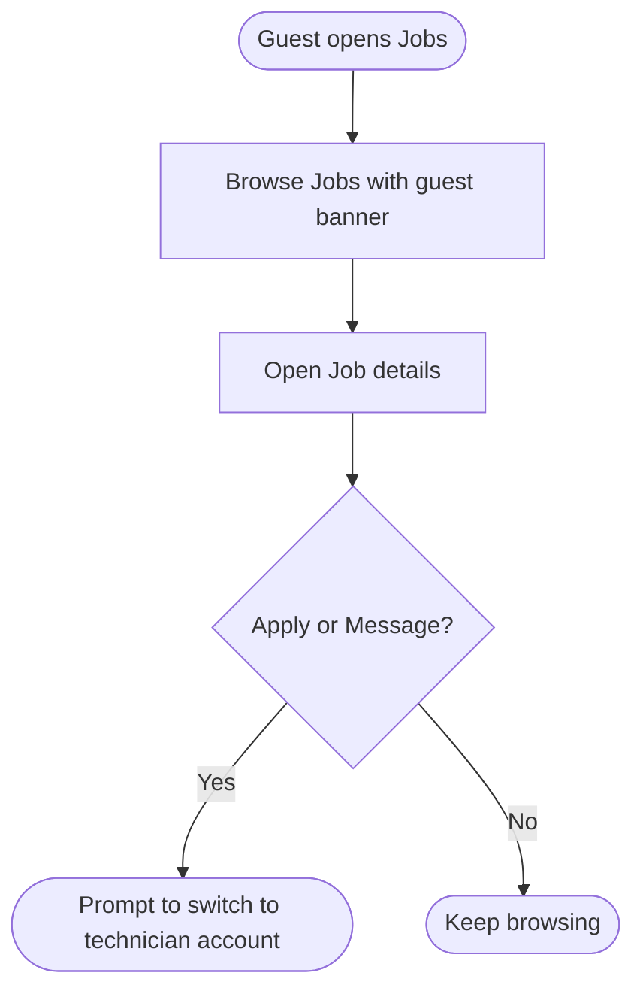

---

### System Configuration & Administration

- As an Ops reviewer, I want to approve or reject postings and seeking posts that are Pending review, so that only appropriate content becomes public. *(Not built — see Known Gaps.)*
- As a Salon Owner, I want the services list in Advanced compose to come from my active salon menu, so that skills suggestions match what my salon offers. *(Current behavior.)*
- As a Product/Ops stakeholder, I want postings to close automatically after their apply-by date, so that expired jobs don't stay on the board. *(Not built.)*

---

### State Lifecycle

#### Job posting (Salon Owner)

| Current Status | Trigger | New Status | Notes |
| :--- | :--- | :--- | :--- |
| (none) | Save draft (Advanced compose) | Draft | "Not sent to NailHub yet" |
| (none) / Draft | **Post to NailHub** | Pending review | "Posting sent for review" |
| Pending review | NailHub review approves | Recruiting | **Not implemented** in the demo |
| Recruiting | Position filled (external) | Filled | **Not implemented** in the demo |
| Pending review / Recruiting / Filled | **Close recruitment** | Closed | Confirmation required |
| Recruiting / Closed | Edit and send again | Pending review | Closed postings can be reopened this way |
| Any edited | Save draft | Draft | |

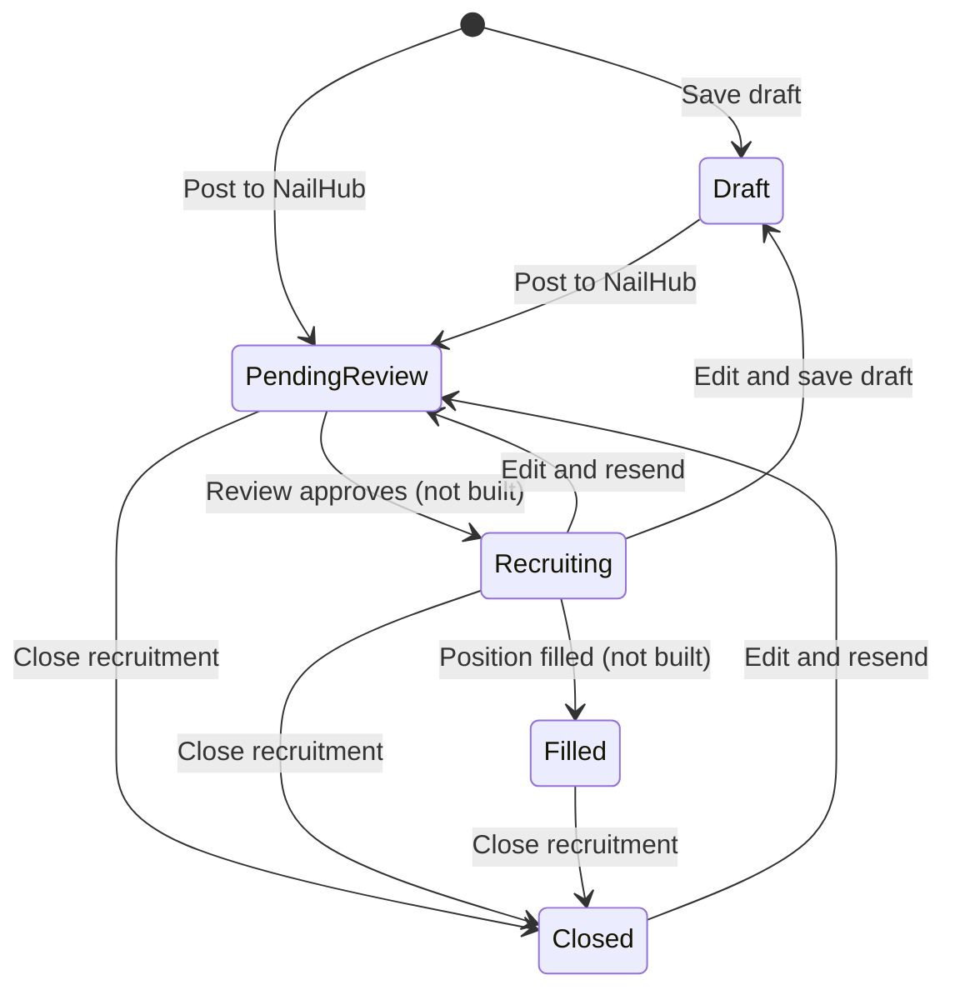

#### Seeking post (Nail Technician)

| Current Status | Trigger | New Status | Notes |
| :--- | :--- | :--- | :--- |
| (none) | Save draft | Draft | |
| (none) / Draft | Publish | Pending review | |
| Pending review | Review approves | Visible to salons (Published) | **Not implemented** in the demo |
| Pending review / Published | Close | Closed | "No longer visible to salons" |
| Published | Edit and save draft | Draft | Leaves the board |

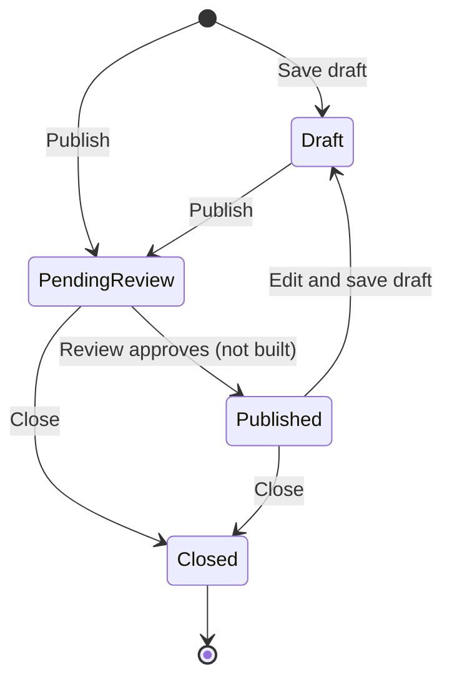

#### Application

| Current Status | Trigger | New Status | Notes |
| :--- | :--- | :--- | :--- |
| (none) | Submit application | Submitted | The only application status today |

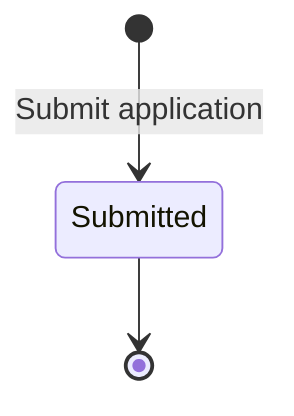

#### What appears on Browse Jobs

| Status | Hiring posting | Seeking post |
| :--- | :--- | :--- |
| Draft | Hidden | Hidden |
| Pending review | **Shown**, with a "Pending review" chip | Hidden |
| Recruiting / Published | Shown | Shown |
| Closed / Filled | Hidden | Hidden |

---

### Business Rules

- **Rule 1 — Role decides the post type.** Salon owners can only create hiring postings; technicians can only create seeking posts. The type cannot be changed.
- **Rule 2 — One posting list per salon.** Postings created or edited in POS and in Community are the same records.
- **Rule 3 — Required fields (Advanced compose).** Job title, position, number of openings (1–50), apply-by date, at least one skill, content of 20–4,000 characters, contact name and a 10-digit phone number. Fixed pay must be more than $0 and at most $100,000. A draft needs only a title.
- **Rule 4 — One way to create a posting.** **Post a Job** always opens the full posting form (Advanced compose); the Quick post short form is hidden (2026-10-06), so every new posting goes through the same required fields and preview.
- **Rule 5 — Owner privacy.** The owner chooses whether job seekers see the salon name & photo, full street address, contact name and phone. Hidden details may not appear in the title or content; sending is blocked until they are removed. A hidden salon name displays as "Nail salon in {location}".
- **Rule 6 — Technician privacy.** On the board, a seeking post never shows the phone number; the full name shows only if the technician allows it, otherwise "Anonymous technician". A salon receives the technician's phone only if "Share my phone number with this salon" is ticked when applying.
- **Rule 7 — Sending means review.** Sending a posting or publishing a seeking post sets it to **Pending review**. Seeking posts appear on Browse Jobs only once approved (Published); hiring postings appear while Pending (marked "Pending review").
- **Rule 8 — Closing.** Owners can close any non-draft, non-closed posting after confirmation. Technicians can close Pending or Published seeking posts. A closed posting can be edited and sent again (back to Pending review).
- **Rule 9 — One application per posting.** A technician cannot apply twice to the same posting.
- **Rule 10 — Who can act on Browse Jobs.** Only technicians can apply or message from Browse Jobs. Owners and guests are shown why they can't.
- **Rule 11 — Pay display.** The full pay label shows the owner's text if entered; otherwise "Pay negotiable", "Commission · discuss directly", or "$amount / unit". On hiring cards, the pay chip shows only weekly dollar amounts or "Negotiable"; other formats (hourly, commission) appear only in details.
- **Rule 12 — Urgent.** Urgent adds a red badge; it does not change the order of the list.
- **Rule 13 — Apply-by date.** Shown in the posting preview ("Accepting applications until …"); it is not enforced (postings do not expire automatically).
- **Rule 14 — Sorting and filters.** Browse Jobs is newest first; post type, area and keyword filters combine. The owner's posting list can be filtered by status and searched by title or skill.
- **Rule 15 (demo-only) — Persistence.** All jobs data is sample data held in the browser session and resets on refresh.

> 💡 **Important:** No step in Jobs moves money — there are no fees for posting, browsing, applying or messaging. Rules 5 and 6 protect personal contact details and directly affect who can contact whom.

---

### Edge Cases & Exception Handling

| Scenario | What Happens | Who Resolves It |
| :--- | :--- | :--- |
| Owner leaves the posting form with unsaved changes | Asked to confirm ("Leave the posting composer?" — "Your draft has unsaved content.") | Owner |
| Hidden salon details appear in title/content | Preview blocked: "Please remove hidden {fields} from the title or content." | Owner |
| Required fields missing on send | Field-level errors (e.g. "Select at least one desired skill.") | Owner |
| Closing a posting fails | "Could not close this posting. Please try again." | Owner (retry) |
| Postings list fails to load | "Job postings could not be loaded." with **Try again** | Owner / Support |
| No postings match the owner's filter | "No matching postings yet" with **Show all postings** | Owner |
| No posts match on Browse Jobs | "No posts match your filters" with **Clear filters** | Member |
| Browse Jobs fails to load | "Could not load job posts. Please try again." with **Try again** | Member / Support |
| Technician applies twice | "You already applied to this posting." | Auto |
| Application fails for another reason | "Could not submit your application. Please try again." | Technician (retry) |
| Technician messages a sample salon | Inbox opens with "This is a sample salon posting for the demo — no real chat is available here." | N/A (demo) |
| Chat can't be started | "Couldn't start the chat. Please try again." | Technician (retry) |
| Posting removed after applying | Applied row shows "Posting no longer available" | N/A |
| Owner or guest taps Apply / Message | Explanation toast; no action | N/A — by design |
| Technician's published seeking post doesn't appear on Browse Jobs | It is Pending review; visible only in My Posts | Ops review — **not built in the demo** |
| Page refreshed | All demo postings, seeking posts and applications reset | N/A (demo) |

---

### Known Gaps (demo vs. intended behavior)

| # | Gap | Impact |
| :--- | :--- | :--- |
| 1 | No review step: nothing moves Pending review → Recruiting/Published, or to Filled | New postings never become "Recruiting"; technicians' seeking posts never reach Browse Jobs |
| 2 | Pending hiring postings are shown on Browse Jobs, while their preview says "not public yet" | Conflicting message to technicians |
| 3 | Owners cannot see applications they receive in Recruitment; number of openings is not tracked against applications | Owner must rely on chat to learn about applicants |
| 4 | Owners cannot open or contact a technician from a seeking post | One-way discovery |
| 5 | Apply-by date is not enforced | Expired postings stay visible |
| 6 | Closed postings can be reopened by editing; the earlier plan said Closed is final | Business rule needs a decision |
| 7 | ~~Quick post skips validation~~ — resolved 2026-10-06: Quick post hidden, all postings use the full form | — |
| 8 | "Write with AI" and "Use template text" are templates, not AI | Expectation management |
| 9 | Work-type and skill filters exist but are not shown on Browse Jobs | Fewer filters than the data supports |
| 10 | Messaging always targets the demo owner account; sample salons have no chat | Demo-only limitation |
| 11 | NailHub sending, "View posting on NailHub" and status sync are presentation only | No real external publishing yet |

---

### Frequently Asked Questions

**Q: Is a posting made in POS the same as one made in Community?**
A: Yes. Both screens show and edit the same list of postings for the salon.

**Q: Where did Quick post go?**
A: It was hidden on 2026-10-06. **Post a Job** now always opens the full posting form, so every posting includes skills, pay, content and contact settings and goes through the preview step.

**Q: Why does my posting say "Pending review"?**
A: Every sent posting goes to NailHub review before it is public. In the current demo the review step isn't connected, so postings stay Pending review.

**Q: Can I reopen a closed posting?**
A: Yes, today: edit it and send it again; it returns to Pending review.

**Q: Can job seekers see my phone number or address?**
A: Only if you allow it in "What can job seekers see?". You can show everything, chat only, or hide name and contact.

**Q: As a technician, will my current salon see my seeking post?**
A: Your post is visible to all salons once published, but you can hide your full name (shown as "Anonymous technician"), and your phone number is never shown on the board.

**Q: Does the salon get my phone number when I apply?**
A: Only if you tick "Share my phone number with this salon".

**Q: Why can't a salon owner apply or message from Browse Jobs?**
A: Those actions are for technician accounts. Owners use Browse Jobs to see the market and manage their own postings in Recruitment.

**Q: Will my data still be there tomorrow?**
A: Not in the demo — refreshing the page resets all jobs data.

---

### Related Features

- **Browse Jobs (Owner & Technician)** — [community-jobs-browse.md](./community-jobs-browse.md): detailed browse/filter rules.
- **Community Jobs (earlier prototype)** — [community-jobs.md](./community-jobs.md): describes the previous prototype board (Open/Filled/Closed, delete); superseded by this document for current behavior.
- **POS › Staff & Recruitment** — the owner's entry point in POS; the Staff tab is a separate sample staff list.
- **Community Chat** — used for owner **Messages** and technician **Message salon / Message the business**.
- **Salon menu (services)** — source of services offered in Advanced compose.
