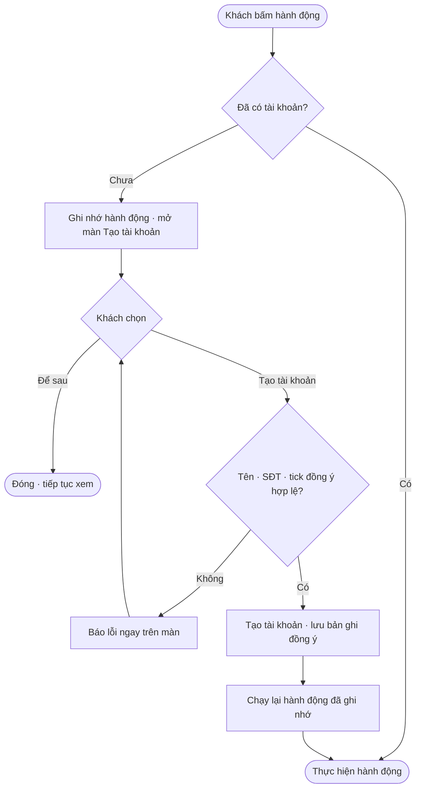
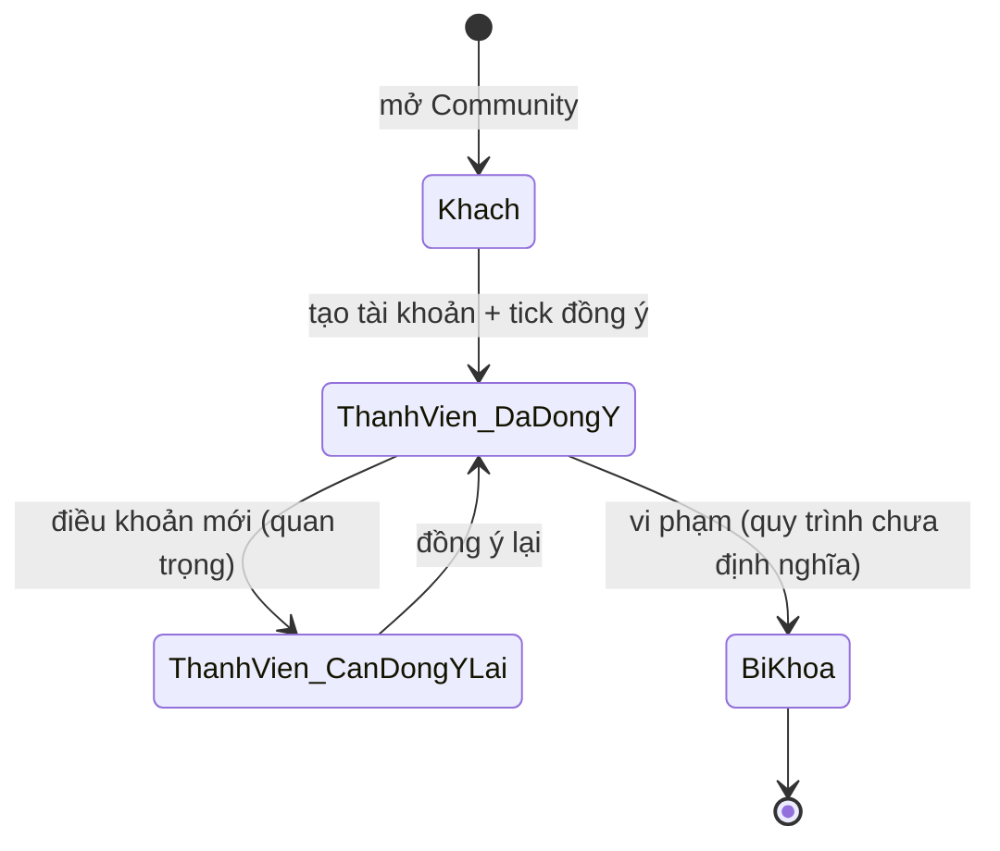

# 00 · Tài khoản, định danh & điều khoản (nền tảng Community)

**Cập nhật:** 2026-09-26
**Đối tượng đọc:** Dev, PM, QA, CSKH
**Trạng thái:** Draft — chờ Brian duyệt
**Nguồn:** bản mẫu `nexora-community-tong-hop.html` (shell + module Bảng tin), quyết định đã chốt trong phiên làm việc

> Tài liệu này là nền cho 5 tài liệu module còn lại. Mọi module đều giả định các quy tắc ở đây đã có. Dev nên làm phần này trước.

---

## Tổng quan

Community là một menu trong app NEXORA TOUCH, dùng chung cho **thợ**, **chủ tiệm** và **khách hàng của tiệm**. Mọi người xem được mọi thứ mà không cần tài khoản; chỉ khi bắt đầu một hành động (đăng bài, nhắn tin, lấy coupon, nhận việc…) mới cần tài khoản. Điều khoản cộng đồng được đồng ý **một lần duy nhất lúc tạo tài khoản**, không hỏi lại ở từng hành động. Số điện thoại là khoá định danh chung giữa Community và POS, để POS nhận diện khách và coupon của họ khi check-in.

---

## Khái niệm chính

| Thuật ngữ | Định nghĩa |
|---|---|
| **Thành viên** | Người đã tạo tài khoản NEXORA (tên hiển thị + SĐT + đồng ý điều khoản). |
| **Khách (chưa đăng ký)** | Người mở Community mà chưa có tài khoản. Xem được tất cả, không làm được hành động cần tài khoản. |
| **NEXORA ID** | Mã định danh công khai dạng `NX-####` (bản mẫu: 4 chữ số) + QR + link `nexora.link/@nickname`. Dùng để tìm nhau, chia sẻ, quét tại quầy. |
| **Số điện thoại (khoá chung)** | Trường bắt buộc khi đăng ký; là khoá để POS ghép hồ sơ khách ↔ tài khoản Community. |
| **Vai trò** | `tech` (thợ), `owner` (chủ tiệm, có POS), `client` (khách của tiệm), `admin` (nhân sự NEXORA). Một người có thể vừa là thợ vừa là khách của tiệm khác. |
| **Bản ghi đồng ý** | Ghi nhận thời điểm, phiên bản điều khoản, ngôn ngữ, thiết bị khi thành viên đồng ý. |
| **Phiên bản điều khoản** | Điều khoản có số phiên bản (bản mẫu: `1.0`, `1.1`). Thay đổi quan trọng ⇒ phải đồng ý lại. |

---

## Vai trò

| Vai trò | Trong Community làm gì |
|---|---|
| Khách chưa đăng ký | Xem Bảng tin, Nhóm & Chợ, Việc làm, Ca làm thêm, Deal & Coupon, Nhóm chat công khai. Bấm hành động cần tài khoản ⇒ hiện màn tạo tài khoản. |
| Thợ (`tech`) | Toàn bộ, trừ mục chỉ dành cho chủ tiệm (Quầy redeem, POS Services). Có thêm Hồ sơ thợ, Wish list & Ví coupon. |
| Chủ tiệm (`owner`) | Toàn bộ, trừ mục chỉ dành cho thợ (Hồ sơ thợ, Wish list & Ví coupon). Có thêm Quầy redeem (POS), Tuyển thợ từ POS. |
| Khách của tiệm (`client`) | **Chưa định nghĩa trong bản mẫu** (nút "Linh · khách" không có hành vi). Xem Câu hỏi mở. |
| Admin NEXORA | Bật "chế độ admin": chỉnh giá Nổi bật, chính sách cọc ca làm thêm. Không phải chủ tiệm. |

---

## Luồng nghiệp vụ

### Luồng 1: Khách chưa đăng ký bấm một hành động cần tài khoản

**Tác nhân chính:** khách chưa đăng ký · **Kích hoạt:** bấm nút thuộc danh sách "hành động cần tài khoản" · **Kết quả:** có tài khoản, hành động đang dở tự chạy tiếp.

**User stories**
- Là khách, tôi muốn xem thoải mái mà không bị bảng điều khoản chặn, để quyết định có tham gia hay không.
- Là khách, khi bấm "Lấy coupon" tôi muốn đăng ký nhanh rồi coupon vào ví luôn, không phải bấm lại.
- Là khách, tôi muốn bấm "Để sau" và tiếp tục xem, không bị nhắc liên tục.

| Bước | Ai | Hành động | Hệ thống phản hồi | Ghi chú |
|---|---|---|---|---|
| 1 | Khách | Bấm hành động cần tài khoản (xem bảng dưới) | Chặn hành động, ghi nhớ nút vừa bấm, mở màn **Tạo tài khoản NEXORA · miễn phí** | Không chuyển trang |
| 2 | Khách | Nhập **Tên hiển thị**, **Số điện thoại**, tick "Tôi đủ 18 tuổi, đã đọc và đồng ý Điều khoản sử dụng & Nội quy cộng đồng NEXORA." | Nút "Tạo tài khoản & tiếp tục" chỉ bật khi đã tick | Có link "Xem 6 điều chính ▾" |
| 3 | Khách | Bấm "Tạo tài khoản & tiếp tục" | Kiểm tra: tên ≥ 2 ký tự (`Nhập tên hiển thị`), SĐT ≥ 7 chữ số sau khi bỏ ký tự lạ (`Nhập số điện thoại hợp lệ`), đã tick (`Cần đồng ý điều khoản để tạo tài khoản`) | Bản thật cần OTP — xem Câu hỏi mở |
| 4 | Hệ thống | Tạo tài khoản, **lưu bản ghi đồng ý** (phiên bản hiện hành, thời điểm, ngôn ngữ, thiết bị) | Toast `✓ Đã tạo tài khoản — tiếp tục việc bạn đang làm` | |
| 5 | Hệ thống | Chạy lại hành động đã ghi nhớ ở bước 1 | Ví dụ: coupon vào ví, khung soạn bài mở, tin nhắn được gửi | Độ trễ ~0,4 giây trong bản mẫu |
| 5b | Khách | Bấm "Để sau" | Đóng màn, toast `Bạn vẫn xem được mọi thứ — đăng ký khi cần`, hành động bị huỷ | Không nhắc lại cho tới lần bấm kế |

**Danh sách hành động cần tài khoản** (lấy từ bản mẫu — dev dùng làm danh sách kiểm soát):

| Module | Hành động |
|---|---|
| Bảng tin | Mở khung soạn bài, thích bài, tham gia nhóm, tạo nhóm |
| Việc làm (thợ) | Mở soạn tin tìm việc |
| Việc làm (chủ) | Đăng tin tuyển, ứng tuyển, mời phỏng vấn, đồng ý/từ chối chia sẻ SĐT |
| Ca làm thêm | Đăng ca, nhận ca/ứng tuyển, hỏi thợ, mời vào ca |
| Deal & Coupon | Lấy coupon, phát hành coupon |
| Tin nhắn & Gọi | Gửi tin (nút hoặc Enter), gửi ghi âm, gọi thoại/video, gọi nhóm, gọi lại, tham gia nhóm, chấp nhận lời mời nhắn tin, tham gia cuộc gọi đang diễn ra |

Không cần tài khoản: xem, lọc, tìm, báo cáo/ẩn bài, rời nhóm, mở tin nhắn với người bán (chỉ mở, chưa gửi).

### Luồng 2: Điều khoản có phiên bản mới

**Tác nhân chính:** thành viên · **Kích hoạt:** NEXORA phát hành điều khoản phiên bản mới, đánh dấu "thay đổi quan trọng" · **Kết quả:** thành viên đồng ý lại một lần, rồi dùng bình thường.

**User stories**
- Là thành viên, tôi muốn được báo điều khoản đổi nhưng không bị chặn xem.
- Là NEXORA, tôi cần bằng chứng thành viên đã đồng ý phiên bản mới trước khi họ đăng bài tiếp.

| Bước | Ai | Hành động | Hệ thống phản hồi | Ghi chú |
|---|---|---|---|---|
| 1 | Admin | Phát hành phiên bản mới, đánh dấu quan trọng/không | Nếu **không quan trọng**: không làm gì với thành viên | Tiêu chí "quan trọng" — xem Câu hỏi mở |
| 2 | Hệ thống | Với thay đổi quan trọng: hiện dải thông báo `📜 Điều khoản cộng đồng đã cập nhật (v1.1). Vui lòng xem & đồng ý lại để tiếp tục đăng bài.` + nút "Xem thay đổi" | Thành viên vẫn xem được mọi thứ | |
| 3 | Thành viên | Bấm hành động cần tài khoản | Mở bảng điều khoản với tiêu đề "Điều khoản đã cập nhật", hộp "Thay đổi so với v1.0: …", phải cuộn hết văn bản + tick 4 ô | Bản mẫu: mục mới 6a về tin nhắn thoại/ảnh chụp cuộc gọi |
| 4 | Thành viên | Bấm "Đồng ý & tham gia" | Lưu bản ghi đồng ý mới, chạy lại hành động | Toast `✓ Đã tham gia cộng đồng — bản ghi đồng ý đã được lưu` |
| 4b | Thành viên | Bấm "Để sau · chỉ xem" | Giữ chế độ chỉ xem cho hành động đó | Toast `Bạn đang ở chế độ chỉ xem` |

---

## Cấu trúc menu Community

| Mục (pill) | Mục con | Ai thấy |
|---|---|---|
| Bảng tin | — | Tất cả |
| Nhóm & Chợ | 👥 Nhóm ngành · 🛍️ Rao vặt · Mua bán | Tất cả |
| Việc làm | 💼 Việc làm · 🪪 Hồ sơ thợ (chỉ thợ) | Chủ tiệm thấy giao diện "Tuyển thợ từ POS" thay vì bảng thợ |
| Ca làm thêm | — | Tất cả |
| Deal & Coupon | 🔥 Deal gần bạn · 🏷️ Coupon theo ngành · ♡ Wish list (thợ/khách) · 🎟️ Ví coupon (thợ/khách) · ➕ Tạo coupon · 📊 Coupon của tôi · 🧾 Quầy redeem (chỉ chủ) | Xem tài liệu 04 — "Tạo coupon" sẽ chuyển vào POS |
| Tin nhắn & Gọi | 💬 Tin nhắn · 👥 Nhóm chat · 📞 Cuộc gọi · 🛡️ Riêng tư & NEXORA ID | Tất cả |
| Học tập · Sự kiện | Giữ nguyên module hiện có trong app | |

**Cơ chế kỹ thuật trong bản mẫu (tham khảo):** mỗi module là một trang riêng nhúng bằng iframe; shell truyền `role`, `lang`, `admin`, `view` và trạng thái đồng ý (`consentSync`, `consentReset`, `termsDeclined`) bằng `postMessage`; module gửi `needTerms` khi bị chặn. Bản thật không bắt buộc giữ kiến trúc iframe, nhưng phải giữ hành vi: **hành động bị chặn được chạy lại tự động sau khi đăng ký/đồng ý**.

---

## Vòng đời trạng thái: tài khoản & đồng ý

| Trạng thái | Kích hoạt | Trạng thái mới | Ghi chú |
|---|---|---|---|
| Khách | Tạo tài khoản thành công | Thành viên · đã đồng ý v hiện hành | Bản ghi đồng ý #1 |
| Thành viên · đã đồng ý | Phát hành phiên bản mới quan trọng | Thành viên · cần đồng ý lại | Vẫn xem được, bị chặn hành động |
| Thành viên · cần đồng ý lại | Đồng ý lại | Thành viên · đã đồng ý v mới | Bản ghi đồng ý #n |
| Thành viên | Vi phạm (điều khoản mục 4, 7) | Bị khoá | Quy trình khoá — chưa có trong bản mẫu |

---

## Quy tắc nghiệp vụ

- **Xem không cần tài khoản.** Không có màn chặn theo mục. (Bản mẫu còn dead code `#gate`/`GATED` chặn theo mục — dev bỏ.)
- **Đồng ý một lần lúc đăng ký.** Không hỏi lại ở từng hành động. Chỉ hỏi lại khi phiên bản điều khoản đổi và được đánh dấu quan trọng.
- **Hành động bị chặn phải tự chạy tiếp** sau khi đăng ký/đồng ý. Đây là điểm quyết định trải nghiệm.
- **Bản ghi đồng ý** tối thiểu: user id, phiên bản, thời điểm (UTC), ngôn ngữ đang xem, thiết bị/user-agent, các ô đã tick. Lưu vĩnh viễn, không sửa. > 💡 Liên quan pháp lý — luật sư duyệt cấu trúc bản ghi.
- **SĐT là khoá chung.** Một SĐT = một tài khoản. POS tra hồ sơ khách theo SĐT (chuẩn hoá 10 số, bỏ mã quốc gia +1 nếu là Mỹ). Xem tài liệu 04.
- **NEXORA ID** luôn tìm được (không tắt được); tìm bằng SĐT/email tuỳ cài đặt riêng tư (tài liệu 05).
- **Đủ 18 tuổi** là điều kiện tham gia (tick lúc đăng ký). Không lưu ngày sinh.
- **Ngôn ngữ:** giao diện VI/EN; nội dung thành viên giữ nguyên ngôn ngữ gốc. Điều khoản có bản VI và EN; bản có hiệu lực pháp lý là placeholder `[tiếng Anh]` — luật sư quyết.
- **Chế độ admin** là vai trò riêng của NEXORA, không gắn với chủ tiệm; bản mẫu chỉ là nút bật/tắt, bản thật phải có xác thực.

---

## Điều khoản cộng đồng (nội dung hiện có trong bản mẫu)

**6 điều chính** (hiện khi đăng ký, có thể mở rộng):
1. Bạn chịu trách nhiệm nội dung mình đăng.
2. NEXORA chỉ là nền tảng kết nối — không bảo đảm giao dịch giữa thành viên.
3. Không chuyển tiền qua tin nhắn — chỉ qua cổng thanh toán trong app.
4. Ảnh khách phải có sự đồng ý của khách.
5. Không lừa đảo, quấy rối, spam — vi phạm bị gỡ bài, khoá tài khoản.
6. AI dịch, phụ đề, cảnh báo chỉ để hỗ trợ.

**Bản đầy đủ v1.0** gồm 15 mục: 1 Bên cung cấp dịch vụ (NEXORA TOUCH LLC) · 2 Điều kiện tham gia · 3 Nội dung của bạn · 4 Hành vi bị cấm · 5 Việc làm, ca làm thêm & giao dịch giữa thành viên · 6 Tin nhắn, gọi & AI · 7 Kiểm duyệt · 8 Khiếu nại bản quyền · 9 Miễn trừ bảo đảm · 10 Giới hạn trách nhiệm · 11 Bồi hoàn · 12 Giải quyết tranh chấp · 13 Thay đổi điều khoản · 14 Ngôn ngữ · 15 Liên hệ. **v1.1** thêm mục 6a (không chia sẻ tin nhắn thoại/ảnh chụp cuộc gọi của người khác ra ngoài app).

**Placeholder luật sư phải điền:** địa chỉ đăng ký/tiểu bang; Điều khoản Thanh toán & Ca làm thêm riêng; email/đại lý DMCA; mức trần trách nhiệm; trọng tài cá nhân & từ bỏ kiện tập thể; tiểu bang luật áp dụng; ngôn ngữ ưu tiên; email hỗ trợ/pháp lý. Toàn bộ đang gắn nhãn **BẢN NHÁP — CẦN LUẬT SƯ DUYỆT**.

---

## Ngoại lệ

| Tình huống | Xử lý | Ai giải quyết |
|---|---|---|
| SĐT đã có tài khoản | Báo "SĐT này đã đăng ký" và chuyển sang đăng nhập (OTP) | Hệ thống |
| Khách bấm "Để sau" rồi bấm lại hành động | Hiện lại màn đăng ký (không giới hạn số lần) | Hệ thống |
| Thành viên đăng ký trên Community nhưng POS đã có hồ sơ khách cùng SĐT | Ghép tự động thành một hồ sơ; tên lấy theo tài khoản Community | Hệ thống |
| Điều khoản đổi khi thành viên đang dở hành động | Hoàn tất hành động đang dở, chặn từ hành động kế tiếp | Hệ thống |
| Vi phạm điều khoản | Chưa có luồng khoá/gỡ trong bản mẫu | PM định nghĩa |

---

## Câu hỏi thường gặp

**Q:** Khách không có app có dùng được Community không? **A:** Xem được qua web/link chia sẻ. Lấy coupon qua QR tại quầy chỉ cần nhập SĐT (tài liệu 04).
**Q:** Chủ tiệm có phải đồng ý điều khoản Community riêng với điều khoản POS không? **A:** Chưa chốt — xem Câu hỏi mở.
**Q:** Thợ làm ở tiệm A có được nhìn thấy bởi chủ tiệm A trong Community không? **A:** Có, trừ khi thợ bật "Ẩn với tiệm hiện tại" trong Việc làm (tài liệu 02).

---

## Liên quan
- 01 Bảng tin & Nhóm · 02 Việc làm · 03 Ca làm thêm · 04 Deal & Coupon ↔ POS · 05 Tin nhắn & Gọi
- Onboarding NEXORA TOUCH (tài liệu riêng)

---

## Câu hỏi mở (Brian / luật sư quyết)

1. **Xác thực SĐT:** bản mẫu không có OTP. Bản thật có bắt OTP lúc đăng ký không? (Ảnh hưởng: A2P/10DLC đang chờ.)
2. **Vai trò "khách của tiệm":** có tách khỏi thợ không? Khách thấy gì trong Community (chỉ Deal & Coupon và Tin nhắn với tiệm, hay cả Bảng tin)?
3. **Nguồn sự thật phiên bản điều khoản** và nơi lưu bản ghi đồng ý (backend). Tiêu chí "thay đổi quan trọng" ai quyết.
4. **Ngôn ngữ có hiệu lực pháp lý** (VI hay EN).
5. **Điều khoản POS ↔ Community:** chủ tiệm đã ký hợp đồng POS có phải ký lại điều khoản Community không?
6. **Quy trình khoá tài khoản / gỡ bài** (ai duyệt, kháng nghị, thời hạn).
7. **Thành viên nhiều vai** (chủ tiệm cũng là thợ ở nơi khác): một tài khoản hai vai, hay hai tài khoản?
8. **Tuổi:** chỉ tick 18+ hay cần bằng chứng?
