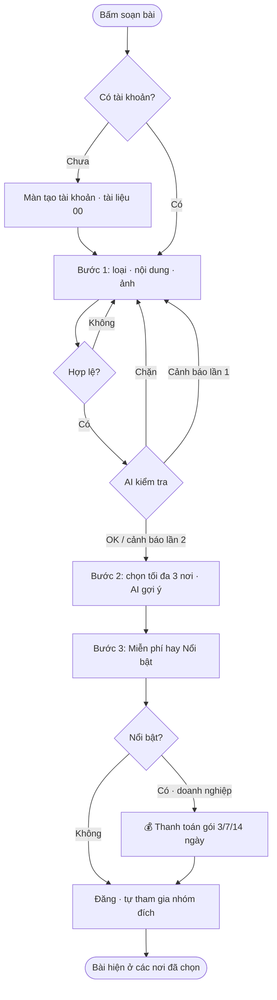
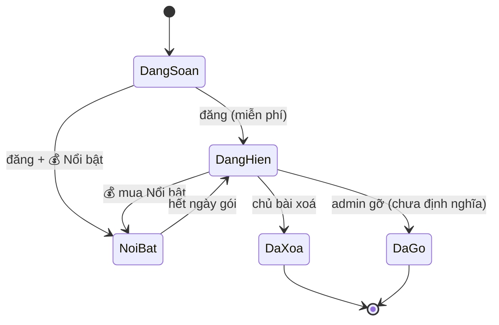

# 01 · Bảng tin, Nhóm ngành & Chợ mua bán

**Cập nhật:** 2026-09-26
**Đối tượng đọc:** Dev, PM, QA, kiểm duyệt, CSKH
**Trạng thái:** Draft — chờ Brian duyệt
**Nguồn:** module `mod_feed.html` trong bản mẫu Community
**Điều kiện tiên quyết:** tài liệu 00 (tài khoản, đồng ý điều khoản)

---

## Tổng quan

Bảng tin là nơi thành viên đăng bài **một lần, hiện ở tối đa 3 nơi** (Bảng tin chung, cộng đồng ngành, chợ mua bán theo ngành). Có 4 loại bài: Khoe mẫu, Mẹo nghề, Hỏi đáp, Mua bán. Bài mua bán bắt buộc ghi giá và chỉ vào Chợ để giữ cộng đồng ngành sạch. AI kiểm tra nội dung trước khi đăng để chặn dấu hiệu lừa đảo. Đăng miễn phí; tài khoản doanh nghiệp có thể mua **Nổi bật** (ghim đầu, nhãn "Được tài trợ"). Giá trị kinh doanh: gom người Việt trong ngành về một chỗ, tạo lưu lượng cho Việc làm, Ca làm thêm và Deal.

---

## Khái niệm chính

| Thuật ngữ | Định nghĩa |
|---|---|
| **Bài** | Nội dung thành viên đăng. Loại: `Khoe mẫu` 📷, `Mẹo nghề` 💡, `Hỏi đáp` ❓, `Mua bán` 🛍️. Bài hệ thống có loại `OFFICIAL`. |
| **Đích đăng** | Nơi bài xuất hiện. 3 loại: **Bảng tin chung**, **Cộng đồng ngành** (Nail, Spa & Massage, Tóc & Salon, Mi & Chân mày), **Chợ theo ngành** (Chợ Nail Houston, Chợ Đồ nghề toàn quốc, Sang tiệm & Thuê ghế, Chợ Spa & Massage…). |
| **Nhóm** | Cộng đồng ngành hoặc Chợ. Thành viên tham gia tự do, có nội quy ngắn. |
| **Nổi bật** | Gói trả phí ghim bài lên đầu các đích đã chọn trong 3/7/14 ngày, gắn nhãn "⭐ Nổi bật · Được tài trợ". Chỉ tài khoản doanh nghiệp. |
| **Tài khoản doanh nghiệp** | Tiệm, nhà phân phối (có POS hoặc được xác minh). Đối lập với tài khoản thợ cá nhân. |
| **AI kiểm tra trước khi đăng** | Bước tự động quét nội dung: chặn hẳn hoặc cảnh báo. |

---

## Vai trò

| Vai trò | Làm gì |
|---|---|
| Khách chưa đăng ký | Xem bài, lọc theo nhóm, báo cáo/ẩn bài, rời nhóm. Không đăng, không thích, không tham gia/tạo nhóm. |
| Thợ (cá nhân) | Đăng miễn phí, thích, bình luận, tham gia/tạo nhóm, nhắn người bán. Không mua Nổi bật. |
| Chủ tiệm / doanh nghiệp | Như thợ + mua Nổi bật. |
| Admin NEXORA | Đặt giá Nổi bật, bật/tắt "chỉ doanh nghiệp được mua". Kiểm duyệt (chưa có luồng). |

---

## Luồng nghiệp vụ

### Luồng 1: Đăng bài (3 bước)

**Tác nhân:** thành viên · **Kích hoạt:** bấm ô "{Tên} ơi, bạn đang nghĩ gì?" hoặc nút nhanh (📷 Khoe mẫu · 💡 Mẹo nghề · ❓ Hỏi đáp · 🛍️ Mua bán) · **Kết quả:** bài xuất hiện ở các đích đã chọn.

**User stories**
- Là thợ, tôi muốn đăng ảnh mẫu tay một lần và hiện ở cả Bảng tin lẫn Cộng đồng Nail.
- Là người bán, tôi muốn đăng máy mài có giá, hiện ở Chợ Nail Houston, để người mua nhắn tôi trong app.
- Là chủ tiệm, tôi muốn bài sang tiệm được ghim 7 ngày.
- Là NEXORA, tôi muốn chặn bài đòi chuyển tiền trước.

| Bước | Ai | Hành động | Hệ thống phản hồi | Ghi chú |
|---|---|---|---|---|
| 1.1 | Thành viên | Chọn loại bài; với Mua bán nhập **Danh mục** (Máy móc & thiết bị / Bột, gel, sơn / Nội thất tiệm / Sang tiệm · thuê ghế / Dụng cụ & đồ nghề), **Giá ($)**, **Khu vực** (Houston · Dallas · Austin · Toàn quốc có ship) | | |
| 1.2 | Thành viên | Nhập nội dung (≤ 1500 ký tự), thêm ảnh (≤ 6) | Có ảnh ⇒ bắt buộc tick "Ảnh do tôi chụp hoặc có quyền đăng; khách trong ảnh đã đồng ý." | |
| 1.3 | Thành viên | Bấm "Tiếp →" | Kiểm tra: nội dung ≥ 5 ký tự (`Nội dung quá ngắn`); Mua bán phải có giá (`Bài mua bán cần ghi giá`); ảnh phải tick (`Xác nhận quyền đăng ảnh & sự đồng ý của khách`) | |
| 1.4 | Hệ thống | **AI kiểm tra**: CHẶN nếu có `zelle · cash app · gift card · chuyển tiền trước · đặt cọc · venmo · western union` ⇒ `⛔ AI chặn: Yêu cầu chuyển tiền / đặt cọc ngoài app — dấu hiệu lừa đảo phổ biến. Vui lòng sửa nội dung.`; CẢNH BÁO nếu có SĐT 10 số ⇒ `⚠️ Có số điện thoại — nên để người mua nhắn tin trong app. Sửa lại hoặc bấm “Tiếp” lần nữa.` | Cảnh báo được bỏ qua ở lần bấm thứ 2; sửa nội dung thì cảnh báo lại |
| 2.1 | Hệ thống | Gợi ý đích (AI): Mua bán → theo từ khoá (`sang tiệm · thuê ghế · booth` → Sang tiệm & Thuê ghế; `spa · giường · massage` → Chợ Spa; khu vực Toàn quốc → Chợ Đồ nghề toàn quốc; còn lại → Chợ Nail Houston). Không mua bán → theo ngành (`spa · massage` / `tóc · hair` / `mi · lash · chân mày` / mặc định Nail). Luôn kèm Bảng tin | Nút "Dùng gợi ý" | Chỉ tự áp nếu người dùng chưa tự chọn |
| 2.2 | Thành viên | Chọn tối đa **3 nơi** | Chọn nơi thứ 4 ⇒ `Tối đa 3 nơi để tránh spam`; Mua bán bấm Cộng đồng ngành ⇒ `Cộng đồng ngành không cho mua bán — chọn nhóm Chợ`; bài thường bấm Chợ ⇒ `Chợ chỉ dành cho bài mua bán`; 0 nơi ⇒ `Chọn ít nhất 1 nơi đăng` | Nhóm chưa tham gia: "sẽ tự tham gia khi đăng" |
| 3.1 | Thành viên | Chọn **Miễn phí** hoặc **Nổi bật** (3/7/14 ngày, giá mẫu $5/$10/$18, thanh toán Ví NEXORA hoặc thẻ) | Tài khoản thợ chọn Nổi bật ⇒ `Nổi bật dành cho tài khoản doanh nghiệp`, ép về Miễn phí | 💰 Bước thanh toán nếu Nổi bật |
| 3.2 | Thành viên | Bấm "🚀 Đăng bài" | Tự tham gia các nhóm đích, bài lên đầu, đánh dấu "mới đăng". Toast `✓ Đã đăng miễn phí vào {n} nơi` hoặc `⭐ Đã đăng & Nổi bật {d} ngày — đã thanh toán ${p}` | |

### Luồng 2: Tương tác với bài

| Hành động | Điều kiện | Hệ thống |
|---|---|---|
| ♡ Thích | Cần tài khoản | Đổi trạng thái, ±1 |
| 💬 Bình luận | — | **Chưa có trong bản mẫu** |
| ✉️ Nhắn người bán (bài Mua bán) | Không cần tài khoản để mở | Mở Tin nhắn với người bán; gửi tin cần tài khoản (tài liệu 05) |
| 🚩 Báo cáo | Không cần tài khoản | Ẩn với người báo cáo; toast `🚩 Đã báo cáo — bài ẩn với bạn`. **Chưa có hàng đợi kiểm duyệt** |
| 🙈 Ẩn bài | Không cần tài khoản | Ẩn phía người xem |
| 🗑 Xoá bài (bài của mình) | Chủ bài | Xoá |

### Luồng 3: Nhóm — tham gia & tạo

| Bước | Ai | Hành động | Hệ thống |
|---|---|---|---|
| 1 | Thành viên | Bấm "Tham gia" trên nhóm | Tham gia ngay, không duyệt. Toast `✓ Đã tham gia {tên}`. Bộ lọc Bảng tin có thêm nhóm này |
| 2 | Thành viên | Bấm "Đã tham gia ✓" | Rời nhóm. Toast `Đã rời nhóm` |
| 3 | Thành viên | "＋ Tạo nhóm": Tên (≥ 3 ký tự), Ngành (Nail / Spa & Massage / Tóc & Salon / Mi & Chân mày), Loại (🛍️ Chợ mua bán — bắt buộc ghi giá · 👥 Cộng đồng ngành — không mua bán), Phí (🆓 Miễn phí · 💳 Thu phí thành viên · Pro — **sắp có, khoá**), Nội quy (mặc định "Ghi giá rõ · Không chuyển tiền trước · Đúng ngành") | Tạo nhóm, người tạo tự tham gia. Chọn Thu phí ⇒ `Nhóm thu phí thuộc bản Pro — cần điều khoản thanh toán riêng` |

---

## Cấu hình & quản trị

- **Giá Nổi bật** (admin): 3 ô giá cho 3/7/14 ngày + ô "Chỉ tài khoản doanh nghiệp được mua Nổi bật (thợ cá nhân luôn đăng miễn phí)". Giá hiện tại trong bản mẫu là **GIÁ MẪU** — Brian quyết giá thật.
- **Danh sách nhóm mặc định** (seed): Bảng tin chung; Cộng đồng Nail / Spa & Massage / Tóc & Salon / Mi & Chân mày; Chợ Nail Houston (nội quy: Ghi giá rõ · Không chuyển tiền trước); Chợ Đồ nghề Nail toàn quốc (Ghi rõ phí ship); Sang tiệm & Thuê ghế (Ghi rõ khu vực & giá); Chợ Spa & Massage.
- **Từ khoá AI chặn/cảnh báo**: danh sách cấu hình được, đa ngôn ngữ (xem Câu hỏi mở).

---

## Vòng đời trạng thái

**Bài đăng**

| Trạng thái | Kích hoạt | Trạng thái mới | Ghi chú |
|---|---|---|---|
| Đang soạn | Đăng | Đang hiện (mới đăng) | Viền tím trong vài phút đầu |
| Đang hiện | Mua Nổi bật | Nổi bật (đến hết ngày) | Ghim đầu các đích |
| Nổi bật | Hết ngày | Đang hiện | Tự động, không thông báo |
| Đang hiện | Chủ bài xoá | Đã xoá | |
| Đang hiện | Bị báo cáo | Đang hiện · có báo cáo | Kiểm duyệt — chưa định nghĩa |
| Đang hiện · có báo cáo | Admin gỡ | Đã gỡ | Chưa định nghĩa |

**Thành viên ↔ nhóm:** Chưa tham gia ⇄ Đã tham gia (tự do, không duyệt). Tự tham gia khi đăng bài vào nhóm.

---

## Quy tắc nghiệp vụ

- **Tối đa 3 đích** mỗi bài. Bảng tin luôn được gợi ý kèm.
- **Bài Mua bán** chỉ vào Bảng tin + Chợ; **bài thường** chỉ vào Bảng tin + Cộng đồng ngành.
- **Bài Mua bán bắt buộc:** giá (số nguyên USD ≤ 6 chữ số), danh mục, khu vực. Mỗi bài Mua bán hiện hộp: "Giao dịch trực tiếp giữa thành viên. NEXORA không đứng giữa & không bảo đảm. Không chuyển tiền trước."
- **Ảnh** ≤ 6, phải xác nhận quyền đăng & sự đồng ý của khách trong ảnh.
- **Mỗi người chỉ thấy bài 1 lần** dù bài ở nhiều nhóm (khử trùng lặp ở tầng phân phối — thuật toán chưa định nghĩa).
- **Nổi bật**: 💰 trả trước theo gói ngày; ghim đầu mọi đích đã chọn; sắp xếp: bài Nổi bật còn hạn trước, rồi theo thời gian; nhãn "Được tài trợ" bắt buộc (tuân thủ quy định quảng cáo). > 💡 Ảnh hưởng tiền: cần hoá đơn, hoàn tiền khi gỡ bài, thuế bán hàng theo bang.
- **Chỉ doanh nghiệp mua Nổi bật** khi admin bật cờ này (mặc định bật).
- **AI kiểm tra** chạy trước khi sang bước 2; chặn là chặn hẳn, cảnh báo cho qua ở lần bấm thứ 2.
- **Báo cáo/ẩn** chỉ ẩn phía người xem cho tới khi có kiểm duyệt.

---

## Ngoại lệ

| Tình huống | Xử lý | Ai |
|---|---|---|
| Thanh toán Nổi bật thất bại | Bài không đăng; giữ bản nháp; báo lỗi | Hệ thống |
| Người dùng gỡ bài Nổi bật trước hạn | Chưa định nghĩa hoàn tiền | Brian |
| Bài Mua bán đã bán | Chưa có trạng thái "Đã bán" | PM |
| Nhiều bài Nổi bật cùng lúc | Sắp theo thời gian đăng | Hệ thống |
| Người đăng bị chặn/khoá | Bài ẩn toàn bộ (chưa có luồng) | Kiểm duyệt |

---

## Câu hỏi thường gặp

**Q:** Tôi đăng bài mua bán vào Cộng đồng Nail được không? **A:** Không. Bài mua bán chỉ vào Chợ và Bảng tin chung.
**Q:** Thợ có mua Nổi bật được không? **A:** Không, thợ cá nhân luôn đăng miễn phí; Nổi bật dành cho tài khoản doanh nghiệp.
**Q:** Tại sao bài của tôi bị chặn? **A:** Nội dung có yêu cầu chuyển tiền/đặt cọc ngoài app. Sửa lại để người mua thanh toán trong app.

---

## Liên quan
- 00 Tài khoản & điều khoản · 05 Tin nhắn (nhắn người bán) · 04 Deal & Coupon (coupon có thể đăng lên Bảng tin — 1 bài giới thiệu)

---

## Câu hỏi mở

1. **Giá Nổi bật thật**, thuế, hoá đơn, hoàn tiền; boost theo từng đích hay cả bài.
2. **Xác minh "tài khoản doanh nghiệp"**: có POS = doanh nghiệp? Nhà phân phối không có POS thì sao?
3. **Bình luận**: chưa có. Có làm ở giai đoạn 1 không?
4. **Kiểm duyệt**: hàng đợi báo cáo, lý do báo cáo, ngưỡng tự ẩn, quy trình khoá tài khoản.
5. **AI kiểm tra thật**: dùng model nào, danh sách từ khoá VI/EN, có quét ảnh không, ngưỡng chặn/cảnh báo, lưu log.
6. **Tin Mua bán**: trạng thái Đã bán/hết hạn, sửa bài, chống đăng trùng.
7. **Nhóm**: quyền quản trị nhóm, duyệt thành viên, sửa/xoá nhóm, nhóm thu phí (Pro) và thuế, nhóm theo địa lý (Houston/Dallas/Austin).
8. **Upload ảnh**: kích thước, định dạng, kiểm duyệt ảnh.
9. **Thuật toán "mỗi người thấy 1 lần"** khi bài ở nhiều nhóm.
