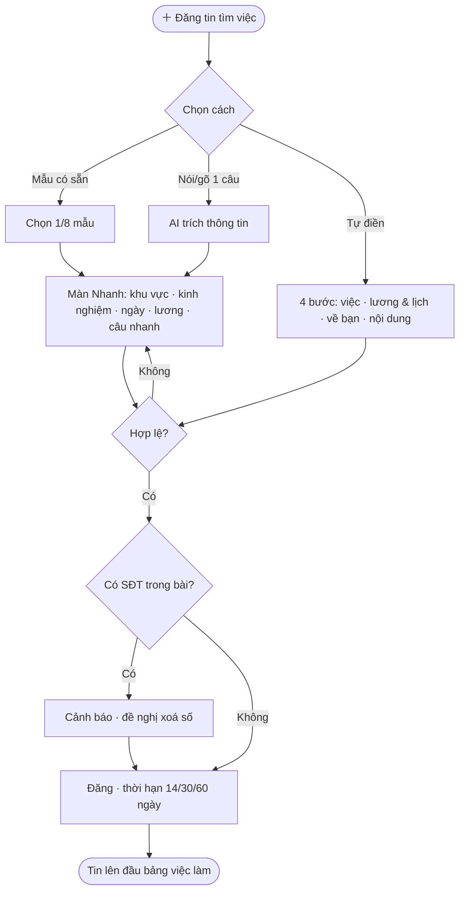
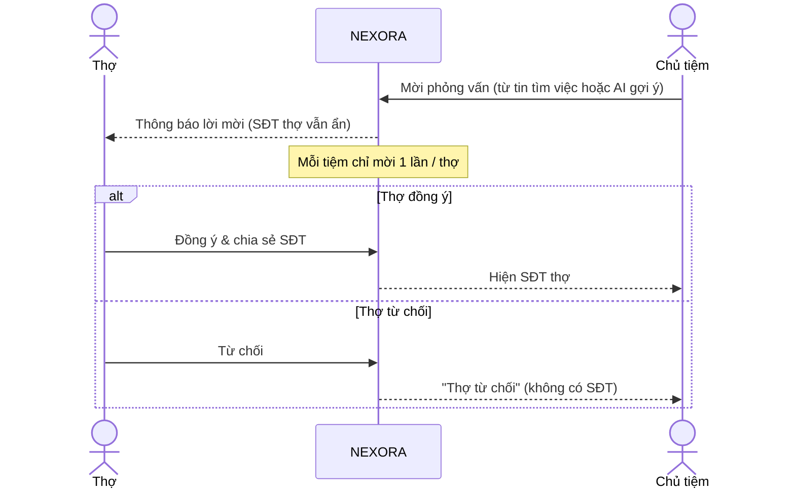
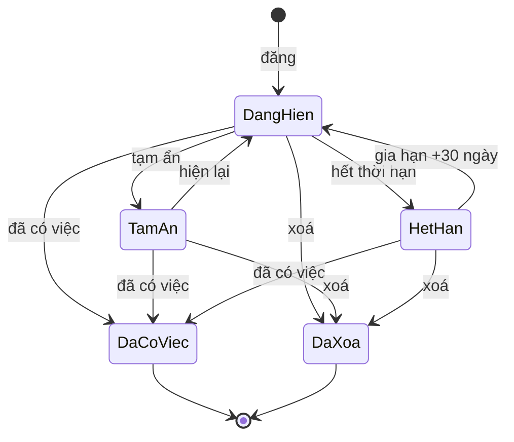

# 02 · Việc làm — thợ tìm việc, tiệm tuyển thợ, hồ sơ thợ

**Cập nhật:** 2026-09-26
**Đối tượng đọc:** Dev, PM, QA, CSKH
**Trạng thái:** Draft — chờ Brian duyệt
**Nguồn:** `mod_jobsTech.html` (phía thợ), `mod_jobsOwner.html` (phía chủ + hồ sơ thợ). Hai bản mẫu được làm độc lập; tài liệu này **hợp nhất** và ghi rõ chỗ lệch để Brian chốt.
**Điều kiện tiên quyết:** tài liệu 00

---

## Tổng quan

Một bảng việc làm chung: **tiệm đăng tin tuyển từ POS**, **thợ đăng tin tìm việc từ Community**, cả hai phía cùng thấy. Thợ tạo **Hồ sơ thợ** một lần (kỹ năng, license, ảnh mẫu tay, việc mong muốn) rồi dùng để AI viết bài, ứng tuyển 1 chạm và để AI gợi ý thợ cho tiệm. Quyền riêng tư là điểm bán hàng: thợ **ẩn với tiệm đang làm**, **ẩn số điện thoại** — tiệm chỉ thấy SĐT khi thợ đồng ý chia sẻ sau lời mời phỏng vấn.

---

## Khái niệm chính

| Thuật ngữ | Định nghĩa |
|---|---|
| **Tin tìm việc** (`seek`) | Bài của thợ. Tạo bằng 1 trong 3 cách: mẫu có sẵn, nói/gõ 1 câu, tự điền 4 bước. |
| **Tin tuyển thợ** (`hire`) | Bài của tiệm, đăng từ POS, tự xuất hiện trên Community chung. |
| **Hồ sơ thợ** | Hồ sơ tạo 1 lần: cơ bản, kỹ năng, portfolio, việc mong muốn. Có % hoàn thiện. |
| **Lời mời phỏng vấn** | Tiệm gửi cho thợ. Thợ đồng ý ⇒ tiệm thấy SĐT. |
| **Ứng tuyển bằng hồ sơ** | Thợ gửi hồ sơ tới tin tuyển, SĐT vẫn ẩn. |
| **Chế độ kín** | Ẩn tin/hồ sơ với tiệm thợ đang làm. |
| **AI gợi ý thợ** | Điểm khớp giữa tin tuyển và hồ sơ thợ (kỹ năng, thành phố, loại việc). |

---

## Vai trò

| Vai trò | Làm gì |
|---|---|
| Thợ | Tạo hồ sơ, đăng/sửa/tạm ẩn/gia hạn/xoá tin tìm việc, ứng tuyển, nhận & xử lý lời mời, bật chế độ kín. |
| Chủ tiệm | Đăng tin tuyển từ POS, xem AI gợi ý thợ, mời phỏng vấn, xem SĐT sau khi thợ đồng ý. |
| Khách chưa đăng ký | Xem bảng việc làm. |

---

## Luồng nghiệp vụ

### Luồng 1: Thợ tạo Hồ sơ thợ (một lần)

**Kích hoạt:** tab ✨ Hồ sơ thợ · **Kết quả:** hồ sơ có % hoàn thiện, dùng cho mọi bài.

| Bước | Trường | Giá trị |
|---|---|---|
| 1. Cơ bản | Tên hiển thị · Kinh nghiệm · Thành phố · Ngôn ngữ · Giới thiệu ngắn | Kinh nghiệm: Mới vào nghề / Dưới 1 năm* / 1–3 / 3–5 / 5–10 / Trên 10 năm. Ngôn ngữ: Tiếng Việt, English, Español |
| 2. Kỹ năng | Kỹ năng (nhiều) · License · Số license | Kỹ năng: Bột/Acrylic, Dip, Gel-X, Gel Polish, Nail Art, Chân/Pedicure, Tay nước, Wax, Lash, Massage*. License: Có license (TX TDLR) / bang khác / Đang học · chờ thi. Số license "để xác minh, không công khai" |
| 3. Portfolio | Ảnh mẫu tay ≤ 9 | Ảnh đầu = ảnh bìa |
| 4. Việc mong muốn | Loại việc (nhiều) · Hình thức lương · Mức mong muốn · Đi xa* · Ca* · Bắt đầu* | Loại: Full-time, Part-time, Cuối tuần, Thay ca/Temp. Lương: Lương bao, Ăn chia, Bao lương + ăn chia*, Thuê ghế, Thoả thuận |
| Riêng tư | Đang tìm việc (bật) · Ẩn với tiệm hiện tại (bật) · Ẩn số điện thoại (bật) · Ẩn họ, chỉ hiện tên* (tắt) | |

\* Chỉ có ở một trong hai bản mẫu — xem Câu hỏi mở #1.

**% hoàn thiện:** +10 mỗi mục tên/kinh nghiệm/thành phố/giới thiệu/license; +15 có kỹ năng; +5 mỗi ảnh (tối đa 15); +10 loại việc; +10 lương; trần 100. **Cần ≥ 60% để AI viết bài** và để xuất hiện trong AI gợi ý thợ. Badge "✓ LICENSE XÁC MINH" chỉ hiện khi có cả loại license và số license (bản mẫu chưa xác minh thật).

### Luồng 2: Thợ đăng tin tìm việc (3 cách)

**Kích hoạt:** "＋ Đăng tin tìm việc" · **Kết quả:** tin lên đầu bảng, các tiệm thấy và gửi lời mời.

| Cách | Bước | Hệ thống |
|---|---|---|
| **A. Mẫu có sẵn** (~30 giây) | Chọn 1 trong 8 mẫu → màn Nhanh: khu vực, kinh nghiệm, ngày làm, lương (Thoả thuận / Từ–Đến /tuần·ngày·tháng), 8 "câu nhanh" (Làm nhanh sạch sẽ · Khách quen đông · Có đồ nghề riêng · Muốn làm lâu dài · Giao tiếp tiếng Anh được · Có xe đi làm đúng giờ · Vui vẻ hoà đồng · Có license TX) → "🚀 Đăng ngay" | Tiêu đề + bài tự sinh từ mẫu; sửa tay được, có nút "↺ Viết lại theo mẫu". Lỗi: `Vui lòng chọn khu vực, kinh nghiệm, ít nhất 1 ngày làm; tiêu đề ≥ 10 ký tự, bài ≥ 30 ký tự.` |
| **B. Nói/gõ 1 câu** | Bấm 🎤 hoặc gõ "thợ bột 5 năm tìm full-time Houston 1000/tuần" → "✦ AI điền giúp" | AI trích: mẫu gần nhất, kỹ năng, số năm → nhóm kinh nghiệm, loại việc, thành phố, lương, hình thức, tiếng Anh, đi bang khác. Hiện "✦ AI hiểu là: …" để thợ sửa. Không nhận ra ⇒ `Chưa nhận ra nhiều — đã chọn mẫu gần nhất.` Dưới 6 ký tự ⇒ `Hãy nói hoặc gõ ít nhất vài chữ về việc bạn muốn tìm.` |
| **C. Tự điền 4 bước** | 1 Việc muốn tìm (vị trí, kỹ năng, loại việc, khu vực, phạm vi đi xa) → 2 Lương & lịch (hình thức, mức, ngày, ca, bắt đầu) → 3 Về bạn (kinh nghiệm, license, ngôn ngữ, ảnh ≤ 6) → 4 Nội dung & đăng ("✦ AI viết giúp", "🌐 Thêm bản English", "✂️ Viết ngắn lại", riêng tư, thời hạn 14/30/60 ngày) | Có "Điền nhanh" từ hồ sơ NEXORA. Lỗi từng bước: `Vui lòng chọn vị trí, ít nhất 1 dịch vụ, loại việc và khu vực.` · `Vui lòng chọn hình thức lương và ngày có thể làm. Mức “Từ” phải nhỏ hơn “Đến”.` · `Vui lòng chọn kinh nghiệm.` · `Tiêu đề cần ít nhất 10 ký tự và phần giới thiệu ít nhất 30 ký tự.` |

**8 mẫu:** 💅 Thợ bột full-time · 🦶 Thợ tay chân nước · ✨ Gel-X / Nail Art · 📅 Part-time cuối tuần · 🌱 Mới vào nghề / thợ phụ · 🔁 Thay ca / làm temp · 🚗 Đi bang khác, cần chỗ ở · 🗣️ Receptionist biết tiếng Anh. Mọi bài mẫu kết bằng "Tiệm quan tâm vui lòng gửi lời mời qua NEXORA."

**Số điện thoại trong bài:** phát hiện SĐT dạng Mỹ ⇒ cảnh báo `⚠️ Bài có số điện thoại trong nội dung. Bạn đang bật “Ẩn số điện thoại” — nên xoá để tiệm liên hệ qua lời mời trong app.` + nút "Xoá số khỏi bài" (thay bằng `[liên hệ qua NEXORA]`). Chỉ cảnh báo, không chặn.

### Luồng 3: Tiệm tuyển thợ từ POS

| Bước | Ai | Hành động | Hệ thống |
|---|---|---|---|
| 1 | Chủ tiệm | Trong POS → Tuyển thợ: tên tiệm, thành phố, **Cần thợ biết** (kỹ năng), loại việc, hình thức lương, mức (text tự do), tuỳ chọn 🔥 Cần gấp · 🏠 Có chỗ ở | |
| 2 | Chủ tiệm | "✦ AI viết tin tuyển" | Sinh tiêu đề `[Cần gấp] Thợ <kỹ năng> <loại> tại <thành phố>` và nội dung kết bằng "Tiệm dùng NEXORA POS — tips minh bạch, trả đúng hạn." |
| 3 | Chủ tiệm | "Đăng lên cộng đồng" | Tin lên bảng chung; thợ ở mọi tiệm đều thấy. Toast `✓ Tin tuyển đã lên Community chung` |
| 4 | Hệ thống | Hiện **AI gợi ý thợ phù hợp** với điểm %: `60 × kỹ năng trùng / số kỹ năng cần` + 25 cùng thành phố + 15 loại việc khớp, trần 100. Loại thợ đang làm tại tiệm này có bật chế độ kín | Ghi chú cố định: "🛡️ … đang làm tại tiệm của bạn và bật chế độ kín — nên không xuất hiện ở đây." |
| 5 | Chủ tiệm | "Mời phỏng vấn" / "Mời" | Tạo lời mời `Chờ thợ duyệt · SĐT ẩn`. Mỗi tiệm mời mỗi thợ 1 lần. Toast `📩 Đã gửi lời mời tới <tên>` |

### Luồng 4: Lời mời phỏng vấn & chia sẻ SĐT (hai chiều)

| Bước | Ai | Hành động | Hệ thống |
|---|---|---|---|
| 1 | Thợ | Thấy "📩 Lời mời phỏng vấn": "🏪 <tiệm> · Mời bạn phỏng vấn thử tay nghề" | |
| 2a | Thợ | "Đồng ý & chia sẻ SĐT" | Lời mời → `ok`; tiệm thấy "✓ Thợ đồng ý · 📞 <SĐT>". Toast `✓ Đã chia sẻ SĐT với tiệm` |
| 2b | Thợ | "Từ chối" | Lời mời → `no`; tiệm thấy "Thợ từ chối" |
| — | Thợ | "Ứng tuyển bằng hồ sơ" trên tin tuyển | Toast `✓ Đã gửi hồ sơ tới tiệm (SĐT vẫn ẩn)`. **Bản mẫu không tạo bản ghi và tiệm không có màn xem đơn** — xem Câu hỏi mở |

### Luồng 5: Quản lý tin của tôi (thợ)

| Nút | Hiệu ứng | Toast |
|---|---|---|
| ✏️ Sửa | Mở lại form với dữ liệu cũ; giữ id; ghi "vừa sửa" | `✓ Đã lưu thay đổi` |
| ⏸ Tạm ẩn / ▶ Hiện lại | Ẩn/hiện trên bảng | `Đã tạm ẩn bài` / `Bài đã hiện lại` |
| ↻ Gia hạn 30 ngày (khi hết hạn) | Hiện lại, +30 ngày | `↻ Đã gia hạn 30 ngày` |
| 🎉 Đã có việc | Xác nhận "Bài sẽ gỡ khỏi bảng việc làm và các lời mời đang chờ sẽ được báo là bạn đã có việc." | `🎉 Đã đánh dấu có việc` |
| 🗑 Xoá | Xác nhận "Bài và lời mời liên quan sẽ bị xoá, không khôi phục được." | `Đã xoá bài` |

Thống kê trên mỗi tin: 👁 lượt xem · 📩 lời mời · 💾 lưu · còn N ngày · badge "🔒 Ẩn với <tiệm>".

---

## Vòng đời trạng thái

**Tin tìm việc**

| Trạng thái | Kích hoạt | Mới | Ghi chú |
|---|---|---|---|
| Đang hiển thị | Tạm ẩn | Tạm ẩn | |
| Tạm ẩn | Hiện lại | Đang hiển thị | |
| Đang hiển thị | Hết thời hạn 14/30/60 ngày | Hết hạn | Tự ẩn; **bản mẫu chưa có bộ đếm ngày** |
| Hết hạn | Gia hạn | Đang hiển thị | +30 ngày |
| Bất kỳ (trừ Đã có việc) | Đã có việc | Đã có việc | Không quay lại; thông báo tiệm đang chờ |
| Bất kỳ | Xoá | Đã xoá | |

**Lời mời phỏng vấn:** Mới (chờ thợ duyệt, SĐT ẩn) → Đồng ý (hiện SĐT) | Từ chối. Không có thu hồi/hết hạn trong bản mẫu.

---

## Quy tắc nghiệp vụ

- **Một bảng chung** cho tin tuyển và tin tìm việc; lọc: Tất cả / Tìm việc / Tuyển thợ, khu vực, tìm theo tiêu đề/tên/khu vực.
- **Thợ cá nhân đăng miễn phí.** Tiệm: chưa chốt có phí/Nổi bật hay không.
- **Chế độ kín:** thợ bật "Ẩn với tiệm hiện tại" ⇒ chủ tiệm đó không thấy tin & hồ sơ, không thấy trong AI gợi ý. "Tiệm hiện tại" lấy từ Staff ID/POS mà thợ đang thuộc.
- **Ẩn SĐT (mặc định bật):** tiệm không bao giờ thấy SĐT cho tới khi thợ đồng ý sau lời mời. > 💡 Quyền riêng tư — không được lộ SĐT qua bất kỳ đường nào khác (tin nhắn, hồ sơ, API).
- **Mỗi tiệm mời mỗi thợ 1 lần.** Mỗi thợ 1 tin tìm việc đang hiển thị (bản mẫu owner: đăng lại thay bài cũ) — cần chốt.
- **AI viết bài chỉ ghép từ dữ liệu thợ đã chọn**, không bịa (bản mẫu là template). Bản English chỉ thêm khi thợ bấm.
- **Tin tuyển từ POS** tự lên Community; sửa/tạm ẩn/xoá tin tuyển — chưa có trong bản mẫu.
- **Nhóm kinh nghiệm, kỹ năng, hình thức lương, loại việc, thành phố, license** phải là **một bộ enum thống nhất** giữa hồ sơ, tin tìm việc, tin tuyển và AI gợi ý (hiện hai bản mẫu lệch nhau).

---

## Ngoại lệ

| Tình huống | Xử lý | Ai |
|---|---|---|
| Thợ đăng tin thứ 2 khi đã có tin đang hiển thị | Chưa chốt: cho phép nhiều tin hay thay bài cũ | Brian |
| Tiệm mời thợ đã "Đã có việc" | Không cho mời; báo "Thợ đã có việc" | Hệ thống |
| Thợ tắt "Ẩn số điện thoại" | Chưa chốt: tiệm thấy SĐT ngay trên hồ sơ? | Brian |
| Hồ sơ < 60% | AI viết bài bị khoá, không vào AI gợi ý; hint "Hồ sơ mới N%. Cần ≥ 60% để AI viết bài." | Hệ thống |
| Chủ tiệm có nhiều tiệm | Chế độ kín áp dụng theo tiệm nào? | Brian |

---

## Câu hỏi thường gặp

**Q:** Chủ tiệm tôi đang làm có thấy tôi tìm việc không? **A:** Không, nếu bạn giữ "Ẩn với tiệm hiện tại" bật (mặc định bật).
**Q:** Tiệm gọi tôi được không? **A:** Chỉ khi bạn bấm "Đồng ý & chia sẻ SĐT" sau lời mời phỏng vấn.
**Q:** Tin của tôi hết hạn thì sao? **A:** Tự ẩn, bấm "Gia hạn 30 ngày" để hiện lại.

---

## Liên quan
- 00 Tài khoản · 03 Ca làm thêm (thợ rảnh nhận ca ngắn) · 05 Tin nhắn (liên hệ sau khi chia sẻ SĐT)

---

## Câu hỏi mở

1. **Thống nhất enum** giữa hai bản mẫu: kinh nghiệm (`Mới vào nghề` vs `Dưới 1 năm`), hình thức lương (`Bao lương + ăn chia`, `Ăn chia (commission)` vs `Ăn chia`), loại việc (`Thay ca / Temp` vs `Thay ca`), kỹ năng (Massage), thành phố (San Antonio), license (`Có license TX` vs `Có license (TX TDLR)` + số).
2. **Mô hình tin tìm việc cuối:** form 3 cách + thời hạn + tạm ẩn/gia hạn (bản thợ) hay "1 bài duy nhất AI viết từ hồ sơ" (bản chủ)? Đề xuất: giữ 3 cách, "Điền nhanh" lấy từ Hồ sơ thợ.
3. **Hết hạn:** bộ đếm ngày, thông báo trước khi hết hạn, gia hạn theo thời hạn gốc hay luôn +30.
4. **Đã có việc:** cách thông báo cho tiệm đang chờ; liên kết tin ↔ lời mời.
5. **Nguồn thống kê** lượt xem / lời mời / lưu; "Nháp lưu tự động" có làm không.
6. **Ứng tuyển bằng hồ sơ:** cần bản ghi đơn ứng tuyển + màn xem đơn phía tiệm; SĐT có lộ khi ứng tuyển không.
7. **Xác minh license TDLR:** thủ công hay tự động (API TDLR).
8. **Tin tuyển phía tiệm:** sửa/tạm ẩn/xoá; có phí hay Nổi bật không.
9. **Nhận giọng nói tiếng Việt & AI parse thật:** model, độ chính xác chấp nhận được.
10. **Lời mời:** thu hồi, hết hạn, kèm tin nhắn/lịch phỏng vấn?
11. **AI gợi ý thợ:** có tính kinh nghiệm, lương, ngày, license không.
12. **SĐT trong bài:** chỉ cảnh báo hay tự che phía server.
