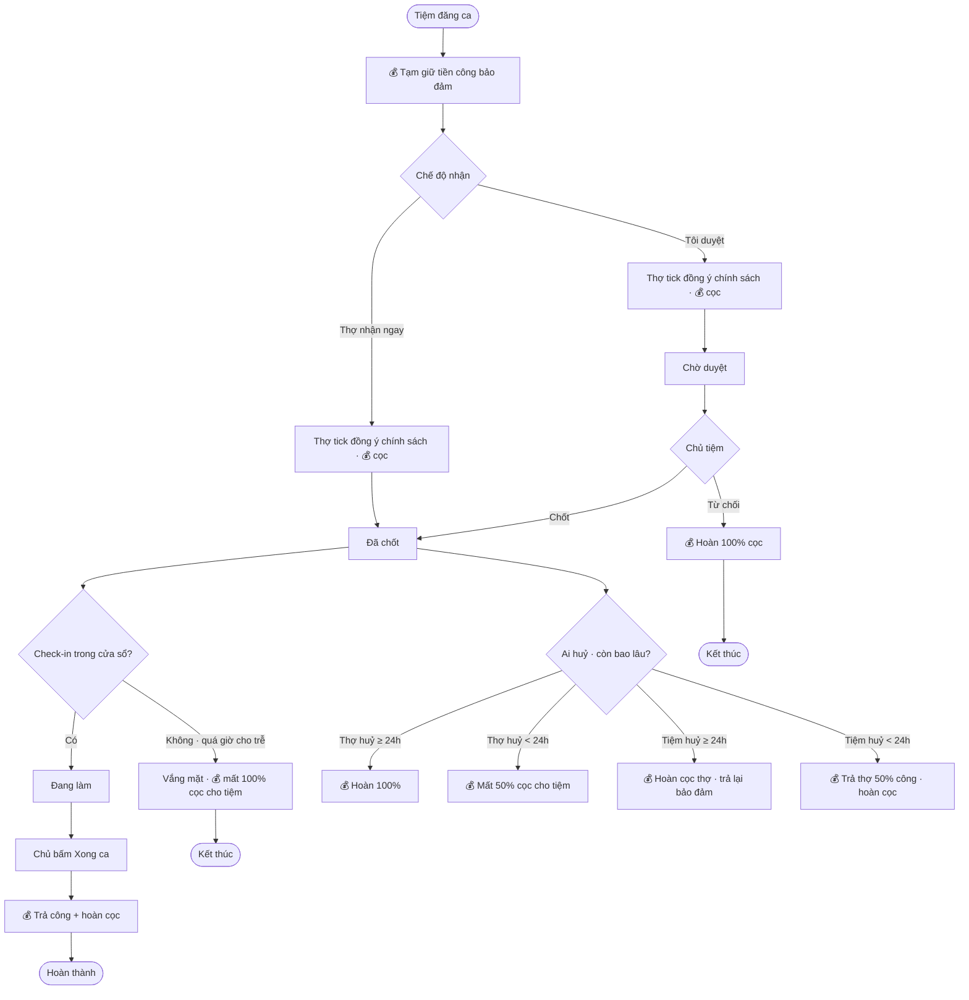
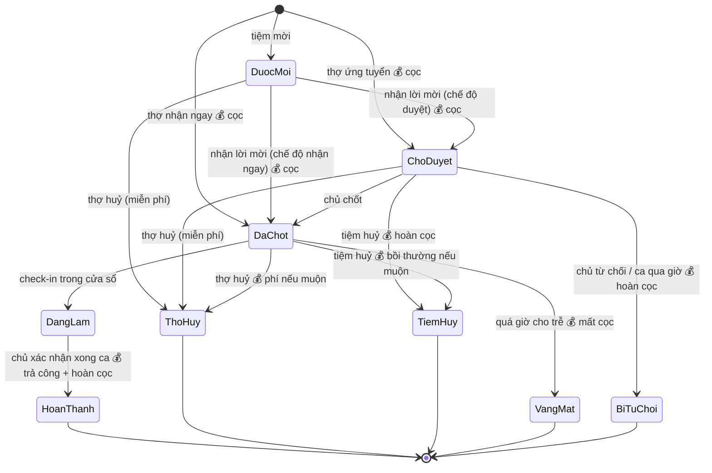

# 03 · Ca làm thêm & chia sẻ thợ

**Cập nhật:** 2026-09-26
**Đối tượng đọc:** Dev, PM, QA, CSKH, kế toán, luật sư
**Trạng thái:** Draft — chờ Brian duyệt · **mọi con số tiền/giờ trong tài liệu là SỐ MẪU**
**Nguồn:** `mod_shift.html`
**Điều kiện tiên quyết:** tài liệu 00; Điều khoản Thanh toán & Ca làm thêm riêng (luật sư)

---

## Tổng quan

Tiệm thiếu thợ (party, khách đông, thiếu gấp) đăng **ca làm thêm**; thợ rảnh gần đó nhận ca. Hai bên đều **đặt cọc qua NEXORA** để cam kết: thợ cọc để chốt ca, tiệm tạm giữ tiền công bảo đảm khi đăng. Thợ check-in tại tiệm, chủ xác nhận xong ca ⇒ thợ nhận tiền công và hoàn cọc. Huỷ muộn hoặc vắng mặt mất một phần/toàn bộ cọc cho bên kia. Tiệm cũng có thể **chia sẻ thợ dư** cho tiệm khác, với điều kiện thợ tự đồng ý. Đây là module **có dòng tiền** — mọi bước 💰 cần cổng thanh toán thật và luật sư duyệt.

---

## Khái niệm chính

| Thuật ngữ | Định nghĩa |
|---|---|
| **Ca** | Một khoảng làm việc tại một tiệm: loại (🎉 Party · 🔥 Khách đông · ⚡ Thiếu thợ gấp), thời gian, số thợ cần, dịch vụ, trả công/thợ, chế độ nhận. |
| **Chế độ nhận** | `Tôi duyệt từng thợ` (thợ ứng tuyển, chủ chốt) hoặc `Thợ nhận ngay (tự chốt)`. |
| **Cọc thợ** 💰 | % tiền công (mẫu 20%), tạm giữ khi thợ ứng tuyển/nhận ca. Hoàn 100% khi xong ca hoặc bị từ chối. |
| **Tiền công bảo đảm** 💰 | Trả công × số thợ cần, tạm giữ khi tiệm đăng ca. Thợ thấy "Tiệm đã bảo đảm tiền công". |
| **Chốt ca** | Ca có thợ được xác nhận. Từ lúc chốt, hai bên không huỷ miễn phí trong cửa sổ trước ca (mẫu 24h). |
| **Check-in** | Thợ xác nhận có mặt tại tiệm (GPS), mở từ 1 giờ trước ca đến hết thời gian cho trễ (mẫu 15 phút). |
| **Vắng mặt (no-show)** | Ca đã chốt, quá thời gian cho trễ mà không check-in. |
| **Độ tin cậy** | Số ca hoàn thành / vắng mặt / huỷ muộn của thợ; số ca đăng / huỷ muộn / trả đúng hạn của tiệm. |
| **Chia sẻ thợ** | Tiệm cho thợ của mình hiện với tiệm khác vào ngày rảnh. Thợ phải bật "Đồng ý chia sẻ" trước. |
| **Chính sách** | Bộ tham số admin: % cọc, giờ huỷ miễn phí, % mất khi huỷ muộn, % mất khi vắng, % tiệm trả khi huỷ muộn, phút cho trễ. |

---

## Vai trò

| Vai trò | Làm gì |
|---|---|
| Thợ | Bật "Sẵn sàng làm thêm" (ngày rảnh, bán kính, dịch vụ), xem ca gần, ứng tuyển/nhận ca, check-in, huỷ, nhận lời mời, bật "Đồng ý chia sẻ". |
| Chủ tiệm | Đăng ca, duyệt/từ chối thợ, mời thợ, xác nhận xong ca, huỷ ca, chia sẻ thợ dư, xem thợ rảnh gần tiệm. |
| Admin NEXORA | Chỉnh chính sách (số mẫu → số thật). |
| NEXORA (hệ thống) | Tạm giữ, hoàn, chuyển tiền qua đối tác thanh toán; xử lý no-show tự động; ghi sổ. |

---

## Luồng nghiệp vụ

### Luồng 1: Tiệm đăng ca

| Bước | Ai | Hành động | Hệ thống |
|---|---|---|---|
| 1 | Chủ tiệm | Chọn loại, tiêu đề, khi nào (Hôm nay / Ngày mai / 2 ngày / 3 ngày), giờ làm, số thợ cần (1–4), dịch vụ (Bột/Acrylic, Dip, Gel-X, Gel Polish, Nail Art, Chân/Pedicure, Tay nước, Wax), trả công/thợ, chế độ nhận | Thiếu ⇒ `Vui lòng chọn loại, tiêu đề, dịch vụ và trả công` |
| 2 | Chủ tiệm | Bấm "Đăng ca" | 💰 **Tạm giữ tiền công bảo đảm = trả công × số thợ** qua ví NEXORA/thẻ. Toast `✓ Đã đăng ca — thợ rảnh gần tiệm được báo ngay` |
| 3 | Hệ thống | Thông báo thợ đang bật "Sẵn sàng" trong bán kính, đúng ngày rảnh | Bản mẫu chưa lọc theo bán kính/ngày — chỉ UI |

### Luồng 2: Thợ nhận ca / ứng tuyển

| Bước | Ai | Hành động | Hệ thống |
|---|---|---|---|
| 1 | Thợ | Bật "🟢 Sẵn sàng làm thêm", chọn ngày rảnh, đi xa tối đa (5/10/25 mi) | Tắt ⇒ không thấy ca, không hiện với tiệm |
| 2 | Thợ | Bấm "⚡ Nhận ca & chốt" (chế độ nhận ngay) hoặc "🙋 Ứng tuyển" (chế độ duyệt) | Modal: trả công + tips, **Cọc chốt ca $X**, hộp "🔒 Cọc chỉ tạm giữ trên ví NEXORA / thẻ — không trả thẳng cho tiệm. Làm xong hoàn 100%.", chính sách huỷ, **checkbox bắt buộc** "Tôi đã đọc và đồng ý chính sách huỷ & vắng mặt của ca này." |
| 3 | Thợ | Bấm "Đặt cọc & chốt ca" / "Đặt cọc & ứng tuyển" | 💰 Tạm giữ cọc. Nhận ngay ⇒ trạng thái **Đã chốt**, toast `🔒 Đã chốt ca — nhớ check-in khi tới tiệm`. Ứng tuyển ⇒ **Chờ duyệt**, toast `✓ Đã ứng tuyển — chờ tiệm duyệt` |
| 4 | Chủ tiệm (chế độ duyệt) | Xem ứng viên với độ tin cậy, bấm "Chốt" hoặc "✕" | Chốt ⇒ toast `🔒 Đã chốt <tên> — cả 2 bên không huỷ miễn phí trong 24h trước ca`. ✕ ⇒ 💰 hoàn 100% cọc thợ |
| 5 | Chủ tiệm | "Mời vào ca" thợ rảnh gần tiệm | Lời mời; thợ bấm "Nhận lời mời & chốt" → đi lại bước 2–3 theo chế độ của ca |

### Luồng 3: Check-in → Xong ca → Thanh toán

| Bước | Ai | Hành động | Hệ thống |
|---|---|---|---|
| 1 | Thợ | "📍 Check-in tại tiệm" | Chỉ bật từ **1 giờ trước ca** đến hết **thời gian cho trễ** (mẫu 15 phút). Kiểm tra GPS khớp tiệm. Toast `📍 Check-in thành công — vị trí khớp với tiệm`. Ngoài cửa sổ ⇒ "Check-in mở 1 giờ trước ca · trễ tối đa 15 phút" |
| 2 | Hệ thống | Quá thời gian cho trễ mà chưa check-in | Tự chuyển **Vắng mặt**; 💰 cọc thợ chuyển cho tiệm ("bồi thường khách"); độ tin cậy thợ +1 vắng. Toast `❌ Không check-in quá 15 phút → vắng mặt, cọc chuyển cho tiệm` |
| 3 | Chủ tiệm | "Xong ca · trả tiền" | 💰 Thợ nhận **trả công** (từ tiền công bảo đảm) + **hoàn 100% cọc**. Độ tin cậy thợ +1 hoàn thành. Toast `✓ Đã trả $X cho <tên> & hoàn cọc`. Tips ngoài hệ thống |

### Luồng 4: Huỷ

| Ai huỷ | Trạng thái | Còn ≥ 24h* | Còn < 24h* |
|---|---|---|---|
| Thợ | Chờ duyệt / Được mời | Miễn phí, hoàn 100% cọc | Miễn phí, hoàn 100% cọc |
| Thợ | Đã chốt | Miễn phí, hoàn 100% cọc | 💰 Mất **50%** cọc → chuyển cho tiệm; hoàn phần còn lại; độ tin cậy +1 huỷ muộn. Modal: "Còn N giờ tới ca (dưới 24h). Bạn sẽ mất $X cọc — chuyển cho tiệm để xếp người thay/bồi thường khách." |
| Tiệm | Ca đã có thợ chốt | Miễn phí; thợ hoàn đủ cọc; tiệm nhận lại toàn bộ bảo đảm | 💰 Trả **50% tiền công** cho mỗi thợ đã chốt (từ bảo đảm); thợ hoàn đủ cọc; tiệm nhận lại phần còn lại. Modal: "Còn dưới 24h. Tiệm trả $X cho mỗi thợ đã chốt (N thợ) từ tiền công bảo đảm." |

\* Số mẫu. Tiệm **không thể huỷ ca đã chốt trong 24h mà không trả phí**. Tiệm huỷ muộn "sẽ bị giảm hiển thị" (chưa có logic).

### Luồng 5: Chia sẻ thợ dư

| Bước | Ai | Hành động | Hệ thống |
|---|---|---|---|
| 1 | Thợ | Bật "Đồng ý chia sẻ" trong app của mình | |
| 2 | Chủ tiệm | Trong "🤝 Chia sẻ thợ dư cho tiệm khác", bật công tắc chia sẻ cho thợ đã đồng ý, chọn ngày | Toast `<tên> hiện với tiệm gần đây (<ngày>)`. Thợ chưa đồng ý ⇒ chỉ có nút "Hỏi thợ" → `Đã gửi yêu cầu — <tên> tự bật "Đồng ý chia sẻ" trong app` |
| 3 | Tiệm khác | Thấy thợ trong "👀 Thợ đang rảnh gần tiệm" với nhãn "Chia sẻ từ <tiệm>", bấm "Mời vào ca" | Đi luồng 2 |

Nguyên tắc: **chủ tiệm không "cho mượn" thay thợ**. Không có dòng tiền giữa hai tiệm trong bản mẫu.

---

## Cấu hình & quản trị (admin)

Modal "⚙️ Chính sách (Admin NEXORA) — SỐ MẪU":

| Tham số | Giá trị mẫu | Giới hạn nhập |
|---|---|---|
| Cọc thợ (% tiền công) | 20 | 0–100 |
| Huỷ miễn phí trước (giờ) | 24 | 0–168 |
| Thợ huỷ muộn mất (% cọc) | 50 | 0–100 |
| Không đến mất (% cọc) | 100 | 0–100 |
| Tiệm huỷ muộn trả thợ (% công) | 50 | 0–100 |
| Cho trễ tối đa (phút) | 15 | 0–120 |

Cửa sổ mở check-in "1 giờ trước ca" và "48h khiếu nại" hiện gắn cứng, không trong bảng. > 💡 Thay đổi chính sách phải **ghi kèm phiên bản vào từng ca** lúc thợ tick đồng ý, không áp hồi tố.

---

## Vòng đời trạng thái

**Ứng tuyển / lời mời của một thợ với một ca**

| Trạng thái | Nhãn thợ | Kích hoạt vào | Ra bằng |
|---|---|---|---|
| Được mời | 📩 Tiệm mời bạn | Chủ "Mời vào ca" | Thợ nhận (→ Chờ duyệt/Đã chốt); thợ huỷ (miễn phí) |
| Chờ duyệt | ⏳ Chờ tiệm duyệt · cọc đang tạm giữ | Thợ ứng tuyển (💰 cọc) | Chủ chốt; chủ ✕ (💰 hoàn); thợ huỷ (miễn phí); tiệm huỷ; ca qua giờ (💰 hoàn) |
| Đã chốt | 🔒 Đã chốt ca | Chủ chốt / nhận ngay | Check-in; thợ huỷ (phí nếu <24h); tiệm huỷ (bồi thường nếu <24h); quá giờ cho trễ ⇒ Vắng mặt |
| Đang làm | ✅ Đã check-in · đang làm | Check-in | Chủ "Xong ca" |
| Hoàn thành | 🎉 Hoàn thành · đã nhận tiền | Chủ xác nhận | Cuối |
| Thợ huỷ / Tiệm huỷ / Vắng mặt / Bị từ chối | — | | Cuối |

**Ca (nhìn từ tiệm):** Đang tuyển → Đủ thợ (ẩn khỏi bảng) → Đã qua giờ → (Tiệm huỷ). Chủ chỉ có nút Huỷ khi ca chưa qua giờ **và** có ≥ 1 thợ đã chốt.

---

## Quy tắc nghiệp vụ (tiền — số mẫu)

- 💰 **Cọc thợ** = làm tròn(trả công × 20%), tạm giữ ngay khi ứng tuyển/nhận/nhận lời mời, không trừ; hoàn 100% khi xong ca, bị từ chối, ca qua giờ chưa được chọn, huỷ miễn phí.
- 💰 **Tiền công bảo đảm tiệm** = trả công × số thợ cần, tạm giữ khi đăng. Hoàn phần không dùng (khi nào — xem Câu hỏi mở).
- 💰 **Thợ huỷ muộn** (đã chốt, < 24h): mất 50% cọc → tiệm. **Vắng mặt:** mất 100% cọc → tiệm.
- 💰 **Tiệm huỷ muộn** (< 24h sau khi chốt): trả 50% tiền công cho mỗi thợ đã chốt từ bảo đảm.
- **Mọi khoản chỉ qua cổng thanh toán trong app** (điều khoản mục 3). "NEXORA tạm giữ qua đối tác thanh toán".
- **Thợ phải tick đồng ý chính sách của ca** mỗi lần đặt cọc.
- **Chia sẻ thợ** cần thợ tự bật đồng ý.
- **Tranh chấp:** 48h để khiếu nại, NEXORA xem check-in & tin nhắn (chỉ text, chưa có luồng).
- **Độ tin cậy** cập nhật: hoàn thành +1, vắng +1, huỷ muộn +1. "Tạm khoá nhận ca nếu lặp lại" — ngưỡng chưa có.

---

## Ngoại lệ

| Tình huống | Xử lý bản mẫu | Cần quyết |
|---|---|---|
| Tiệm huỷ ca chưa có ai chốt | Không có nút huỷ; bảo đảm không hoàn | Cần luồng huỷ + hoàn |
| Ca qua giờ mà thiếu thợ | Bảo đảm phần thừa không hoàn | Cần quy tắc hoàn |
| Tiệm huỷ khi thợ đang "Được mời" | Lời mời không đổi (lỗi tiềm ẩn) | Chuyển sang Tiệm huỷ |
| Thợ đã check-in nhưng tiệm không xác nhận xong ca | Không có xử lý | Tự động xong sau X giờ? |
| Thợ nhận 2 ca trùng giờ | Không kiểm tra | Chặn |
| Ca nhận ngay đủ thợ cùng lúc (race) | Không xử lý | Khoá giao dịch phía server |
| Tiệm "Mời vào ca" khi có nhiều ca | Tự chọn ca gần nhất | Cho chọn ca |

---

## Câu hỏi thường gặp

**Q:** Cọc có bị trừ không? **A:** Không, chỉ tạm giữ. Làm xong hoàn 100%. Chỉ mất khi huỷ muộn hoặc vắng mặt.
**Q:** Tiệm có thể huỷ ca đã chốt không? **A:** Có, nhưng trong 24h trước ca phải trả 50% công cho mỗi thợ đã chốt (số mẫu).
**Q:** Tips tính sao? **A:** Ngoài hệ thống ca làm thêm (qua Tips của NEXORA TOUCH).

---

## Liên quan
- 00 Tài khoản · 02 Việc làm · 05 Tin nhắn (chia sẻ ca trong chat) · Tips & Payout (module hiện có)

---

## Câu hỏi mở (Brian + luật sư + đối tác thanh toán)

1. **Toàn bộ số:** % cọc, giờ huỷ miễn phí, % mất, % tiệm trả, phút cho trễ, giờ mở check-in, thời hạn khiếu nại.
2. **Snapshot chính sách vào từng ca** khi thợ đồng ý — đổi chính sách không áp hồi tố.
3. **Hoàn "phần không dùng" của bảo đảm** khi nào; huỷ ca chưa ai chốt.
4. **Phí nền tảng / phí đối tác thanh toán:** ai chịu khi tạm giữ, hoàn, chuyển phí phạt.
5. **Luồng tranh chấp 48h**, bằng chứng, ai phán.
6. **GPS thật:** bán kính chấp nhận, giả lập vị trí, không có GPS.
7. **Thông báo đẩy** cho thợ rảnh; lọc theo bán kính/ngày rảnh thật.
8. **Ngưỡng khoá nhận ca / giảm hiển thị** khi vi phạm lặp lại.
9. **Pháp lý chia sẻ thợ** (W2/1099, ai là chủ lao động trong ca), có hoa hồng giữa hai tiệm không.
10. **Thợ đã check-in mà tiệm không bấm xong ca** — tự động chốt?
11. **Tài liệu Điều khoản Thanh toán & Ca làm thêm riêng** (placeholder trong điều khoản).
