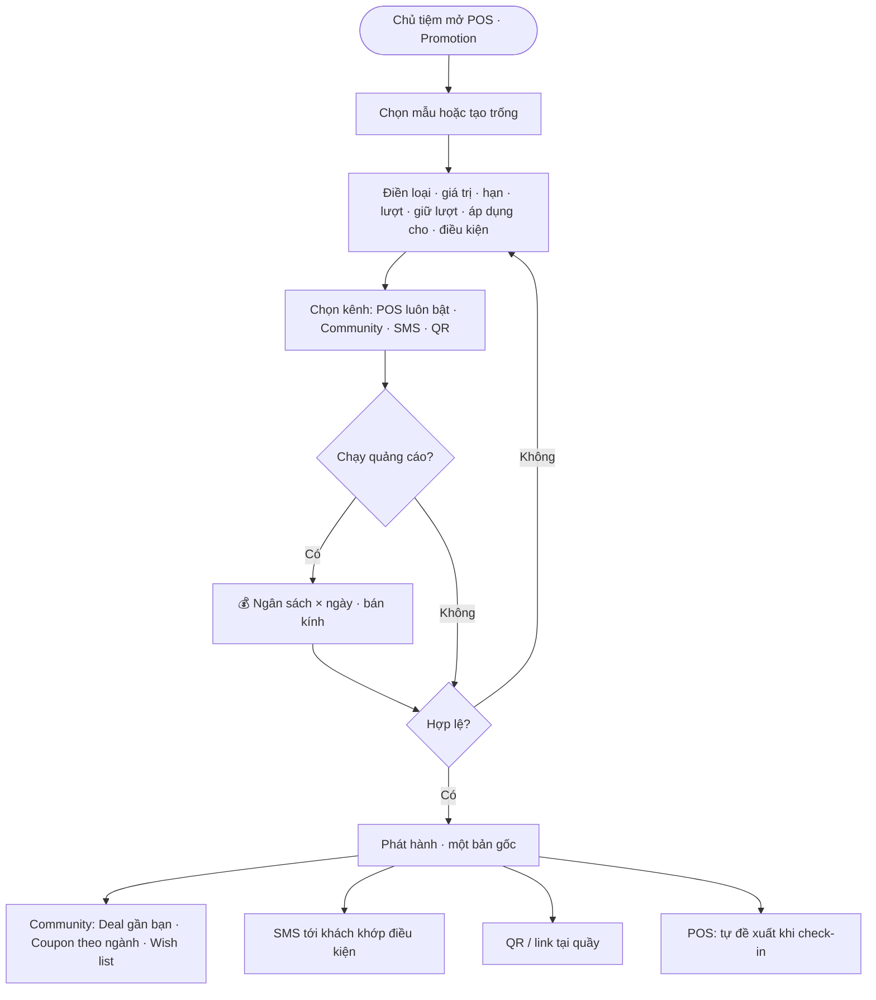
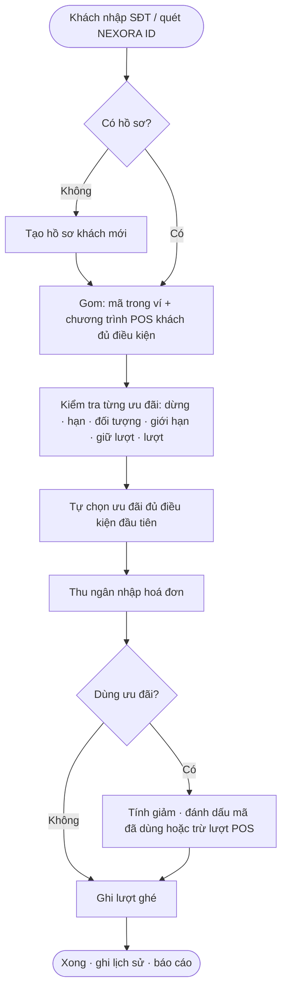
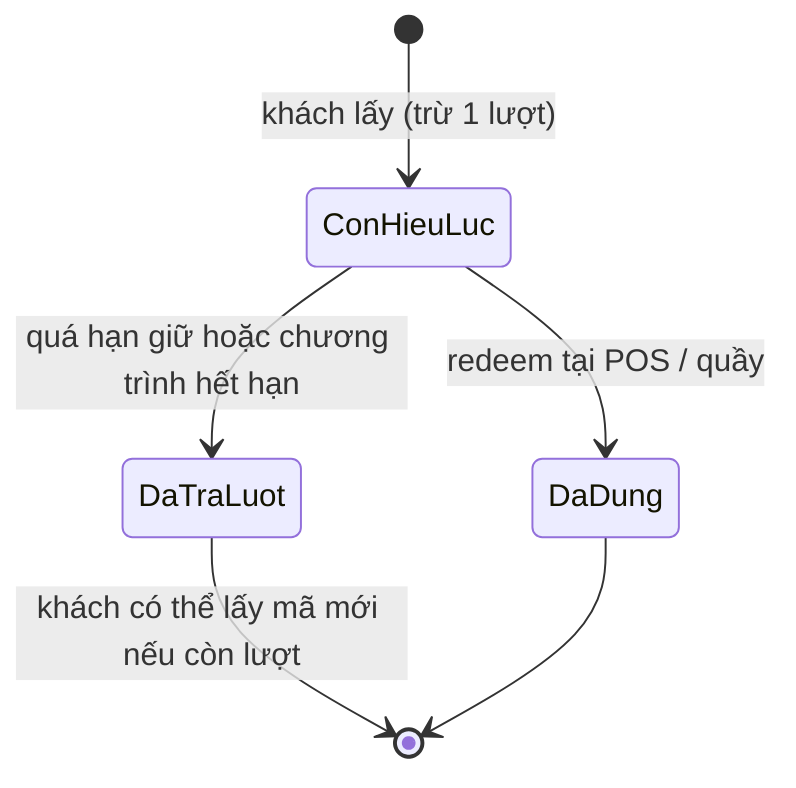

# 04 · Deal & Coupon ↔ POS Promotion

**Cập nhật:** 2026-09-26
**Đối tượng đọc:** Dev POS, dev Community, PM, QA, CSKH
**Trạng thái:** Draft — chờ Brian duyệt
**Nguồn:** `mod_deals.html` (Community, bản đã vá hạn dùng + giữ lượt), `pos-promotion.html` (bản mẫu POS Promotion liên kết), quyết định đã chốt: **POS là nguồn duy nhất; điều khoản coupon nằm trong popup lấy coupon**
**Điều kiện tiên quyết:** tài liệu 00 (SĐT là khoá chung)

---

## Tổng quan

Tiệm tạo **chương trình khuyến mãi** một nơi duy nhất — mục **Promotion trong POS**. Community (Deal gần bạn, Coupon theo ngành), SMS và QR tại quầy chỉ là **kênh phát**. Khách lấy coupon ở đâu cũng về cùng một danh sách, cùng số lượt. Khi khách **check-in tại tiệm bằng SĐT** (hoặc quét NEXORA ID), POS tự tìm hồ sơ, thấy mọi coupon khách đang giữ, tự kiểm tra điều kiện (khách mới / khách quen / lâu không ghé) và đề xuất. Thu ngân chỉ bấm Tính tiền. Ví coupon với QR + PIN động vẫn giữ để dùng ở nơi không có POS NEXORA.

---

## Khái niệm chính

| Thuật ngữ | Định nghĩa |
|---|---|
| **Chương trình (Promotion)** | Bản gốc, tạo trong POS: loại ưu đãi, giá trị, hạn, tổng lượt, giới hạn/người, giữ lượt, áp dụng cho ai, điều kiện, kênh phát. |
| **Coupon (mã)** | Một lượt của chương trình được cấp cho một khách: mã `NX-<ID>-XXXX`, thời điểm lấy, hạn giữ, trạng thái. |
| **Kênh phát** | `POS` (luôn bật, tự đề xuất khi check-in) · `Community` · `SMS` · `QR tại quầy`. |
| **Loại ưu đãi** | Giảm % · Giảm $ · Mua X tặng Y · Giá đặc biệt · Miễn phí (chỉ Community — cần chốt). |
| **Áp dụng cho** | Mọi khách · Khách mới · Khách quen ≥ 2 lần · Khách lâu không ghé ≥ 60 ngày. POS tự kiểm tra bằng lịch sử ghé. |
| **Tổng lượt / còn lượt** | Còn = tổng − đã lấy + đã trả về kho. |
| **Giữ lượt (hold)** | Số ngày khách được giữ lượt sau khi lấy. Quá hạn chưa dùng ⇒ lượt trả về kho, mã vô hiệu, khách có thể lấy lại. Trống = giữ đến khi chương trình hết hạn. |
| **Ví coupon** | Nơi khách giữ mã: QR + PIN động (đổi mỗi 30 giây) dùng tại quầy không có check-in. |
| **Check-in** | Khách nhập SĐT ở máy check-in hoặc thu ngân quét NEXORA ID ⇒ POS nhận diện. |
| **Redeem** | POS ghi nhận đã dùng, trừ vào hoá đơn. |
| **Quảng cáo (Được tài trợ)** 💰 | Trả phí để ghim chương trình đầu Deal gần bạn & Bảng tin trong bán kính; nhãn "⭐ Được tài trợ". Chỉ tài khoản doanh nghiệp. |
| **Wish list** | Khách lưu deal và theo dõi từ khoá; có deal mới khớp ⇒ báo. |

---

## Vai trò

| Vai trò | Làm gì |
|---|---|
| Chủ tiệm (POS) | Tạo/sửa/dừng chương trình, chọn kênh, chạy quảng cáo, xem báo cáo, redeem tại quầy. |
| Thu ngân (POS) | Check-in khách, xác nhận ưu đãi, tính tiền. Với ví: quét QR/nhập mã + PIN. |
| Khách / thợ (Community) | Xem deal, lấy coupon, lưu ví, wish list, theo dõi từ khoá. |
| Thợ (tạo coupon cá nhân) | **Bản mẫu cho phép; đề xuất chuyển vào POS của tiệm, chủ duyệt** — xem Câu hỏi mở. |
| Đối tác không có POS (nhà cung cấp, học viện, TAX IQ) | Đăng deal online — luồng redeem chưa định nghĩa. |

---

## Luồng nghiệp vụ

### Luồng 1: Tạo chương trình trong POS và phát lên kênh

| Bước | Ai | Hành động | Hệ thống |
|---|---|---|---|
| 1 | Chủ tiệm | Chọn mẫu (12 mẫu: Khách mới 👋, Khách quay lại 🔁, Sinh nhật 🎂, Giới thiệu bạn 🤝, Giờ vàng ⏰, Flash 24h ⚡, Combo 🎁, Khai trương 🎊, Lễ Tết 🧧, Valentine/Mother's Day 💐, Nhà cung cấp 📦, Khoá học 🎓) hoặc tạo trống | Mẫu điền sẵn loại, giá trị, tiêu đề, điều kiện, hạn, tổng lượt |
| 2 | Chủ tiệm | Điền: loại ưu đãi & giá trị; tiêu đề (≤ 60); hết hạn sau (24h/7/14/21/30/60 ngày); tổng lượt; mỗi khách tối đa (1/2/không giới hạn); **giữ lượt sau khi lấy (ngày)**; **áp dụng cho**; điều kiện thêm (hiện cho khách); màu | "✦ AI gợi ý tiêu đề & điều kiện" ghép từ loại + ngành |
| 3 | Chủ tiệm | Tick kênh phát: **POS** (luôn bật) · **Community** (mặc định bật) · **SMS cho khách trong POS** (gửi tới khách khớp điều kiện) · **QR tại quầy / tờ rơi** | Bấm POS ⇒ `POS luôn bật — đây là nguồn gốc của chương trình` |
| 4 | Chủ tiệm | (Tuỳ chọn) Bật **🚀 Chạy quảng cáo**: ngân sách/ngày, số ngày (3/7/14), bán kính (5/10/25 mi), thanh toán | 💰 Giá là **GIÁ MẪU**. Tài khoản thợ ⇒ khoá |
| 5 | Chủ tiệm | "🚀 Phát hành" | Kiểm tra: tiêu đề (`Nhập tiêu đề coupon`), lượt ≥ 1 (`Tổng số lượt phải lớn hơn 0`), % trong 1–100 (`Phần trăm giảm phải từ 1 đến 100`), ngân sách nếu quảng cáo (`Nhập ngân sách quảng cáo`). Giữ lượt ≥ hạn ⇒ bỏ giữ lượt (cần báo người tạo). Ghi `hết hạn = bây giờ + số ngày`. Toast `🚀 Đã phát hành: POS · Community · …` |
| 6 | Hệ thống | Community: xuất hiện ở Deal gần bạn (theo bán kính, ngành) & Coupon theo ngành; báo người theo dõi từ khoá khớp; SMS: gửi link tới khách trong POS khớp "áp dụng cho"; QR: tạo link `nexora.link/c/<id>` + QR in | Bảng tin/Nhóm: "1 bài giới thiệu coupon" — chưa có luồng |

### Luồng 2: Khách lấy coupon trên Community

| Bước | Ai | Hành động | Hệ thống |
|---|---|---|---|
| 1 | Khách | Xem **Deal gần bạn** (bản đồ, bán kính 1/5/10/25 mi + Online, lọc Khách hàng/Tiệm & thợ, sắp xếp Gần nhất/Sắp hết hạn/Sắp hết lượt, tìm từ khoá) hoặc **Coupon theo ngành** (7 ngành) | Ẩn chương trình tạm dừng và hết hạn. Deal Được tài trợ xếp trước |
| 2 | Khách | Bấm "🎟️ Lấy coupon" | Cần tài khoản (tài liệu 00). Kiểm tra theo thứ tự: đã có mã còn hiệu lực ⇒ mở ví; hết hạn ⇒ `Coupon đã hết hạn`; vượt giới hạn/người ⇒ `Đã đạt giới hạn N lần/người cho coupon này`; hết lượt ⇒ `Coupon đã hết lượt` |
| 3 | Hệ thống | Cấp mã `NX-<ID>-XXXX`, trừ 1 lượt, đặt **hạn giữ = min(hết hạn, lấy + giữ lượt)** | Popup "🎟️ Đã lấy coupon! Đã tự lưu vào Ví NEXORA." + **dòng điều kiện coupon**: "Điều kiện coupon: <điều kiện> · tối đa N lần/người · mỗi mã dùng 1 lần · HSD <ngày giờ> · dùng trước <hạn giữ>, quá hạn lượt tự trả về kho. Lấy coupon nghĩa là bạn đồng ý các điều kiện này." |
| 4 | Khách | (Tuỳ chọn) Lưu thêm: Apple Wallet · Google Wallet · Tải ảnh PNG (có QR) · Gửi SMS/Email cho người chưa cài app | Apple/Google: cần tài khoản nhà phát triển; SMS: người nhận mở link → nhập SĐT → vào ví |
| — | Khách | ♡ Lưu vào Wish list; "＋ Theo dõi" từ khoá (≥ 2 ký tự) | Có deal mới khớp từ khoá ⇒ thông báo `🔔 Deal mới khớp “<kw>”: <tiêu đề> · <tiệm>` |

### Luồng 3: Khách check-in tại tiệm — POS tự nhận diện (luồng chính)

| Bước | Ai | Hành động | Hệ thống |
|---|---|---|---|
| 1 | Khách / thu ngân | Nhập SĐT ở máy check-in, hoặc thu ngân quét QR NEXORA ID | SĐT < 7 số ⇒ `Nhập SĐT hợp lệ`. Chuẩn hoá 10 số |
| 2 | Hệ thống | Tìm hồ sơ khách theo SĐT. Không có ⇒ **tạo hồ sơ mới** (khách mới, tên tuỳ chọn) | Hiện: `🆕 Khách mới — SĐT chưa có trong POS` hoặc `Khách quen · N lần · ghé cách đây D ngày` |
| 3 | Hệ thống | Gom **mọi ưu đãi**: (a) mã trong ví khách (từ Community/SMS/QR); (b) chương trình có kênh POS mà khách đủ điều kiện (không cần mã). Với mỗi ưu đãi chạy **kiểm tra điều kiện** (bảng dưới). Sắp: đủ điều kiện trước. **Tự chọn** ưu đãi đủ điều kiện đầu tiên | Hiện nguồn: `POS · tự đề xuất` hoặc `khách lấy từ Community/SMS/QR` + mã; `✓ Đủ điều kiện — POS đã kiểm tra: <đối tượng>` hoặc `⛔ <lý do>` |
| 4 | Thu ngân | Nhập tổng hoá đơn, (đổi ưu đãi nếu cần), bấm "✓ Tính tiền & ghi nhận" hoặc "Không dùng ưu đãi" | Bấm ưu đãi không đủ điều kiện ⇒ `Ưu đãi này không đủ điều kiện` |
| 5 | Hệ thống | Tính giảm: % ⇒ hoá đơn × %/100; $ ⇒ min($, hoá đơn); giá đặc biệt ⇒ max(0, hoá đơn − giá); Mua X tặng Y / Miễn phí ⇒ 0 (thu ngân áp trên dịch vụ). Đánh dấu mã **đã dùng** (nếu từ ví) hoặc trừ 1 lượt kênh POS; lượt ghé +1; ghi lịch sử | Toast `✓ Đã áp dụng <tiêu đề> — khách tiết kiệm $X` |

**Kiểm tra điều kiện (theo thứ tự, trả về mọi lý do từ chối):**

| # | Điều kiện | Lý do hiện |
|---|---|---|
| 1 | Chương trình tạm dừng | `đang tạm dừng` |
| 2 | Quá hạn | `đã hết hạn` |
| 3 | "Khách mới" mà đã ghé ≥ 1 lần | `khách đã ghé N lần — không phải khách mới` |
| 4 | "Khách quen ≥ 2 lần" mà < 2 | `chưa đủ 2 lần ghé` |
| 5 | "Lâu không ghé" mà chưa từng ghé / ghé < 60 ngày | `khách mới — chưa từng ghé` / `mới ghé gần đây` |
| 6 | Đã dùng chương trình này ≥ giới hạn/người | `đã dùng N/M lần` |
| 7 | Mã trong ví quá hạn giữ | `quá thời gian giữ lượt (N ngày) — lượt đã trả về kho` |
| 8 | Chương trình kênh POS hết lượt | `hết lượt` |

Chương trình "Mọi khách" không đủ điều kiện thì **ẩn**; chương trình có đối tượng cụ thể thì **vẫn hiện kèm lý do** (để thu ngân giải thích cho khách).

### Luồng 4: Redeem bằng ví (nơi không có check-in)

| Bước | Ai | Hành động | Hệ thống |
|---|---|---|---|
| 1 | Khách | Mở Ví coupon, đưa QR + PIN động (6 số, đổi mỗi 30 giây) | QR đổi theo cửa sổ 30 giây; ảnh chụp màn hình không dùng được |
| 2 | Thu ngân | Quét QR (bản thật) hoặc nhập mã + PIN, bấm "🔍 Kiểm tra coupon" | Từ chối theo thứ tự: mã không tồn tại (`Mã không tồn tại hoặc không phải của NEXORA.`); thuộc tiệm khác (`Mã này thuộc <tiệm> — không dùng được tại <tiệm này>.`); đã dùng (`Mã đã được dùng lúc hh:mm — mỗi mã chỉ dùng 1 lần.`); tạm dừng (`Coupon đang tạm dừng.`); hết hạn (`Coupon đã hết hạn lúc <t> — không áp dụng được.`); quá hạn giữ (`Mã đã hết thời gian giữ lượt (<t>) — lượt đã trả về kho. Khách có thể lấy lại nếu coupon còn lượt.`); PIN sai — chấp nhận cửa sổ hiện tại và cửa sổ trước (`PIN động không khớp — nhờ khách mở lại Ví coupon…`) |
| 3 | Thu ngân | Nếu điều kiện có "khách mới": tick "Đã xác nhận: khách mới lần đầu" (fallback khi không có hồ sơ); nhập hoá đơn; "✓ Xác nhận dùng & ghi vào POS" | Kiểm tra lại hạn/giữ lượt ngay trước khi ghi. Toast `✓ Redeem thành công` |

### Luồng 5: Quản lý chương trình

| Hành động | Hệ thống |
|---|---|
| ⏸ Dừng / ▶ Chạy lại | Dừng ⇒ mọi kênh ngừng nhận, POS ngừng đề xuất, quầy từ chối mã. Toast `Đã dừng — mọi kênh ngừng nhận, POS ngừng đề xuất` |
| 📣 Đăng lên / 🔕 Gỡ khỏi Community | Gỡ ⇒ không hiện trên Community nữa; **mã khách đã lấy vẫn dùng được tới hạn**. Toast `Đã gỡ khỏi Community — coupon khách đã lấy vẫn dùng được tới hạn` |
| 🚀 Quảng cáo (chưa có) | Mở form quảng cáo cho chương trình đang chạy |
| 🖨️ Link & QR dán tại tiệm | `nexora.link/c/<id>`; khách quét → nhập SĐT → coupon vào ví, POS tạo hồ sơ |
| Báo cáo | Theo chương trình · theo kênh: lấy bao nhiêu từ Community/SMS/QR/POS → dùng bao nhiêu (%), khách tiết kiệm; check-in hôm nay; lịch sử redeem |

---

## Vòng đời trạng thái

**Chương trình**

| Trạng thái | Kích hoạt | Mới |
|---|---|---|
| Đang chạy | ⏸ Dừng | Tạm dừng |
| Tạm dừng | ▶ Chạy lại | Đang chạy |
| Đang chạy / Tạm dừng | Quá hạn | Hết hạn (ưu tiên hiển thị) |
| Đang chạy | Hết lượt (còn = 0) | Hết lượt — vẫn chạy, không cấp thêm; lượt trả về kho thì cấp lại |

**Mã coupon của khách**

| Trạng thái | Kích hoạt | Mới | Ghi chú |
|---|---|---|---|
| Còn hiệu lực | Redeem (check-in hoặc ví) | Đã dùng | Ghi tiền tiết kiệm |
| Còn hiệu lực | Quá hạn giữ / chương trình hết hạn | Đã trả lượt | Lượt về kho; khách "Lấy lại" ⇒ mã mới, mã cũ giữ nguyên |
| Còn hiệu lực | Chương trình dừng | Còn hiệu lực · bị từ chối tạm | Chạy lại thì dùng được |

---

## Quy tắc nghiệp vụ

- **Một nguồn duy nhất:** chương trình chỉ tạo/sửa/dừng trong POS. Community không có "Tạo coupon" riêng (mục ➕ Tạo coupon trong bản mẫu Community sẽ thay bằng link sang POS).
- **SĐT là khoá:** tài khoản Community và hồ sơ khách POS ghép theo SĐT chuẩn hoá. Không ghép được ⇒ POS không thấy coupon của khách (rủi ro lớn nhất — tài liệu 00).
- **Còn lượt = tổng − đã lấy + đã trả về kho.** Lượt trừ lúc **lấy**, trả về khi quá hạn giữ chưa dùng.
- **Giữ lượt:** hạn giữ = min(hết hạn chương trình, lấy + N ngày). Trống ⇒ giữ đến hết hạn (⚠️ người lấy không dùng sẽ chiếm lượt tới cuối).
- **Giới hạn/người:** Community đếm theo số mã đã lấy còn hiệu lực + đã dùng; POS đếm theo số lần đã dùng. **Cần thống nhất** (Câu hỏi mở #3).
- **Điều kiện đối tượng do POS xác nhận** bằng lịch sử ghé, không phải thu ngân tick. Checkbox "khách mới" ở quầy chỉ là fallback khi redeem bằng ví không có hồ sơ.
- **Mỗi mã dùng 1 lần.** Đánh dấu "đã dùng" phải là thao tác nguyên tử phía server (hai quầy không redeem cùng mã).
- **PIN động:** chuẩn TOTP 30 giây, chấp nhận cửa sổ trước; QR chứa token ký, không chứa PIN tĩnh. Bản mẫu là hash demo — **không dùng cho bản thật**.
- **Dừng chương trình** chặn cả lấy lẫn dùng. **Gỡ khỏi Community** chỉ chặn lấy mới.
- **Quảng cáo** 💰: ghim đầu theo bán kính, nhãn "Được tài trợ" bắt buộc; hết ngày/ngân sách ⇒ gỡ ghim. Chỉ tài khoản doanh nghiệp. Giá thật, hoàn tiền khi dừng — chưa chốt.
- **Deal Online** (không có khoảng cách) chỉ hiện khi khách chọn "+ Online".
- **Hết hạn** tính theo thời gian tuyệt đối, hiển thị "còn N ngày" tính lại mỗi lần xem; ≤ 3 ngày hiện đỏ.

---

## Ngoại lệ

| Tình huống | Xử lý | Ai |
|---|---|---|
| Khách check-in bằng SĐT khác SĐT tài khoản Community | Không thấy coupon; thu ngân dùng ví (luồng 4) | Thu ngân |
| Khách có 2 coupon cùng đủ điều kiện | Tự chọn cái đầu (đủ điều kiện, theo thứ tự); thu ngân đổi được | Brian quyết quy tắc "lợi nhất" |
| Mã của tiệm A đưa tại tiệm B | Từ chối; chuỗi nhiều chi nhánh — chưa định nghĩa | Brian |
| Coupon của đối tác online (học viện, nhà cung cấp) | Không có quầy; redeem ở đâu? | PM |
| Thợ tạo coupon cá nhân | Đề xuất: đi qua POS của tiệm, chủ duyệt; ai redeem | Brian |
| Chương trình bị gỡ khỏi Community khi khách đang xem | Lấy coupon bị từ chối `Coupon đã hết lượt`/ẩn | Hệ thống |
| Khách check-in nhiều lần cùng ngày | Đếm check-in mỗi lần; hàng chờ cần khử trùng | Dev POS |

---

## Câu hỏi thường gặp

**Q:** Khách lấy coupon trên app rồi tới tiệm có phải mở app không? **A:** Không, nếu tiệm dùng POS NEXORA: nhập SĐT lúc check-in là POS thấy ngay. Mở ví chỉ cần ở tiệm không có POS NEXORA.
**Q:** Coupon "khách mới" mà khách đã từng ghé thì sao? **A:** POS tự từ chối kèm lý do; thu ngân không cần tự nhớ.
**Q:** Khách lấy mà không tới thì mất lượt của tiệm? **A:** Nếu tiệm đặt "giữ lượt N ngày", quá N ngày lượt tự trả về kho.

---

## Liên quan
- 00 Tài khoản (SĐT là khoá) · 01 Bảng tin (đăng 1 bài giới thiệu coupon) · 05 Tin nhắn (gửi coupon qua chat) · POS Promotion / khung khuyến mãi 12 tháng theo ngành (module NEXORA TOUCH đang làm)

---

## Câu hỏi mở

1. **Ánh xạ dữ liệu POS ↔ Community:** một bản ghi chung hay hai bản đồng bộ; trường bắt buộc; loại "Miễn phí" có ở POS không; "Dành cho: Tiệm & thợ" (B2B) có ở POS không.
2. **Mục Promotion hiện có trong POS** — em chưa xem được màn hình thật; cần đối chiếu để không làm trùng khung khuyến mãi 12 tháng.
3. **Giới hạn/người:** đếm theo lấy hay theo dùng.
4. **Giữ lượt:** để trống được hay bắt buộc điền; có giá trị mặc định không.
5. **Chọn ưu đãi khi có nhiều:** lợi nhất cho khách hay cho tiệm.
6. **Chuỗi nhiều chi nhánh:** coupon dùng chung hay theo tiệm.
7. **PIN/QR thật:** chuẩn TOTP, khoá bí mật, lệch giờ; nội dung QR.
8. **Kênh Bảng tin/Nhóm:** tự tạo bài giới thiệu? Nội quy nhóm.
9. **Trang `nexora.link/c/<id>`** cho khách chưa có app: nhập SĐT → ví; có OTP không.
10. **Quảng cáo:** giá thật, tính phí, gỡ ghim khi hết, hoàn tiền khi dừng, lượt hiển thị.
11. **SMS kênh phát:** nội dung, đồng ý nhận SMS (TCPA), phụ thuộc A2P/10DLC.
12. **Apple/Google Wallet:** làm ở giai đoạn nào; cập nhật trạng thái đã dùng trên pass.
13. **Thợ tạo coupon cá nhân:** giữ hay bỏ; ai redeem.
14. **Deal online của đối tác:** redeem thế nào.
15. **Định nghĩa "lượt xem"** cho báo cáo.
16. **Lấy lại sau khi trả lượt:** giới hạn số lần.
