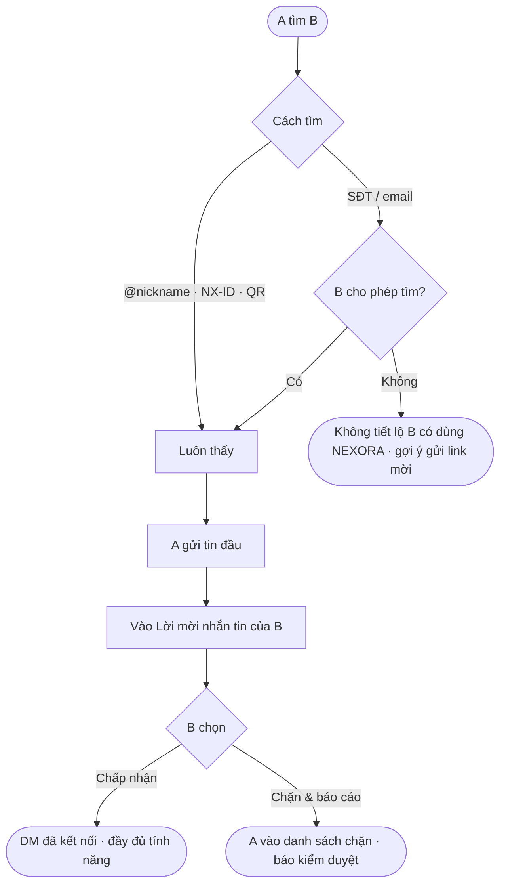
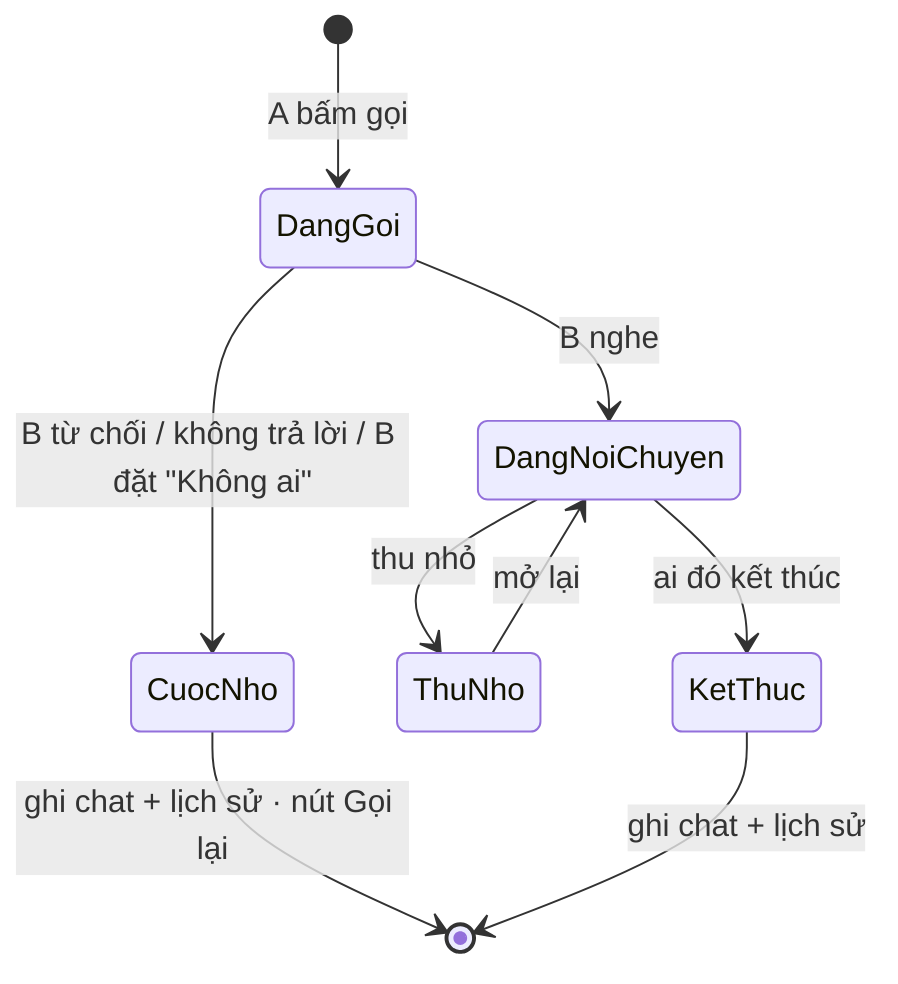

# 05 · Tin nhắn, Cuộc gọi & Riêng tư (NEXORA ID)

**Cập nhật:** 2026-09-26
**Đối tượng đọc:** Dev, PM, QA, CSKH, kiểm duyệt
**Trạng thái:** Draft — chờ Brian duyệt
**Nguồn:** `mod_connect.html`
**Điều kiện tiên quyết:** tài liệu 00 (NEXORA ID, SĐT)

---

## Tổng quan

Tin nhắn 1–1, nhóm chat (nhóm tiệm tự tạo từ POS, cộng đồng công khai), gọi thoại & video có **phụ đề AI Việt ⇄ Anh**, ghi âm AI chép lời, cảnh báo lừa đảo trong tin nhắn. Mỗi thành viên có **NEXORA ID** (mã `NX-####`, @nickname, QR, link) và tự chọn ai tìm được mình bằng SĐT/email, ai được nhắn, ai được gọi. Mục tiêu: gom người Việt trong ngành vào app, thay Zalo/Messenger cho việc kết nối thợ – tiệm – khách.

---

## Khái niệm chính

| Thuật ngữ | Định nghĩa |
|---|---|
| **NEXORA ID** | `NX-####` + `@nickname` (3–20 ký tự: chữ thường, số, dấu chấm) + QR + link `nexora.link/@nickname`. Luôn tìm được. |
| **Tin nhắn trực tiếp (DM)** | Hội thoại 1–1. |
| **Lời mời nhắn tin** | Tin đầu tiên từ người chưa kết nối. Người nhận **Chấp nhận** hoặc **Chặn & báo cáo**; chưa chấp nhận thì không thể trả lời, người gửi không thấy online và không gọi được. |
| **Nhóm tiệm (POS)** | Nhóm chat đồng bộ từ danh sách nhân viên POS; nghỉ việc tự rời. |
| **Cộng đồng công khai** | Nhóm theo thành phố / chủ đề, tham gia 1 chạm. |
| **Phụ đề AI** | Phụ đề Việt ⇄ Anh trong cuộc gọi (bật/tắt). |
| **Cảnh báo lừa đảo** | AI quét tin đến, hiện cảnh báo dưới tin có dấu hiệu đòi tiền. |
| **Nhắn nhanh** | 3 câu trả lời sẵn khi từ chối cuộc gọi. |

---

## Vai trò

| Vai trò | Làm gì |
|---|---|
| Thành viên | Tìm người, nhắn, gọi, tham gia nhóm, đặt cài đặt riêng tư, chặn/báo cáo. |
| Khách chưa đăng ký | Xem danh sách nhóm công khai; bấm gửi/gọi/tham gia ⇒ đăng ký (tài liệu 00). |
| Chủ tiệm | Thêm: nhóm tiệm tự tạo từ POS. |
| Kiểm duyệt NEXORA | Nhận báo cáo từ "Chặn & báo cáo". |

---

## Luồng nghiệp vụ

### Luồng 1: Tìm người & nhắn lần đầu (lời mời nhắn tin)

| Bước | Ai | Hành động | Hệ thống |
|---|---|---|---|
| 1 | A | Gõ vào ô tìm: `@nickname`, `NX-####`, SĐT, email hoặc tên | Nhận dạng: bắt đầu `NX` + số ⇒ ID (khớp chính xác); ≥ 7 ký tự số/ký hiệu ⇒ SĐT (so 10 số cuối); có `@` và `.` ⇒ email; còn lại ⇒ nickname/tên (chứa) |
| 2 | Hệ thống | Áp cài đặt riêng tư của **người bị tìm**: SĐT/email chỉ trả kết quả khi họ cho phép | Không cho phép ⇒ `🔒 Không tìm thấy người dùng — Người này có thể chưa dùng NEXORA hoặc không cho tìm bằng số điện thoại/email. NEXORA không tiết lộ ai đang dùng số/email này.` + nút "📲 Gửi link mời" |
| 3 | A | Bấm "Nhắn tin" | Tạo hội thoại phía A với tin hệ thống `Tin đầu tiên sẽ vào "Lời mời nhắn tin" của họ cho tới khi họ chấp nhận` |
| 4 | B | Thấy card vàng "Lời mời nhắn tin [n] · Người lạ — bạn duyệt mới trả lời được" | Trong phòng: không có ô soạn, không nút gọi; chỉ **Chấp nhận** / **🚫 Chặn & báo cáo** |
| 5a | B | Chấp nhận | Hội thoại thành DM "Đã kết nối". Toast `Đã chấp nhận — có thể trả lời` |
| 5b | B | Chặn & báo cáo | B vào danh sách chặn; gửi báo cáo kiểm duyệt. Toast `🚫 Đã chặn & gửi báo cáo cho đội kiểm duyệt NEXORA` |

### Luồng 2: Trong phòng chat

| Tính năng | Hành vi |
|---|---|
| Gửi tin | Enter hoặc nút gửi. Trạng thái ✓✓ "Đã xem" (xanh khi đã đọc), "đang nhập…" |
| Trả lời | Trích tin gốc |
| Cảm xúc | ❤️ 👍 😂 😮 😢 🙏 (bản mẫu: không giới hạn, không bỏ được — cần chốt) |
| 🌐 Dịch | Hiện bản dịch của tin (bản mẫu chỉ có với tin có sẵn bản dịch) |
| 📌 Ghim | Chỉ trong nhóm, 1 tin ghim/nhóm, ai cũng ghim được (cần chốt quyền) |
| Đính kèm | Ảnh/video · **Chia sẻ ca làm thêm** (card ca, nút "Xem ca & nhận" → tài liệu 03) · Vị trí tiệm |
| 🎤 Ghi âm | "Đang ghi âm · AI sẽ chép lời"; gửi ⇒ tin thoại + "📝 AI chép lời: …" |
| Tìm trong chat | Đếm và tô sáng kết quả |
| **Cảnh báo lừa đảo** | Tin đến khớp `zelle · cash app · gift card · đặt cọc · chuyển tiền trước · phí giữ chỗ · western union` ⇒ dưới tin hiện `⚠️ AI cảnh báo lừa đảo: tin nhắn đòi chuyển tiền trước / đặt cọc … Tiệm thật trên NEXORA không thu phí giữ chỗ qua tin nhắn. Đừng chuyển tiền.` Không chặn tin. Tắt được trong Riêng tư (toast `AI cảnh báo lừa đảo: tắt — hãy cẩn thận với tin đòi chuyển tiền`) |
| Nhắn người bán (từ Chợ) | Mở DM với người bán; đi luồng 1 nếu chưa kết nối |

### Luồng 3: Cuộc gọi

| Bước | Ai | Hành động | Hệ thống |
|---|---|---|---|
| 1 | A | Gọi thoại / video từ đầu phòng chat, tab Cuộc gọi hoặc danh sách thành viên | Màn gọi toàn màn hình: `Đang gọi...` → kết nối → đồng hồ; nhãn `🔒 Mã hoá`; nút Tắt mic · Camera/Đổi cam (video) · Loa (thoại) · **Phụ đề AI** · Kết thúc; thu nhỏ thành pill để vẫn nhắn tin |
| 2 | B | Màn "Cuộc gọi thoại/video đến": **Nghe** / **Từ chối** / **Nhắn nhanh** (`Em đang làm khách, xíu gọi lại nha` · `Nhắn tin giúp em, em đọc liền` · `Gọi lại sau 30 phút được không?`) | Từ chối ⇒ cuộc nhỡ trong chat + tab Cuộc gọi (đỏ). Nhắn nhanh ⇒ cuộc nhỡ + tin trả lời |
| 3 | A/B | Bật "Phụ đề AI" | Phụ đề `{người nói}: {VI}` + `🌐 {EN}` |
| 4 | — | Kết thúc | Bong bóng trong chat (`thời lượng` hoặc `không trả lời`) + dòng lịch sử; nút "Gọi lại" |
| Nhóm | Bất kỳ | "Gọi nhóm" / "Video nhóm" | Người chưa vào thấy `● ĐANG GỌI · N người đang tham gia` + "Tham gia" |
| Cài đặt "Không ai" | — | Mọi cuộc gọi đến thành cuộc nhỡ | Toast `📵 Cuộc gọi bị chặn theo cài đặt Riêng tư — lưu vào cuộc nhỡ` |

### Luồng 4: Nhóm

| Loại | Vào bằng | Quy tắc |
|---|---|---|
| Nhóm tiệm (POS) | Tự động theo danh sách nhân viên POS | Tag `POS`; nghỉ việc tự rời; có ghim (lịch tuần, tips) |
| Cộng đồng công khai | "Tham gia" (1 chạm, không duyệt) | Lọc Tất cả / Thành phố / Chủ đề. Mặc định: Thợ Nail Houston, Thợ Nail Dallas – Fort Worth, Nail Austin & San Antonio, Học Gel-X & Nail Art, Thuế & 1099 cho thợ (TAX IQ), Chủ tiệm Việt tại Mỹ. Tin hệ thống `Bạn đã tham gia · nhớ đọc nội quy nhóm` |
| Mời thành viên | "Mời bằng @nickname, NX-ID hoặc link nhóm" | Chưa có luồng |

### Luồng 5: Riêng tư & NEXORA ID

| Cài đặt | Giá trị | Mặc định |
|---|---|---|
| Tìm bằng số điện thoại | Mọi người · Chỉ người đã có số bạn trong danh bạ · Không ai | Danh bạ |
| Tìm bằng email | Mọi người · Danh bạ · Không ai | Không ai |
| Tìm bằng @nickname / NX-ID / QR | Luôn bật | — |
| Người lạ nhắn tin | Vào Lời mời · Nhận trực tiếp · Chặn hết | Vào Lời mời |
| Ai được gọi cho bạn | Chỉ bạn bè & nhóm chung · Mọi người · Không ai | Bạn bè & nhóm chung |
| AI cảnh báo lừa đảo | Bật/tắt | Bật |
| Đã chặn | Danh sách + "Bỏ chặn" | — |

Thẻ ID: avatar, tên, vai trò · thành phố, ✓ Xác minh, @nickname, `NEXORA ID · NX-####`, QR, `nexora.link/@nickname`. Nút "🔗 Chia sẻ ID" (Zalo · Messenger · SMS · Sao chép link), "✏️ Đổi nickname" (lỗi: `Nickname 3–20 ký tự: chữ thường, số, dấu chấm.` / `@x đã có người dùng — thử tên khác.`). "📲 Mời người quen vào NEXORA" — gửi link, không cần họ có app.

---

## Vòng đời trạng thái

**Lời mời nhắn tin:** Đến → Chấp nhận (DM đã kết nối) | Chặn & báo cáo (vào danh sách chặn, không lưu hội thoại). Bỏ chặn ⇒ xoá khỏi danh sách, người đó phải nhắn lại từ đầu.

**Cuộc gọi:** xem sơ đồ luồng 3.

**Chặn:** Không chặn ⇄ Đã chặn. Người bị chặn: không tìm thấy, không nhắn, không gọi, không thấy online (bản mẫu chưa thực thi — bắt buộc ở bản thật).

---

## Quy tắc nghiệp vụ

- **Mặc định an toàn:** người lạ vào Lời mời; chỉ bạn bè & nhóm chung gọi được; tìm bằng SĐT chỉ với người có số trong danh bạ; email không ai tìm được.
- **Không tiết lộ** một SĐT/email có đang dùng NEXORA hay không khi người đó không cho tìm.
- **Lời mời chưa chấp nhận:** người gửi không thấy online, không gọi được, người nhận không trả lời được.
- **Chặn & báo cáo** gửi báo cáo tới kiểm duyệt NEXORA; chặn theo NEXORA ID (không theo tên).
- **"Bạn bè"** = đã kết nối (chấp nhận lời mời) hoặc cùng nhóm — cần chốt định nghĩa.
- **Nickname** duy nhất toàn hệ thống; link cũ sau khi đổi — cần chốt.
- **Cảnh báo lừa đảo** chỉ cảnh báo, không chặn, không tự báo cáo; danh sách mẫu cấu hình được, VI/EN.
- **AI dịch/phụ đề/chép lời** "chỉ để hỗ trợ — không dùng cho mục đích pháp lý hay y tế" (điều khoản mục 6). Điều khoản 6a: không chia sẻ tin thoại/ảnh chụp cuộc gọi của người khác ra ngoài app.
- **Nhóm tiệm** do POS quản: thành viên = nhân viên đang làm.
- **Badge** = tổng tin chưa đọc + số lời mời (0 nếu đặt "Chặn hết").
- **Mã hoá:** nhãn `🔒 Mã hoá` — cần chốt E2E hay chỉ đường truyền.

---

## Ngoại lệ

| Tình huống | Xử lý | Ai |
|---|---|---|
| Người bị chặn nhắn lại | Không tới; không báo cho họ | Hệ thống |
| Gọi người đang bận cuộc khác | Bản mẫu: cuộc cũ tự kết thúc — bản thật: báo bận | Dev |
| "Tham gia" cuộc gọi nhóm đang video | Bản mẫu luôn vào thoại — sửa | Dev |
| Tin có dấu hiệu lừa đảo trong nhóm | Cảnh báo như DM | Hệ thống |
| Nickname trùng khi đổi | Từ chối | Hệ thống |

---

## Câu hỏi thường gặp

**Q:** Người lạ có gọi tôi được không? **A:** Không, mặc định chỉ bạn bè & nhóm chung; đổi trong Riêng tư.
**Q:** Tôi không muốn ai tìm bằng số điện thoại. **A:** Đặt "Không ai" ở Tìm bằng số điện thoại; mọi người vẫn tìm bạn bằng @nickname/QR.
**Q:** Chặn có báo cho người kia không? **A:** Không.

---

## Liên quan
- 00 Tài khoản (NEXORA ID) · 01 Chợ (nhắn người bán) · 03 Ca làm thêm (chia sẻ ca) · 02 Việc làm (liên hệ sau khi chia sẻ SĐT)

---

## Câu hỏi mở

1. Chặn theo NEXORA ID và hành vi phía người bị chặn (tìm/nhắn/gọi/online).
2. Định nghĩa "bạn bè & nhóm chung" cho quyền gọi.
3. "Danh bạ": đọc danh bạ điện thoại (quyền), băm SĐT.
4. Lời mời khi đặt "Nhận trực tiếp": có cần chấp nhận nữa không; "Chặn hết": xoá hay giữ.
5. Cảnh báo lừa đảo: danh sách mẫu thật, đa ngôn ngữ, tự báo cáo/giới hạn gửi.
6. Nickname: từ cấm, số lần đổi, link cũ.
7. Dịch tin: tự động hay theo yêu cầu; tin không có bản dịch sẵn gọi AI thời gian thực; chi phí.
8. Ghim: ai được ghim, nhiều ghim, bỏ ghim. Cảm xúc: 1 người 1 lần, bỏ được.
9. Voice note: lưu audio bao lâu, ngôn ngữ chép lời.
10. Nhóm: rời/kick, quyền chủ tiệm trong nhóm POS, nội quy & kiểm duyệt cộng đồng công khai, mời thành viên.
11. Nhắn nhanh: cho tuỳ chỉnh không.
12. Mã hoá: E2E hay transport; lưu trữ tin nhắn, thời hạn.
13. Nền tảng gọi (WebRTC/nhà cung cấp), chất lượng, chi phí phụ đề AI theo phút.
14. Thông báo đẩy khi có tin/gọi khi app đóng.
